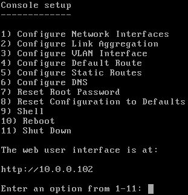

.. _Booting:

Booting
-------

The Console Setup menu, shown in
:numref:`Figure %s <console_setup_menu_fig>`,
appears at the end of the boot process. If the FreeNAS\ :sup:`®` system has a
keyboard and monitor, this Console Setup menu can be used to
administer the system.

.. note:: When connecting to the FreeNAS\ :sup:`®` system with SSH or the web
   :ref:`Shell`, the Console Setup menu is not shown by default.
   It can be started by the *root* user or another user with root
   permissions by typing :samp:`/etc/netcli`.

   The Console Setup menu can be disabled by unchecking
   :guilabel:`Enable Console Menu` in
   :menuselection:`System --> Advanced`.

.. _console_setup_menu_fig:

   Console Setup Menu

The menu provides these options:

:guilabel:`1) Configure Network Interfaces` provides a configuration
wizard to set up the system's network interfaces.

:guilabel:`2) Configure Link Aggregation` is for creating or deleting
link aggregations.

:guilabel:`3) Configure VLAN Interface` is used to create or delete
VLAN interfaces.

:guilabel:`4) Configure Default Route` is used to set the IPv4 or IPv6
default gateway. When prompted, enter the IP address of the default
gateway.

:guilabel:`5) Configure Static Routes` prompts for the destination
network and gateway IP address. Re-enter this option for each static
route needed.

:guilabel:`6) Configure DNS` prompts for the name of the DNS domain
and the IP address of the first DNS server. When adding multiple DNS
servers, press :kbd:`Enter` to enter the next one. Press :kbd:`Enter`
twice to leave this option.

:guilabel:`7) Reset Root Password` is used to reset a lost or
forgotten :literal:`root` password. Select this option and follow the
prompts to set the password.

:guilabel:`8) Reset Configuration to Defaults` **Caution**! This
option deletes *all* of the configuration settings made in the
administrative GUI and is used to reset a FreeNAS\ :sup:`®` system back to
defaults. **Before selecting this option, make a full backup of all
data and make sure all encryption keys and passphrases are known!**
After this option is selected, the configuration is reset to defaults
and the system reboots.
:menuselection:`Storage --> Pools --> Import Pool`
can be used to re-import pools.

:guilabel:`9) Shell` starts a shell for running FreeBSD commands. To
leave the shell, type :command:`exit`.

:guilabel:`10) Reboot` reboots the system.

:guilabel:`11) Shut Down` shuts down the system.

.. note:: The numbering and quantity of options on this menu can
   change due to software updates, service agreements, or other
   factors. Please carefully check the menu before selecting an
   option, and keep this in mind when writing local procedures.

.. _Obtaining_an_IP_Address:

Obtaining an IP Address
^^^^^^^^^^^^^^^^^^^^^^^

During boot, FreeNAS\ :sup:`®` automatically attempts to connect to a DHCP
server from all live network interfaces. After FreeNAS\ :sup:`®` successfully
receives an IP address, the address is displayed so it can be used
to access the web interface. The example in
:numref:`Figure %s <console_setup_menu_fig>` shows a
FreeNAS\ :sup:`®` system that is accessible at *http://10.0.0.102*.

Some FreeNAS\ :sup:`®` systems are set up without a monitor, making it
challenging to determine which IP address has been assigned. On
networks that support Multicast DNS (mDNS), the hostname and domain
can be entered into the address bar of a browser. By default, this
value is *freenas.local*.

If the FreeNAS\ :sup:`®` server is not connected to a network with a DHCP
server, use the console network configuration menu to manually
configure the interface as shown here. In this example, the FreeNAS\ :sup:`®`
system has one network interface, *em0*.

.. code-block:: none

   Enter an option from 1-11: 1
   1) em0
   Select an interface (q to quit): 1
   Remove the current settings of this interface? (This causes a momentary disconnec
   tion of the network.) (y/n) n
   Configure interface for DHCP? (y/n) n
   Configure IPv4? (y/n) y
   Interface name:     (press enter, the name can be blank)
   Several input formats are supported
   Example 1 CIDR Notation:
       192.168.1.1/24
   Example 2 IP and Netmask separate:
       IP: 192.168.1.1
       Netmask: 255.255.255.0, or /24 or 24
   IPv4 Address: 192.168.1.108/24
   Saving interface configuration: Ok
   Configure IPv6? (y/n) n
   Restarting network: ok

   ...

   The web user interface is at
   http://192.168.1.108

.. index:: GUI Access, Web Interface
.. _Accessing the Web Interface:

Accessing the web interface
----------------------

On a computer that can access the same network as the FreeNAS\ :sup:`®` system,
enter the IP address in a web browser to connect to the web interface. The
password for the root user is requested.

.. _login_fig:

   Login Screen

Enter the password chosen during the installation. A prompt is shown
to set a root password if it was not set during installation.

The web interface is displayed after login:

.. _login_dashboard_fig:

.. figure:: images/dashboard.png

   Dashboard

The
:menuselection:`Dashboard`
shows details about the system. These details are grouped into
sections about the hardware components, networking,
storage, and other categories.

web interface Troubleshooting
^^^^^^^^^^^^^^^^^^^^^^^^^^^^^^^^^^^^^^^^^^

If the user interface is not accessible by IP address from a browser,
check these things:

* Are proxy settings enabled in the browser configuration? If so,
  disable the settings and try connecting again.

* If the page does not load, make sure that a :command:`ping` reaches
  the FreeNAS\ :sup:`®` system's IP address. If the address is in a private
  IP address range, it is only accessible from within that private
  network.

If the UI becomes unresponsive after an upgrade or other system operation,
clear the site data and refresh the browser.

The rest of this User Guide describes the FreeNAS\ :sup:`®` web interface in
more detail. The layout of this User Guide follows the order of the menu
items in the tree located in the left frame of the web interface.

