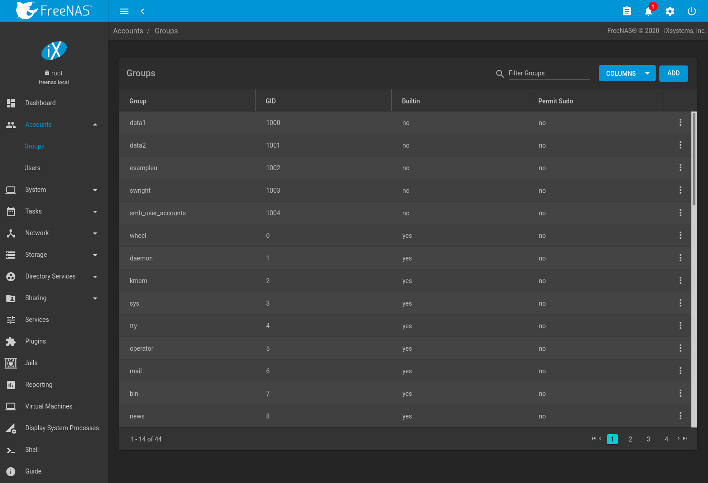
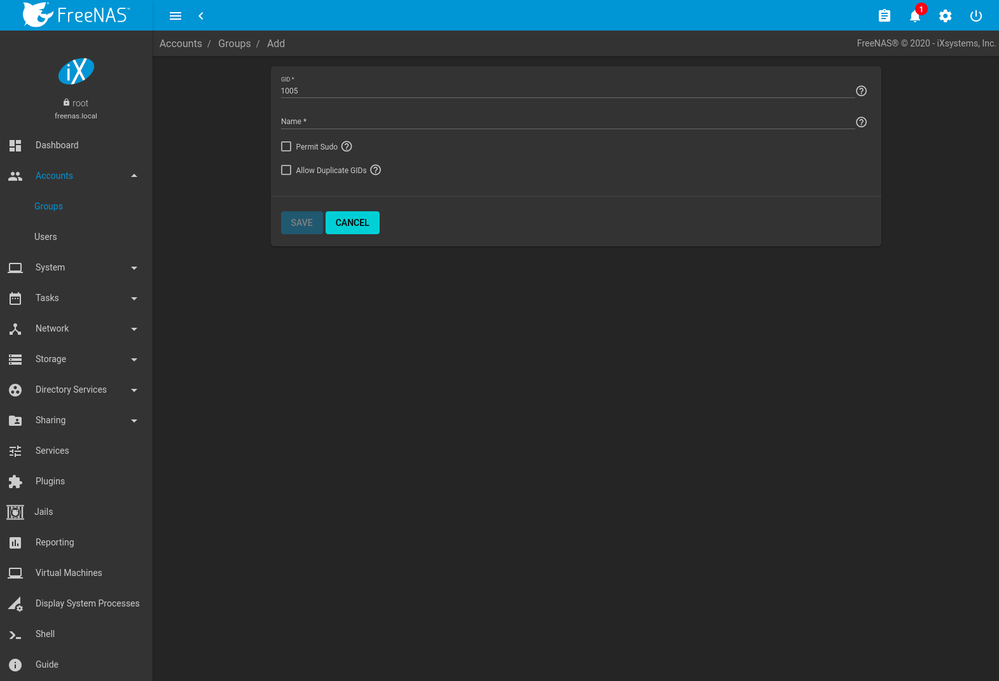
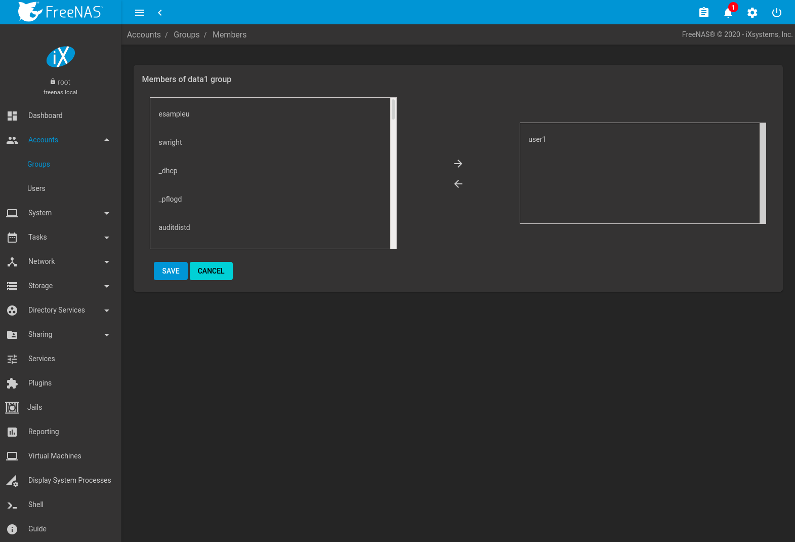
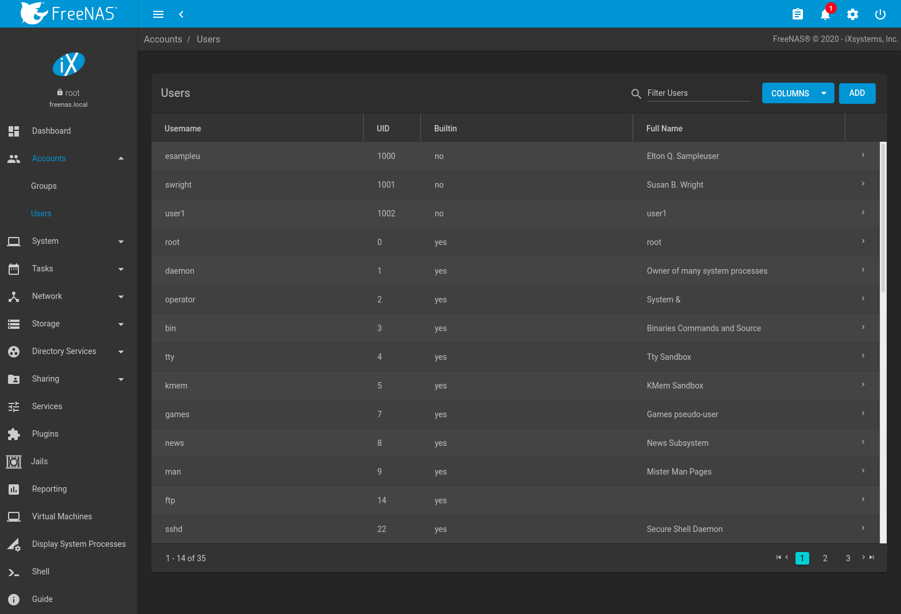
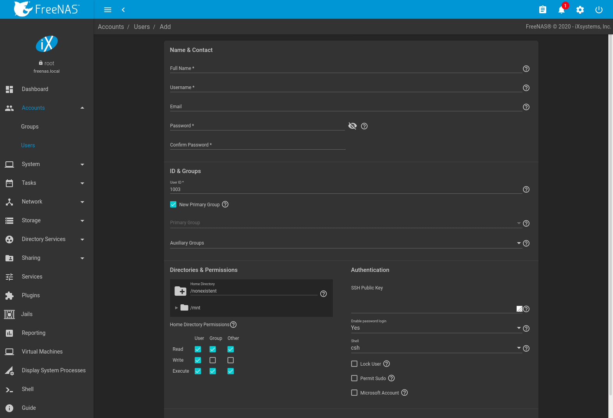

Accounts
========

`Accounts` is used to manage users and groups. This section contains
these entries:

-   `Groups`: used to manage UNIX-style groups on the
    FreeNAS® system.
-   `Users`: used to manage UNIX-style accounts on the
    FreeNAS® system.

Each entry is described in more detail in this section.

Groups

Groups
------

The Groups interface provides management of UNIX-style groups on the
FreeNAS® system.

Note

It is unnecessary to recreate the network users or groups when a
directory service is running on the same network. Instead, import the
existing account information into FreeNAS®. Refer to
`Directory Services` for details.

This section describes how to create a group and assign user accounts to
it. The `Groups` page lists all groups, including those built in and
used by the operating system.

The table displays group names, group IDs (GID), built-in groups, and
whether `sudo` is permitted. Clicking the ui-options icon on a
user-created group entry displays `Members`, `Edit`, and `Delete`
options. Click `Members` to view and modify the group membership.
Built-in groups are required by the FreeNAS® system and
cannot be edited or deleted.

Add Group, New Group, Create Group

The `ADD` button opens the screen shown in `Figure %s <new_group_fig>`.
`Table %s <new_group_tab>` summarizes the available options when
creating a group.

&gt;{RaggedRight}p{dimexpr 0.12linewidth-2tabcolsep}

| Setting              | Value    | Description                                                                                                                                                                                                                                                                                                                      |
|----------------------|----------|----------------------------------------------------------------------------------------------------------------------------------------------------------------------------------------------------------------------------------------------------------------------------------------------------------------------------------|
| GID                  | string   | The next available group ID is suggested. By convention, UNIX groups containing user accounts have an ID greater than 1000 and groups required by a service have an ID equal to the default port number used by the service. Example: the `sshd` group has an ID of 22. This setting cannot be edited once the group is created. |
| Name                 | string   | Enter an alphanumeric name for the new group. Group names cannot begin with a hyphen (`-`) or contain a space, tab, or these characters: *, : + & \# % ^ ( ) ! @ \~* ? &lt; &gt; =\* . *$* can only be used as the last character of the group name.                                                                             |
| Permit Sudo          | checkbox | Set to allow group members to use [sudo](https://www.sudo.ws/). When using `sudo`, a user is prompted for their own password.                                                                                                                                                                                                    |
| Allow Duplicate GIDs | checkbox | **Not recommended**. Allow more than one group to have the same group ID.                                                                                                                                                                                                                                                        |

Group Creation Options

To change which users are members of a group, expand the group from the
list and click `Members`. To add users to the group, select users in the
left frame and click `->`. To remove users from the group, select users
in the right frame and click `<-`. Click `SAVE` when finished changing
the group members.

`Figure %s <user_group_fig>`, shows adding a user as a member of a
group.

Delete Group, Remove Group

The `Delete` button deletes a group. The pop-up message asks if all
users with this primary group should also be deleted, and to confirm the
action. Note built-in groups do not have a `Delete` button.

Users

Users
-----

FreeNAS® supports users, groups, and permissions, allowing
flexibility in configuring which users have access to the data stored on
FreeNAS®. To assign permissions to shares, select one of
these options:

1.  Create a guest account for all users, or create a user account for
    every user in the network where the name of each account is the same
    as a login name used on a computer. For example, if a Windows system
    has a login name of *bobsmith*, create a user account with the name
    *bobsmith* on FreeNAS®. A common strategy is to create
    groups with different sets of permissions on shares, then assign
    users to those groups.
2.  If the network uses a directory service, import the existing account
    information using the instructions in `Directory Services`.

`Accounts --> Users` lists all system accounts installed with the
FreeNAS® operating system, as shown in
`Figure %s <managing_user_fig>`.

By default, each user entry displays the username, User ID (UID),
whether the user is built into FreeNAS®, and full name. This
table is adjustable by clicking `COLUMNS` and setting the desired
columns.

Clicking a column name sorts the list by that value. An arrow indicates
which column controls the view sort order. Click the arrow to reverse
the sort order.

Click ui-options on the user created account to display the `Edit` and
`Delete` buttons. Note built-in users do not have a `Delete` button.

Note

Setting the email address for the built-in *root* user account is
recommended as important system messages are sent to the *root* user.
For security reasons, password logins are disabled for the *root*
account and changing this setting is highly discouraged.

Except for the *root* user, the accounts that come with
FreeNAS® are system accounts. Each system account is used by
a service and should not be used as a login account. For this reason,
the default shell on system accounts is
[nologin(8)](https://www.freebsd.org/cgi/man.cgi?query=nologin). For
security reasons and to prevent breakage of system services, modifying
the system accounts is discouraged.

Add User, Create User, New User

The `ADD` button opens the screen shown in `Figure %s <add_user_fig>`.
`Table %s <user_account_conf_tab>` summarizes the options that are
available when user accounts are created or modified.

Warning

When using `Active Directory`, Windows user passwords must be set from
within Windows.

&gt;{RaggedRight}p{dimexpr 0.20linewidth-2tabcolsep}

<table>
<caption>User Account Configuration</caption>
<colgroup>
<col style="width: 16%" />
<col style="width: 10%" />
<col style="width: 73%" />
</colgroup>
<thead>
<tr class="header">
<th>Setting</th>
<th>Value</th>
<th>Description</th>
</tr>
</thead>
<tbody>
<tr class="odd">
<td>Username</td>
<td>string</td>
<td>Usernames can be up to 16 characters long. When using NIS or other legacy software with limited username lengths, keep usernames to eight characters or less for compatibility. Usernames cannot begin with a hyphen (<code>-</code>) or contain a space, tab, or these characters: <em>, : + &amp; # % ^ ( ) ! @ ~</em> ? &lt; &gt; =* . <em>$</em> can only be used as the last character of the username.</td>
</tr>
<tr class="even">
<td>Full Name</td>
<td>string</td>
<td>This field is mandatory and may contain spaces.</td>
</tr>
<tr class="odd">
<td>Email</td>
<td>string</td>
<td>The email address associated with the account.</td>
</tr>
<tr class="even">
<td>Password</td>
<td>string</td>
<td>Mandatory unless <code class="interpreted-text" role="guilabel">Disable Password</code> is <em>Yes</em>. Cannot contain a <code>?</code>. Click ui-password-show to view or obscure the password characters.</td>
</tr>
<tr class="odd">
<td>Confirm Password</td>
<td>string</td>
<td>Required to match the value of <code class="interpreted-text" role="guilabel">Password</code>.</td>
</tr>
<tr class="even">
<td>User ID</td>
<td>integer</td>
<td>Grayed out if the user already exists. When creating an account, the next numeric ID is suggested. By convention, user accounts have an ID greater than 1000 and system accounts have an ID equal to the default port number used by the service.</td>
</tr>
<tr class="odd">
<td>New Primary Group</td>
<td>checkbox</td>
<td>Set by default to create a new a primary group with the same name as the user. Unset to select a different primary group name.</td>
</tr>
<tr class="even">
<td>Primary Group</td>
<td>drop-down menu</td>
<td>Unset <code class="interpreted-text" role="guilabel">New Primary Group</code> to access this menu. For security reasons, FreeBSD will not give a user <code class="interpreted-text" role="command">su</code> permissions if <em>wheel</em> is not their primary group. To give a user <code class="interpreted-text" role="command">su</code> access, add them to the <em>wheel</em> group in <code class="interpreted-text" role="guilabel">Auxiliary groups</code>.</td>
</tr>
<tr class="odd">
<td>Auxiliary groups</td>
<td>drop-down menu</td>
<td>Select which groups the user will be added to.</td>
</tr>
<tr class="even">
<td>Home Directory</td>
<td>browse button</td>
<td>Choose a path to the user's home directory. If the directory exists and matches the username, it is set as the user's home directory. When the path does not end with a subdirectory matching the username, a new subdirectory is created. The full path to the user's home directory is shown here when editing a user.</td>
</tr>
<tr class="odd">
<td>Home Directory Permissions</td>
<td>checkboxes</td>
<td>Sets default Unix permissions of user's home directory. This is <strong>read-only</strong> for built-in users.</td>
</tr>
<tr class="even">
<td>SSH Public Key</td>
<td>string</td>
<td>Paste the user's <strong>public</strong> SSH key to be used for key-based authentication. <strong>Do not paste the private key!</strong></td>
</tr>
<tr class="odd">
<td>Disable Password</td>
<td>drop-down</td>
<td>
<em>Yes</em> : Disables the <code class="interpreted-text" role="guilabel">Password</code> fields and removes the password from the account. The account cannot use password-based logins for services. For example, disabling the password prevents using account credentials to log in to an SMB share or open an SSH session on the system. The <code class="interpreted-text" role="guilabel">Lock User</code> and <code class="interpreted-text" role="guilabel">Permit Sudo</code> options are also removed.

<em>No</em> : Requires adding a <code class="interpreted-text" role="guilabel">Password</code> to the account. The account can use the saved <code class="interpreted-text" role="guilabel">Password</code> to authenticate with password-based services.
</td>
</tr>
<tr class="even">
<td>Shell</td>
<td>drop-down menu</td>
<td>Select the shell to use for local and SSH logins. The <em>root</em> user shell is used for web interface <code class="interpreted-text" role="ref">Shell</code> sessions. See <code class="interpreted-text" role="numref">Table %s &lt;shells_tab&gt;</code> for an overview of available shells.</td>
</tr>
<tr class="odd">
<td>Lock User</td>
<td>checkbox</td>
<td>Prevent the user from logging in or using password-based services until this option is unset. Locking an account is only possible when <code class="interpreted-text" role="guilabel">Disable Password</code> is <em>No</em> and a <code class="interpreted-text" role="guilabel">Password</code> has been created for the account.</td>
</tr>
<tr class="even">
<td>Permit Sudo</td>
<td>checkbox</td>
<td>Give this user permission to use <a href="https://www.sudo.ws/">sudo</a>. When using sudo, a user is prompted for their account <code class="interpreted-text" role="guilabel">Password</code>.</td>
</tr>
<tr class="odd">
<td>Microsoft Account</td>
<td>checkbox</td>
<td>Set if the user is connecting from a Windows 8 or newer system or when using a Microsoft cloud service.</td>
</tr>
</tbody>
</table>

User Account Configuration

Note

Some fields cannot be changed for built-in users and are grayed out.

&gt;{RaggedRight}p{dimexpr 0.66linewidth-2tabcolsep}\|

| Shell     | Description                                                                                                                                                |
|-----------|------------------------------------------------------------------------------------------------------------------------------------------------------------|
| csh       | [C shell](https://en.wikipedia.org/wiki/C_shell)                                                                                                           |
| sh        | [Bourne shell](https://en.wikipedia.org/wiki/Bourne_shell)                                                                                                 |
| tcsh      | [Enhanced C shell](https://en.wikipedia.org/wiki/Tcsh)                                                                                                     |
| bash      | [Bourne Again shell](https://en.wikipedia.org/wiki/Bash_%28Unix_shell%29)                                                                                  |
| ksh93     | [Korn shell](http://www.kornshell.com/)                                                                                                                    |
| mksh      | [mirBSD Korn shell](https://www.mirbsd.org/mksh.htm)                                                                                                       |
| rbash     | [Restricted bash](http://www.gnu.org/software/bash/manual/html_node/The-Restricted-Shell.html)                                                             |
| rzsh      | [Restricted zsh](http://www.csse.uwa.edu.au/programming/linux/zsh-doc/zsh_14.html)                                                                         |
| scponly   | Select [scponly](https://github.com/scponly/scponly/wiki) to restrict the user's SSH usage to only the `scp` and `sftp` commands.                          |
| zsh       | [Z shell](http://www.zsh.org/)                                                                                                                             |
| git-shell | [restricted git shell](https://git-scm.com/docs/git-shell)                                                                                                 |
| nologin   | Use when creating a system account or to create a user account that can authenticate with shares but which cannot login to the FreeNAS system using `ssh`. |

Available Shells

Remove User, Delete User

Built-in user accounts needed by the system cannot be removed. A
`Delete` button appears for custom users that were added by the system
administrator. Clicking `Delete` opens a popup window to confirm the
action and offer an option to keep the user primary group when the user
is deleted.
