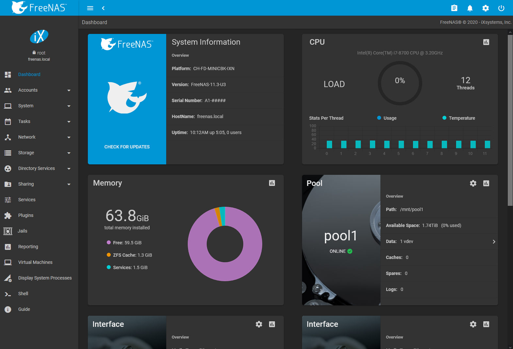

Booting
=======

The Console Setup menu, shown in `Figure %s <console_setup_menu_fig>`,
appears at the end of the boot process. If the FreeNAS®
system has a keyboard and monitor, this Console Setup menu can be used
to administer the system.

Note

When connecting to the FreeNAS® system with SSH or the web
`Shell`, the Console Setup menu is not shown by default. It can be
started by the *root* user or another user with root permissions by
typing `/etc/netcli`.

The Console Setup menu can be disabled by unchecking
`Enable Console Menu` in `System --> Advanced`.

The menu provides these options:

`1) Configure Network Interfaces` provides a configuration wizard to set
up the system's network interfaces.

`2) Configure Link Aggregation` is for creating or deleting link
aggregations.

`3) Configure VLAN Interface` is used to create or delete VLAN
interfaces.

`4) Configure Default Route` is used to set the IPv4 or IPv6 default
gateway. When prompted, enter the IP address of the default gateway.

`5) Configure Static Routes` prompts for the destination network and
gateway IP address. Re-enter this option for each static route needed.

`6) Configure DNS` prompts for the name of the DNS domain and the IP
address of the first DNS server. When adding multiple DNS servers, press
`Enter` to enter the next one. Press `Enter` twice to leave this option.

`7) Reset Root Password` is used to reset a lost or forgotten `root`
password. Select this option and follow the prompts to set the password.

`8) Reset Configuration to Defaults` **Caution**! This option deletes
*all* of the configuration settings made in the administrative GUI and
is used to reset a FreeNAS® system back to defaults. **Before
selecting this option, make a full backup of all data and make sure all
encryption keys and passphrases are known!** After this option is
selected, the configuration is reset to defaults and the system reboots.
`Storage --> Pools --> Import Pool` can be used to re-import pools.

`9) Shell` starts a shell for running FreeBSD commands. To leave the
shell, type `exit`.

`10) Reboot` reboots the system.

`11) Shut Down` shuts down the system.

Note

The numbering and quantity of options on this menu can change due to
software updates, service agreements, or other factors. Please carefully
check the menu before selecting an option, and keep this in mind when
writing local procedures.

Obtaining an IP Address
-----------------------

During boot, FreeNAS® automatically attempts to connect to a
DHCP server from all live network interfaces. After FreeNAS®
successfully receives an IP address, the address is displayed so it can
be used to access the web interface. The example in
`Figure %s <console_setup_menu_fig>` shows a FreeNAS® system
that is accessible at *http://10.0.0.102*.

Some FreeNAS® systems are set up without a monitor, making it
challenging to determine which IP address has been assigned. On networks
that support Multicast DNS (mDNS), the hostname and domain can be
entered into the address bar of a browser. By default, this value is
*freenas.local*.

If the FreeNAS® server is not connected to a network with a
DHCP server, use the console network configuration menu to manually
configure the interface as shown here. In this example, the
FreeNAS® system has one network interface, *em0*.

    Enter an option from 1-11: 1
    1) em0
    Select an interface (q to quit): 1
    Remove the current settings of this interface? (This causes a momentary disconnec
    tion of the network.) (y/n) n
    Configure interface for DHCP? (y/n) n
    Configure IPv4? (y/n) y
    Interface name:     (press enter, the name can be blank)
    Several input formats are supported
    Example 1 CIDR Notation:
        192.168.1.1/24
    Example 2 IP and Netmask separate:
        IP: 192.168.1.1
        Netmask: 255.255.255.0, or /24 or 24
    IPv4 Address: 192.168.1.108/24
    Saving interface configuration: Ok
    Configure IPv6? (y/n) n
    Restarting network: ok

    ...

    The web user interface is at
    http://192.168.1.108

GUI Access, Web Interface

Accessing the web interface ----------------------

On a computer that can access the same network as the
FreeNAS® system, enter the IP address in a web browser to
connect to the web interface. The password for the root user is
requested.

Enter the password chosen during the installation. A prompt is shown to
set a root password if it was not set during installation.

The web interface is displayed after login:

The `Dashboard` shows details about the system. These details are
grouped into sections about the hardware components, networking,
storage, and other categories.

web interface Troubleshooting
-----------------------------

If the user interface is not accessible by IP address from a browser,
check these things:

-   Are proxy settings enabled in the browser configuration? If so,
    disable the settings and try connecting again.
-   If the page does not load, make sure that a `ping` reaches the
    FreeNAS® system's IP address. If the address is in a
    private IP address range, it is only accessible from within that
    private network.

If the UI becomes unresponsive after an upgrade or other system
operation, clear the site data and refresh the browser.

The rest of this User Guide describes the FreeNAS® web
interface in more detail. The layout of this User Guide follows the
order of the menu items in the tree located in the left frame of the web
interface.
