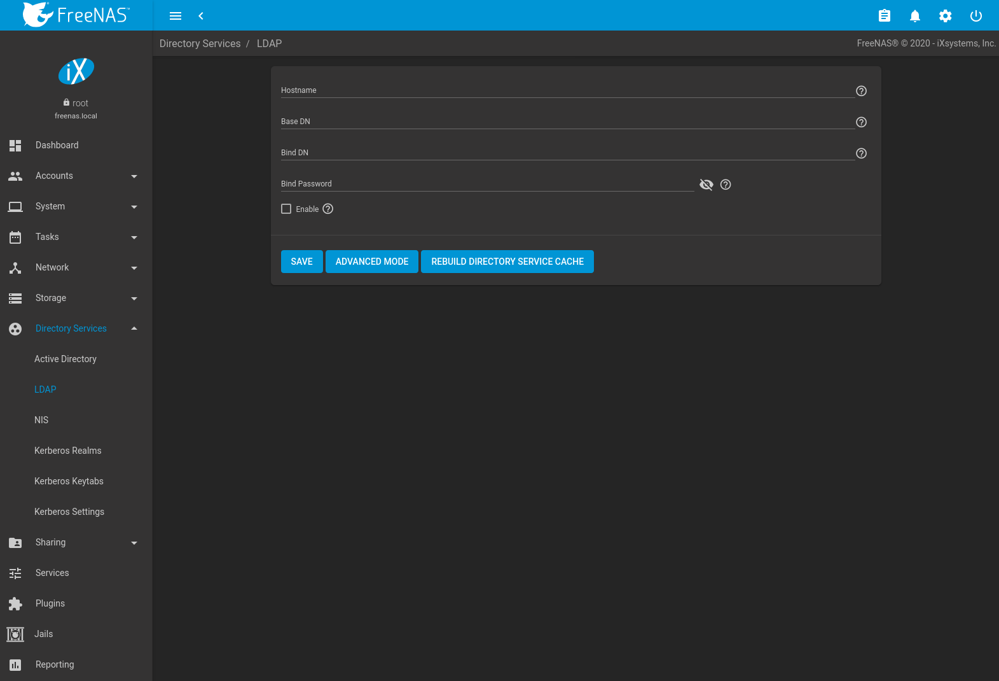
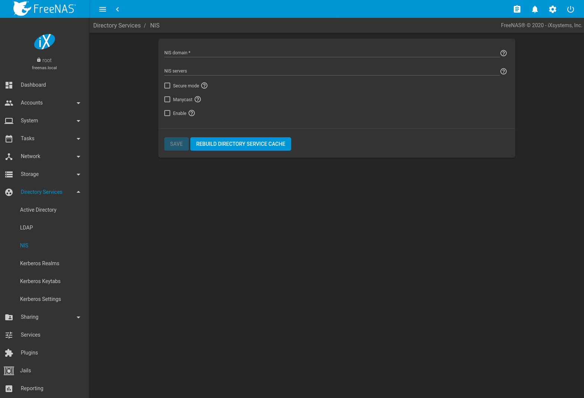

Directory Services
==================

FreeNAS® supports integration with these directory services:

-   `Active Directory` (for Windows 2000 and higher networks)
-   `LDAP`
-   `NIS`

FreeNAS® also supports `Kerberos Realms`, `Kerberos Keytabs`,
and the ability to add more parameters to `Kerberos Settings`.

This section summarizes each of these services and the available
configuration options within the FreeNAS® web interface.
After successfully enabling a directory service, alert-icon-info appears
in the top toolbar row. Click alert-icon-info to show the
`Directory Services Monitor` menu. This menu shows the name and status
of each directory service.

Active Directory
----------------

Active Directory (AD) is a service for sharing resources in a Windows
network. AD can be configured on a Windows server that is running
Windows Server 2000 or higher or on a Unix-like operating system that is
running [Samba version
4](https://wiki.samba.org/index.php/Setting_up_Samba_as_an_Active_Directory_Domain_Controller#Provisioning_a_Samba_Active_Directory).
Since AD provides authentication and authorization services for the
users in a network, it is not necessary to recreate the same user
accounts on the FreeNAS® system. Instead, configure the
Active Directory service so account information and imported users can
be authorized to access the SMB shares on the FreeNAS®
system.

Many changes and improvements have been made to Active Directory support
within FreeNAS®. It is strongly recommended to update the
system to the latest FreeNAS® before attempting Active
Directory integration.

Ensure name resolution is properly configured before configuring the
Active Directory service. `ping` the domain name of the Active Directory
domain controller from `Shell` on the FreeNAS® system. If the
`ping` fails, check the DNS server and default gateway settings in
`Network --> Global Configuration` on the FreeNAS® system.

By default, `Allow DNS updates` in the
`Active Directory options <ad_tab>` is enabled. This adds
FreeNAS®
`SMB 'Bind IP Addresses' <global_smb_config_opts_tab>` DNS records to
the Active Directory DNS when the domain is joined. Disabling
`Allow DNS updates` means that the Active Directory DNS records must be
updated manually.

Active Directory relies on Kerberos, a time-sensitive protocol. During
the domain join process the [PDC emulator FSMO
role](https://docs.microsoft.com/en-us/openspecs/windows_protocols/ms-adts/f96ff8ec-c660-4d6c-924f-c0dbbcac1527)
server is added as the preferred NTP server. The time on the
FreeNAS® system and the Active Directory Domain Controller
cannot be out of sync by more than five minutes in a default Active
Directory environment. An `alert` is sent when the time is out of sync.

To ensure both systems are set to the same time:

-   use the same NTP server (set in `System --> NTP Servers` on the
    FreeNAS® system)
-   set the same timezone
-   set either localtime or universal time at the BIOS level

`Figure %s <ad_fig>` shows `Directory Services --> Active Directory`
settings.

`Table %s <ad_tab>` describes the configurable options. Some settings
are only available in Advanced Mode. Click the `ADVANCED MODE` button to
show the Advanced Mode settings. Go to `System --> Advanced` and set the
`Show advanced fields by default` option to always show advanced
options.

&gt;{RaggedRight}p{dimexpr 0.14linewidth-2tabcolsep}
&gt;{RaggedRight}p{dimexpr 0.54linewidth-2tabcolsep}\|

<table>
<caption>Active Directory Configuration Options</caption>
<colgroup>
<col style="width: 14%" />
<col style="width: 8%" />
<col style="width: 6%" />
<col style="width: 70%" />
</colgroup>
<thead>
<tr class="header">
<th>Setting</th>
<th>Value</th>
<th>Advanced Mode</th>
<th>Description</th>
</tr>
</thead>
<tbody>
<tr class="odd">
<td>Domain Name</td>
<td>string</td>
<td></td>
<td>Name of the Active Directory domain (<em>example.com</em>) or child domain (<em>sales.example.com</em>). This field is mandatory. <code class="interpreted-text" role="guilabel">Save</code> will be inactive until valid input is entered. Hidden when a <code class="interpreted-text" role="guilabel">Kerberos Principal</code> is selected.</td>
</tr>
<tr class="even">
<td>Domain Account Name</td>
<td>string</td>
<td></td>
<td>Name of the Active Directory administrator account. This field is mandatory. <code class="interpreted-text" role="guilabel">Save</code> will be inactive until valid input is entered. Hidden when a <code class="interpreted-text" role="guilabel">Kerberos Principal</code> is selected.</td>
</tr>
<tr class="odd">
<td>Domain Account Password</td>
<td>string</td>
<td></td>
<td>Password for the Active Directory administrator account. Required the first time a domain is configured. After initial configuration, the password is not needed to edit, start, or stop the service.</td>
</tr>
<tr class="even">
<td>Encryption Mode</td>
<td>drop-down</td>
<td>✓</td>
<td>Choices are <em>Off</em>, <em>SSL (LDAPS protocol port 636)</em>, or <em>TLS (LDAP protocol port 389)</em>. See <a href="http://info.ssl.com/article.aspx?id=10241">http://info.ssl.com/article.aspx?id=10241</a> and <a href="https://hpbn.co/transport-layer-security-tls/">https://hpbn.co/transport-layer-security-tls/</a> for more information about SSL and TLS.</td>
</tr>
<tr class="odd">
<td>Certificate</td>
<td>drop-down menu</td>
<td>✓</td>
<td>
Select the Active Directory server certificate if SSL connections are used. If a certificate does not exist, create or import a <code class="interpreted-text" role="ref">Certificate Authority &lt;CAs&gt;</code>, then create a certificate on the Active Directory server. Import the certificate to the FreeNAS® system using the <code class="interpreted-text" role="ref">Certificates</code> menu. It is recommended to leave this drop-down unset when configuring LDAPs.

To clear a saved certificate, choose the blank entry and click <code class="interpreted-text" role="guilabel">SAVE</code>.
</td>
</tr>
<tr class="even">
<td>Validate Certificate</td>
<td>checkbox</td>
<td>✓</td>
<td>Check server certificates in a TLS session.</td>
</tr>
<tr class="odd">
<td>Verbose logging</td>
<td>checkbox</td>
<td>✓</td>
<td>Set to log attempts to join the domain to <code class="interpreted-text" role="file">/var/log/messages</code>.</td>
</tr>
<tr class="even">
<td>Allow Trusted Domains</td>
<td>checkbox</td>
<td>✓</td>
<td>Do not set this unless the network has active <a href="https://docs.microsoft.com/en-us/previous-versions/windows/it-pro/windows-server-2003/cc757352(v=ws.10)">domain/forest trusts</a> and managing files on multiple domains is required. Setting this option generates more winbindd traffic and slows down filtering with user and group information. If enabled, also configuring the idmap ranges and a backend for each trusted domain in the environment is recommended.</td>
</tr>
<tr class="odd">
<td>Use Default Domain</td>
<td>checkbox</td>
<td>✓</td>
<td>Unset to prepend the domain name to the username. Unset to prevent name collisions when <code class="interpreted-text" role="guilabel">Allow Trusted Domains</code> is set and multiple domains use the same username.</td>
</tr>
<tr class="even">
<td>Allow DNS updates</td>
<td>checkbox</td>
<td>✓</td>
<td>Set to enable Samba to do DNS updates when joining a domain.</td>
</tr>
<tr class="odd">
<td>Disable FreeNAS Cache</td>
<td>checkbox</td>
<td>✓</td>
<td>Disable caching AD users and groups. Setting this hides all AD users and groups from web interface drop-down menus and auto-completion suggestions, but manually entering names is still allowed. This can help when unable to bind to a domain with a large number of users or groups.</td>
</tr>
<tr class="even">
<td>Site Name</td>
<td>string</td>
<td>✓</td>
<td>Auto-detected site name. Do not change this unless the detected site name is incorrect for the particular AD environment.</td>
</tr>
<tr class="odd">
<td>Kerberos Realm</td>
<td>drop-down menu</td>
<td>✓</td>
<td>Select the realm created using the instructions in <code class="interpreted-text" role="ref">Kerberos Realms</code>.</td>
</tr>
<tr class="even">
<td>Kerberos Principal</td>
<td>drop-down menu</td>
<td>✓</td>
<td>Select a keytab created using the instructions in <code class="interpreted-text" role="ref">Kerberos Keytabs</code>. Selecting a principal hides the <code class="interpreted-text" role="guilabel">Domain Account Name</code> and <code class="interpreted-text" role="guilabel">Domain Account Password</code> fields. An existing account name is not overwritten by the principal.</td>
</tr>
<tr class="odd">
<td>Computer Account OU</td>
<td>string</td>
<td>✓</td>
<td>The OU in which new computer accounts are created. The OU string is read from top to bottom without RDNs. Slashes (<code>/</code>) are used as delimiters, like <code class="interpreted-text" role="samp">Computers/Servers/NAS</code>. The backslash (<code>\\</code>) is used to escape characters but not as a separator. Backslashes are interpreted at multiple levels and might require doubling or even quadrupling to take effect. When this field is blank, new computer accounts are created in the Active Directory default OU.</td>
</tr>
<tr class="even">
<td>AD Timeout</td>
<td>integer</td>
<td>✓</td>
<td>Increase the number of seconds before timeout if the AD service does not immediately start after connecting to the domain.</td>
</tr>
<tr class="odd">
<td>DNS Timeout</td>
<td>integer</td>
<td>✓</td>
<td>Increase the number of seconds before a timeout occurs if AD DNS queries timeout.</td>
</tr>
<tr class="even">
<td>Idmap backend</td>
<td>drop-down menu and Edit Idmap button</td>
<td>✓</td>
<td>Choose the backend to map Windows security identifiers (SIDs) to UNIX UIDs and GIDs. See <code class="interpreted-text" role="numref">Table %s &lt;id_map_backends_tab&gt;</code> for a summary of the available backends. Click <code class="interpreted-text" role="guilabel">Edit Idmap</code> to configure the selected backend.</td>
</tr>
<tr class="odd">
<td>Windbind NSS Info</td>
<td>drop-down menu</td>
<td>✓</td>
<td>Choose the schema to use when querying AD for user/group information. <em>rfc2307</em> uses the RFC2307 schema support included in Windows 2003 R2, <em>sfu</em> is for Services For Unix 3.0 or 3.5, and <em>sfu20</em> is for Services For Unix 2.0.</td>
</tr>
<tr class="even">
<td>SASL wrapping</td>
<td>drop-down menu</td>
<td>✓</td>
<td>
Choose how LDAP traffic is transmitted. Choices are <em>PLAIN</em> (plain text), <em>SIGN</em> (signed only), or <em>SEAL</em> (signed and encrypted). Windows 2000 SP3 and newer can be configured to enforce signed LDAP connections. This should be set to <em>PLAIN</em> when using Microsft Active Directory.

This can be set to <em>SIGN</em> or <em>SEAL</em> when using Samba Active Directory if <em>allow sasl over tls</em> has been explicitly enabled in the Samba Domain Controller configuration.
</td>
</tr>
<tr class="odd">
<td>Enable (requires password or Kerberos principal)</td>
<td>checkbox</td>
<td></td>
<td>Activate the Active Directory service.</td>
</tr>
<tr class="even">
<td>Netbios Name</td>
<td>string</td>
<td>✓</td>
<td>Name for the computer object generated in AD. Limited to 15 characters. Automatically populated with the original hostname of the system. This <strong>must</strong> be different from the <em>Workgroup</em> name.</td>
</tr>
<tr class="odd">
<td>NetBIOS alias</td>
<td>string</td>
<td>✓</td>
<td>Limited to 15 characters.</td>
</tr>
</tbody>
</table>

Active Directory Configuration Options

`Table %s <id_map_backends_tab>` summarizes the backends which are
available in the `Idmap backend` drop-down menu. Each backend has its
own [man page](http://samba.org.ru/samba/docs/man/manpages/) that gives
implementation details.

Changing idmap backends automatically refreshes the `windbind` resolver
cache by sending SIGHUP (signal hang up) to the parent `windbindd`
process. To find this parent process, start an `SSH` session with the
FreeNAS® system and enter `service samba_server status`. To
manually send the SIGHUP, enter `kill -HUP {pid}`, where *pid* is the
parent process ID.

&gt;{RaggedRight}p{dimexpr 0.66linewidth-2tabcolsep}\|

| Value   | Description                                                                                                                                                                                                                                                                                           |
|---------|-------------------------------------------------------------------------------------------------------------------------------------------------------------------------------------------------------------------------------------------------------------------------------------------------------|
| ad      | AD server uses RFC2307 or Services For Unix schema extensions. Mappings must be provided in advance by adding the uidNumber attributes for users and gidNumber attributes for groups in the AD.                                                                                                       |
| autorid | Similar to `rid`, but automatically configures the range to be used for each domain, so there is no need to specify a specific range for each domain in the forest. The only needed configuration is the range of UID or GIDs to use for user and group mappings and an optional size for the ranges. |
| ldap    | Stores and retrieves mapping tables in an LDAP directory service. Default for LDAP directory service.                                                                                                                                                                                                 |
| nss     | Provides a simple means of ensuring that the SID for a Unix user is reported as the one assigned to the corresponding domain user.                                                                                                                                                                    |
| rfc2307 | IDs for AD users stored as [RFC2307](https://tools.ietf.org/html/rfc2307) ldap schema extensions. This module can either look up the IDs in the AD LDAP servers or an external (non-AD) LDAP server.                                                                                                  |
| rid     | Default for AD. Requires an explicit idmap configuration for each domain, using disjoint ranges where a writeable default idmap range is to be defined, using a backend like tdb or ldap.                                                                                                             |
| script  | Stores mapping tables for clustered environments in the winbind\_cache tdb.                                                                                                                                                                                                                           |
| tdb     | Default backend used by winbindd for storing mapping tables.                                                                                                                                                                                                                                          |

ID Mapping Backends

`REBUILD DIRECTORY SERVICE CACHE` immediately refreshes the web
interface directory service cache. This occurs automatically once a day
as a cron job.

If there are problems connecting to the realm,
[verify](https://support.microsoft.com/en-us/help/909264/naming-conventions-in-active-directory-for-computers-domains-sites-and)
the settings do not include any disallowed characters. Active Directory
does not allow `$` characters in Domain or NetBIOS names. The length of
those names is also limited to 15 characters. The Administrator account
password cannot contain the *$* character.

It can take a few minutes after configuring the Active Directory service
for the AD information to be populated to the FreeNAS®
system. To check the AD join progress, open the web interface Task
Manager in the upper-right corner. Any errors during the join process
are also displayed in the Task Manager.

Once populated, the AD users and groups will be available in the
drop-down menus of the `Permissions` screen of a dataset.

The Active Directory users and groups that are imported to the
FreeNAS® system are shown by typing commands in the
FreeNAS® `shell`:

-   View users: `wbinfo -u`
-   View groups: `wbinfo -g`

In addition, `wbinfo -m` shows the domains and `wbinfo -t` tests the
connection. When successful, `wbinfo -t` shows a message similar to:

    checking the trust secret for domain YOURDOMAIN via RPC calls succeeded

To manually check that a specified user can authenticate, open the
`shell` and enter
`smbclient//127.0.0.1/{SHARE} -U {DOMAIN}\\{username}`, where *SHARE* is
the SMB share name, *DOMAIN* is the name of the trusted domain, and
*username* is the user account for authentication testing.

`getent passwd` and `getent group` can provide more troubleshooting
information if no users or groups are listed in the output.

Tip

Sometimes network users do not appear in the drop-down menu of a
`Permissions` screen but the `wbinfo` commands display these users. This
is typically due to the FreeNAS® system taking longer than
the default ten seconds to join Active Directory. Increase the value of
`AD timeout` to 60 seconds.

### Leaving the Domain

A `Leave Domain` button appears on the service dialog when a domain is
connected. To leave the domain, click the button and enter credentials
with privileges sufficient to permit leaving.

### Troubleshooting Tips

Active Directory uses DNS to determine the location of the domain
controllers and global catalog servers in the network. Use
`host -t srv _ldap._tcp.{domainname.com}` to determine the SRV records
of the network and change the weight and/or priority of the SRV record
to reflect the fastest server. More information about SRV records can be
found in the Technet article [How DNS Support for Active Directory
Works](https://docs.microsoft.com/en-us/previous-versions/windows/it-pro/windows-server-2003/cc759550(v=ws.10)).

The realm used depends on the priority in the SRV DNS record. DNS can
override the system Active Directory settings. When unable to connect to
the correct realm, check the SRV records on the DNS server.

An expired password for the administrator account will cause `kinit` to
fail. Ensure the password is still valid and double-check the password
on the AD account being used does not include any spaces, special
symbols, and is not unusually long.

If the Windows server version is lower than 2008 R2, try creating a
`Computer` entry on the Windows server Organizational Unit (OU). When
creating this entry, enter the FreeNAS® hostname in the
`name` field. Make sure it is under 15 characters, the same name as the
one set in the `Hostname` field in `Network --> Global Configuration`,
and the same `NetBIOS alias` in
`Directory Service --> Active Directory --> Advanced` settings.

If the cache becomes out of sync due to an AD server being taken off and
back online, resync the cache using
`Directory Service --> Active Directory --> REBUILD DIRECTORY SERVICE CACHE`.

If any of the commands fail or result in a traceback, create a bug
report at &lt;https://bugs.ixsystems.com&gt;. Include the
commands in the order in which they were run and the exact wording of
the error message or traceback.

LDAP
----

FreeNAS® includes an [OpenLDAP](http://www.openldap.org/)
client for accessing information from an LDAP server. An LDAP server
provides directory services for finding network resources such as users
and their associated permissions. Examples of LDAP servers include Mac
OS X Server, Novell eDirectory, and OpenLDAP running on a BSD or Linux
system. If an LDAP server is running on the network, configure the
FreeNAS® LDAP service so network users can authenticate to
the LDAP server and have authorized access to the data stored on the
FreeNAS® system.

Note

LDAP authentication for SMB shares is disabled unless the LDAP directory
has been configured for and populated with Samba attributes. The most
popular script for performing this task is
[smbldap-tools](https://wiki.samba.org/index.php/4.1_smbldap-tools). The
LDAP server must support SSL/TLS and the certificate for the LDAP server
CA must be imported with `System --> CAs --> Import CA`. Non-CA
certificates are not currently supported.

Tip

Apple's [Open
Directory](https://manuals.info.apple.com/MANUALS/0/MA954/en_US/Open_Directory_Admin_v10.5_3rd_Ed.pdf)
is an LDAP-compatible directory service into which FreeNAS®
can be integrated. The forum post [FreeNAS with Open Directory in Mac OS
X
environments](https://forums.freenas.org/index.php?threads/howto-freenas-with-open-directory-in-mac-os-x-environments.46493/)
has more information.

`Figure %s <ldap_config_fig>` shows the LDAP Configuration section from
`Directory Services --> LDAP`.

`Table %s <ldap_config_tab>` summarizes the available configuration
options. Some settings are only available in Advanced Mode. Click the
`ADVANCED MODE` button to show the Advanced Mode settings. Go to
`System --> Advanced` and set the `Show advanced fields by default`
option to always show advanced options.

Those new to LDAP terminology should read the [OpenLDAP Software 2.4
Administrator's Guide](http://www.openldap.org/doc/admin24/).

&gt;{RaggedRight}p{dimexpr 0.14linewidth-2tabcolsep}
&gt;{RaggedRight}p{dimexpr 0.54linewidth-2tabcolsep}\|

<table>
<caption>LDAP Configuration Options</caption>
<colgroup>
<col style="width: 16%" />
<col style="width: 10%" />
<col style="width: 7%" />
<col style="width: 65%" />
</colgroup>
<thead>
<tr class="header">
<th>Setting</th>
<th>Value</th>
<th>Advanced Mode</th>
<th>Description</th>
</tr>
</thead>
<tbody>
<tr class="odd">
<td>Hostname</td>
<td>string</td>
<td></td>
<td>LDAP server hostnames or IP addresses. Separate entries with an empty space. Multiple hostnames or IP addresses can be entered to create an LDAP failover priority list. If a host does not respond, the next host in the list is tried until a new connection is established.</td>
</tr>
<tr class="even">
<td>Base DN</td>
<td>string</td>
<td></td>
<td>Top level of the LDAP directory tree to be used when searching for resources (Example: <em>dc=test,dc=org</em>).</td>
</tr>
<tr class="odd">
<td>Bind DN</td>
<td>string</td>
<td></td>
<td>Administrative account name on the LDAP server (Example: <em>cn=Manager,dc=test,dc=org</em>).</td>
</tr>
<tr class="even">
<td>Bind Password</td>
<td>string</td>
<td></td>
<td>Password for the <code class="interpreted-text" role="guilabel">Bind DN</code>. Click <code class="interpreted-text" role="guilabel">SHOW/HIDE PASSWORDS</code> to view or obscure the password characters.</td>
</tr>
<tr class="odd">
<td>Allow Anonymous Binding</td>
<td>checkbox</td>
<td>✓</td>
<td>Instruct the LDAP server to disable authentication and allow read and write access to any client.</td>
</tr>
<tr class="even">
<td>Kerberos Realm</td>
<td>drop-down menu</td>
<td>✓</td>
<td>The realm created using the instructions in <code class="interpreted-text" role="ref">Kerberos Realms</code>.</td>
</tr>
<tr class="odd">
<td>Kerberos Principal</td>
<td>drop-down menu</td>
<td>✓</td>
<td>The location of the principal in the keytab created as described in <code class="interpreted-text" role="ref">Kerberos Keytabs</code>.</td>
</tr>
<tr class="even">
<td>Encryption Mode</td>
<td>drop-down menu</td>
<td>✓</td>
<td>
Options for encrypting the LDAP connection:

<ul>
<li><em>OFF:</em> do not encrypt the LDAP connection.</li>
<li><em>ON:</em> encrypt the LDAP connection with SSL on port <code>636</code>.</li>
<li><em>START_TLS:</em> encrypt the LDAP connection with STARTTLS on the default LDAP port <code>389</code>.</li>
</ul></td>
</tr>
<tr class="odd">
<td>Certificate</td>
<td>drop-down menu</td>
<td>✓</td>
<td><code class="interpreted-text" role="ref">Certificate &lt;Certificates&gt;</code> to use when performing LDAP certificate-based authentication. To configure LDAP certificate-based authentication, create a Certificate Signing Request for the LDAP provider to sign. A certificate is not required when using username/password or Kerberos authentication.</td>
</tr>
<tr class="even">
<td>Validate Certificate</td>
<td>checkbox</td>
<td>✓</td>
<td>Verify certificate authenticity.</td>
</tr>
<tr class="odd">
<td>Disable LDAP User/Group Cache</td>
<td>checkbox</td>
<td>✓</td>
<td>Disable caching LDAP users and groups in large LDAP environments. When caching is disabled, LDAP users and groups do not appear in dropdown menus, but are still accepted when manually entered.</td>
</tr>
<tr class="even">
<td>LDAP timeout</td>
<td>integer</td>
<td>✓</td>
<td>Increase this value in seconds if obtaining a Kerberos ticket times out.</td>
</tr>
<tr class="odd">
<td>DNS timeout</td>
<td>integer</td>
<td>✓</td>
<td>Increase this value in seconds if DNS queries timeout.</td>
</tr>
<tr class="even">
<td>Idmap Backend</td>
<td>drop-down menu</td>
<td>✓</td>
<td>Backend used to map Windows security identifiers (SIDs) to UNIX UIDs and GIDs. See <code class="interpreted-text" role="numref">Table %s &lt;id_map_backends_tab&gt;</code> for a summary of the available backends. To configure the selected backend, click <code class="interpreted-text" role="guilabel">EDIT IDMAP</code>.</td>
</tr>
<tr class="odd">
<td>Samba Schema</td>
<td>checkbox</td>
<td>✓</td>
<td>Set if LDAP authentication for SMB shares is required <strong>and</strong> the LDAP server is <strong>already</strong> configured with Samba attributes.</td>
</tr>
<tr class="even">
<td>Auxiliary Parameters</td>
<td>string</td>
<td>✓</td>
<td>Additional options for <a href="https://arthurdejong.org/nss-pam-ldapd/nslcd.conf.5">nslcd.conf</a>.</td>
</tr>
<tr class="odd">
<td>Schema</td>
<td>drop-down menu</td>
<td>✓</td>
<td>If <code class="interpreted-text" role="guilabel">Samba Schema</code> is set, select the schema to use. Choices are <em>rfc2307</em> and <em>rfc2307bis</em>.</td>
</tr>
<tr class="even">
<td>Enable</td>
<td>checkbox</td>
<td></td>
<td>Unset to disable the configuration without deleting it.</td>
</tr>
</tbody>
</table>

LDAP Configuration Options

LDAP users and groups appear in the drop-down menus of the `Permissions`
screen of a dataset after configuring the LDAP service. Type
`getent passwd` in the FreeNAS® `Shell` to verify the users
have been imported. Type `getent group` to verify the groups have been
imported. When the `Samba Schema` is enabled, LDAP users also appear in
the output of `pdbedit -L`.

If the users and groups are not listed, refer to [Common errors
encountered when using OpenLDAP
Software](http://www.openldap.org/doc/admin24/appendix-common-errors.html)
for common errors and how to fix them.

Any LDAP bind errors are displayed during the LDAP bind process. When
troubleshooting LDAP, you can open the FreeNAS® `Shell` and
find `nslcd.conf` errors in `/var/log/messages`. When `Samba schema` is
enabled, any Samba errors are recorded in `/var/log/samba4/log.smbd`.
Additional details are saved in `/var/log/middlewared.log`.

To clear LDAP users and groups from FreeNAS®, go to
`Directory Services --> LDAP`, clear the `Hostname` field, unset
`Enable`, and click `SAVE`. Confirm LDAP users and groups are cleared by
going to the `Shell` and viewing the output of the `getent passwd` and
`getent group` commands.

NIS
---

The Network Information Service (NIS) maintains and distributes a
central directory of Unix user and group information, hostnames, email
aliases, and other text-based tables of information. If an NIS server is
running on the network, the FreeNAS® system can be configured
to import the users and groups from the NIS directory.

Click the `Rebuild Directory Service Cache` button if a new NIS user
needs immediate access to FreeNAS®. This occurs automatically
once a day as a cron job.

Note

In Windows Server 2016, Microsoft removed the Identity Management for
Unix (IDMU) and NIS Server Role. See [Clarification regarding the status
of Identity Management for Unix (IDMU) & NIS Server Role in Windows
Server 2016 Technical Preview and
beyond](https://blogs.technet.microsoft.com/activedirectoryua/2016/02/09/identity-management-for-unix-idmu-is-deprecated-in-windows-server/).

`Figure %s <nis_fig>` shows the `Directory Services --> NIS` section.
`Table %s <nis_config_tab>` summarizes the configuration options.

&gt;{RaggedRight}p{dimexpr 0.20linewidth-2tabcolsep}

| Setting     | Value    | Description                                                                                                                                             |
|-------------|----------|---------------------------------------------------------------------------------------------------------------------------------------------------------|
| NIS domain  | string   | Name of NIS domain.                                                                                                                                     |
| NIS servers | string   | Comma-delimited list of hostnames or IP addresses.                                                                                                      |
| Secure mode | checkbox | Set to have [ypbind(8)](https://www.freebsd.org/cgi/man.cgi?query=ypbind) refuse to bind to any NIS server not running as root on a TCP port over 1024. |
| Manycast    | checkbox | Set to have `ypbind` to bind to the server that responds the fastest. This is useful when no local NIS server is available on the same subnet.          |
| Enable      | checkbox | Unset to disable the configuration without deleting it.                                                                                                 |

NIS Configuration Options

Kerberos Realms
---------------

A default Kerberos realm is created for the local system in
FreeNAS®. `Directory Services --> Kerberos Realms` can be
used to view and add Kerberos realms. If the network contains a Key
Distribution Center (KDC), click `ADD` to add the realm. The
configuration screen is shown in `Figure %s <ker_realm_fig>`.

`Table %s <ker_realm_config_tab>` summarizes the configurable options.
Some settings are only available in Advanced Mode. To see these
settings, either click `ADVANCED MODE` or configure the system to always
display these settings by setting `Show advanced fields by default` in
`System --> Advanced`.

&gt;{RaggedRight}p{dimexpr 0.14linewidth-2tabcolsep}
&gt;{RaggedRight}p{dimexpr 0.54linewidth-2tabcolsep}\|

| Setting         | Value  | Advanced Mode | Description                                             |
|-----------------|--------|---------------|---------------------------------------------------------|
| Realm           | string |               | Name of the realm.                                      |
| KDC             | string | ✓             | Name of the Key Distribution Center.                    |
| Admin Server    | string | ✓             | Server where all changes to the database are performed. |
| Password Server | string | ✓             | Server where all password changes are performed.        |

Kerberos Realm Options

Kerberos Keytabs
----------------

Kerberos keytabs are used to do Active Directory or LDAP joins without a
password. This means the password for the Active Directory or LDAP
administrator account does not need to be saved into the
FreeNAS® configuration database, which is a security risk in
some environments.

When using a keytab, it is recommended to create and use a less
privileged account for performing the required queries as the password
for that account will be stored in the FreeNAS® configuration
database. To create the keytab on a Windows system, use the
[ktpass](https://docs.microsoft.com/en-us/windows-server/administration/windows-commands/ktpass)
command:

    ktpass.exe /out freenas.keytab /princ http/useraccount@EXAMPLE.COM /mapuser useraccount /ptype KRB5_NT_PRINCIPAL /crypto ALL /pass userpass

where:

-   `{freenas.keytab}` is the file to upload to the FreeNAS®
    server.
-   `{useraccount}` is the name of the user account for the
    FreeNAS® server generated in [Active Directory Users and
    Computers](https://technet.microsoft.com/en-us/library/aa998508(v=exchg.65).aspx).
-   `{http/useraccount@EXAMPLE.COM}` is the principal name written in
    the format *host/user.account@KERBEROS.REALM*. By convention, the
    kerberos realm is written in all caps, but make sure the case used
    for the `Kerberos Realm <Kerberos Realms>` matches the realm name.
    See [this
    note](https://docs.microsoft.com/en-us/windows-server/administration/windows-commands/ktpass#BKMK_remarks)
    about using `/princ` for more details.
-   `{userpass}` is the password associated with `{useraccount}`.

Setting `/crypto` to *ALL* allows using all supported cryptographic
types. These keys can be specified instead of *ALL*:

-   *DES-CBC-CRC* is used for compatibility.
-   *DES-CBC-MD5* adheres more closely to the MIT implementation and is
    used for compatibility.
-   *RC4-HMAC-NT* uses 128-bit encryption.
-   *AES256-SHA1* uses AES256-CTS-HMAC-SHA1-96 encryption.
-   *AES128-SHA1* uses AES128-CTS-HMAC-SHA1-96 encryption.

This will create a keytab with sufficient privileges to grant tickets.

After the keytab is generated, add it to the FreeNAS® system
using `Directory Services --> Kerberos Keytabs
--> Add Kerberos Keytab`.

To instruct the Active Directory service to use the keytab, select the
installed keytab using the drop-down `Kerberos Principal` menu in
`Directory Services --> Active Directory` Advanced Mode. When using a
keytab with Active Directory, make sure that username and userpass in
the keytab matches the Domain Account Name and Domain Account Password
fields in `Directory Services --> Active Directory`.

To instruct LDAP to use a principal from the keytab, select the
principal from the drop-down `Kerberos Principal` menu in
`Directory Services --> LDAP` Advanced Mode.

Kerberos Settings
-----------------

Configure additional Kerberos parameters in the
`Directory Services --> Kerberos Settings` section.
`Figure %s <ker_setting_fig>` shows the fields available:

-   **Appdefaults Auxiliary Parameters:** Define any additional settings
    for use by some Kerberos applications. The available settings and
    syntax is listed in the [\[appdefaults\] section of
    krb.conf(5)](http://web.mit.edu/kerberos/krb5-1.12/doc/admin/conf_files/krb5_conf.html#appdefaults).
-   **Libdefaults Auxiliary Parameters:** Define any settings used by
    the Kerberos library. The available settings and their syntax are
    listed in the [\[libdefaults\] section of
    krb.conf(5)](http://web.mit.edu/kerberos/krb5-1.12/doc/admin/conf_files/krb5_conf.html#libdefaults).
