Installing and Upgrading
========================

The FreeNAS® operating system has to be installed on a
separate device from the drives which hold the storage data. With only
one disk drive, the FreeNAS® web interface is available, but
there is no place to store any data. And storing data is, after all, the
whole point of a NAS system. Home users experimenting with
FreeNAS® can install FreeNAS® on an inexpensive
USB stick and use the computer disks for storage.

This section describes:

-   `Getting FreeNAS\ :sup:`®\`\`
-   `Preparing the Media`
-   `Performing the Installation`
-   `Installation Troubleshooting`
-   `Upgrading`
-   `Virtualization`

Getting FreeNAS®, Download

Getting FreeNAS®
---------------------------

The latest STABLE version of FreeNAS® is available for
download from <https://www.freenas.org/download-freenas-release/>.

The download page has links to FreeNAS® release notes, `.iso`
integrity checksums, and PGP security keys.

Clicking `Download` opens a dialog to save an *.iso* file. This bootable
installer must be `written to physical media <Preparing the Media>`
before it can be used to install FreeNAS®.

Verify download files

### Checking Installer Integrity

FreeNAS® uses the [OpenPGP
standard](https://en.wikipedia.org/wiki/Pretty_Good_Privacy#OpenPGP) to
confirm that downloaded files have been provided by a trustworthy
source. OpenPGP compliant software like
[gnupg](https://www.freebsd.org/cgi/man.cgi?query=gpg),
[Kleopatra](https://www.openpgp.org/software/kleopatra/), or
[Gpg4win](https://gpg4win.org/) can check the PGP signature of a
FreeNAS® installer file.

The `sha256.txt` file is used to confirm the integrity of the downloaded
`.iso`. See `SHA256 Verification` for more details.

#### PGP Verification

To verify the `.iso` source, go to
<https://www.freenas.org/download-freenas-release/> and click
`PGP Signature` to download the software signature file. Open the
`PGP Public key` link and note the browser address and `Search results`
string.

Use one of the OpenPGP encryption tools mentioned above to import the
public key and verify the PGP signature.

This example shows verifying the FreeNAS® `.iso` using `gpg`
in a command prompt:

-   Go to the `.iso` and `.iso.gpg` download location and import the
    public key using the keyserver address and search results string:

<!-- -->

    tmoore@Observer ~> cd Downloads/
    tmoore@Observer ~/Downloads> gpg --keyserver sks-keyservers.net --recv-keys 0xc8d62def767c1db0dff4e6ec358eaa9112cf7946
    gpg: /usr/home/tmoore/.gnupg/trustdb.gpg: trustdb created
    gpg: key 358EAA9112CF7946: public key "IX SecTeam <security-officer@ixsystems.com>" imported
    gpg: Total number processed: 1
    gpg:               imported: 1
    tmoore@Observer ~/Downloads>

-   Use `gpg --verify` to compare the `.iso` and `.iso.gpg` files:

<!-- -->

    tmoore@Observer ~/Downloads> gpg --verify FreeNAS-11.2-U6.iso.gpg FreeNAS-11.2-U6.iso
    gpg: Signature made Tue Nov  5 13:48:18 2019 EST
    gpg:                using RSA key C8D62DEF767C1DB0DFF4E6EC358EAA9112CF7946
    gpg: Good signature from "IX SecTeam <security-officer@ixsystems.com>" [unknown]
    gpg: WARNING: This key is not certified with a trusted signature!
    gpg:          There is no indication that the signature belongs to the owner.
    Primary key fingerprint: C8D6 2DEF 767C 1DB0 DFF4  E6EC 358E AA91 12CF 7946
    tmoore@Observer ~/Downloads>

-   This response means the signature is correct but still untrusted. Go
    back to the browser page that has the `PGP Public key` open and
    manually confirm that the key was issued for the iX Security Team on
    October 15, 2019 and has been signed by iXsystems accounts.

#### SHA256 Verification

The command to verify the checksum varies by operating system:

-   on a BSD system use the command `sha256 {isofile}`
-   on a Linux system use the command `sha256sum {isofile}`
-   on a Mac system use the command `shasum -a 256 {isofile}`
-   Windows or Mac users can install additional utilities like
    [HashCalc](http://www.slavasoft.com/hashcalc/) or
    [HashTab](http://implbits.com/products/hashtab/).

The value produced by running the command must match the value shown in
the `sha256.txt` file. Different checksum values indicate a corrupted
installer file that should not be used.

Burn ISO, ISO

Preparing the Media
-------------------

The FreeNAS® installer can run from either a CD or a USB
stick.

A CD burning utility is needed to write the `.iso` file to a CD.

The `.iso` file can also be written to a USB stick. The method used to
write the file depends on the operating system. Examples for several
common operating systems are shown below.

Note

To install from a USB stick to another USB stick, **two** USB ports are
needed, each with an inserted USB device. One USB stick contains the
installer. The other USB stick is the destination for the
FreeNAS® installation. Take care to select the correct USB
device for the FreeNAS® installation. It is **not** possible
to install FreeNAS® onto the same USB stick containing the
installer. After installation, remove the installer USB stick. It might
also be necessary to adjust the BIOS configuration to boot from the new
FreeNAS® USB stick.

Ensure the operating system device order in the BIOS is set to boot from
the device containing the FreeNAS® installer media, then boot
the system to start the installation.

### On FreeBSD or Linux

On a FreeBSD or Linux system, the `dd` command is used to write the
`.iso` file to an inserted USB stick.

Warning

The `dd` command is very powerful and can destroy any existing data on
the specified device. Make **absolutely sure** of the device name to
write to and do not mistype the device name when using `dd`! This
command can be avoided by writing the `.iso` file to a CD instead.

This example demonstrates writing the image to the first USB device
connected to a FreeBSD system. This first device usually reports as
*/dev/da0*. Replace `{FreeNAS-RELEASE.iso}` with the filename of the
downloaded FreeNAS® ISO file. Replace `{/dev/da0}` with the
device name of the device to write.

    dd if=FreeNAS-RELEASE.iso of=/dev/da0 bs=64k
    6117+0 records in
    6117+0 records out
    400883712 bytes transferred in 88.706398 secs (4519220 bytes/sec)

When using the `dd` command:

-   **if=** refers to the input file, or the name of the file to write
    to the device.
-   **of=** refers to the output file; in this case, the device name of
    the flash card or removable USB stick. Note that USB device numbers
    are dynamic, and the target device might be *da1* or *da2* or
    another name depending on which devices are attached. Before
    attaching the target USB stick, use `ls /dev/da*`. Then attach the
    target USB stick, wait ten seconds, and run `ls
    /dev/da*` again to see the new device name and number of the target
    USB stick. On Linux, use `/dev/sd{X}`, where *X* refers to the
    letter of the USB device.
-   **bs=** refers to the block size, the amount of data to write at a
    time. The larger 64K block size shown here helps speed up writes to
    the USB stick.

### On Windows

[Image Writer](https://launchpad.net/win32-image-writer/) and
[Rufus](http://rufus.akeo.ie/) can be used for writing images to USB
sticks on Windows.

### On macOS

Insert the USB stick. In Finder, go to
`Applications --> Utilities --> Disk Utility`. Unmount any mounted
partitions on the USB stick. Check that the USB stick has only one
partition, or partition table errors will be shown on boot. If needed,
use Disk Utility to set up one partition on the USB stick. Selecting
`Free space` when creating the partition works fine.

Determine the device name of the inserted USB stick. From TERMINAL,
navigate to the Desktop, then type this command:

    diskutil list
    /dev/disk0

    #: TYPE NAME       SIZE        IDENTIFIER
    0: GUID_partition_scheme   *500.1 GB   disk0
    1: EFI         209.7 MB    disk0s1
    2: Apple_HFS Macintosh HD  499.2 GB    disk0s2
    3: Apple_Boot Recovery HD  650.0 MB    disk0s3

    /dev/disk1
    #: TYPE NAME       SIZE        IDENTIFIER
    0: FDisk_partition_scheme  *8.0 GB     disk1
    1: DOS_FAT_32 UNTITLED 8.0 GB      disk1s1

This shows which devices are available to the system. Locate the target
USB stick and record the path. To determine the correct path for the USB
stick, remove the device, run the command again, and compare the
difference. Once sure of the device name, navigate to the Desktop from
TERMINAL, unmount the USB stick, and use the `dd` command to write the
image to the USB stick. In this example, the USB stick is `/dev/disk1`.
It is first unmounted. The `dd` command is used to write the image to
the faster "raw" version of the device (note the extra `r` in
`/dev/rdisk1`).

When running these commands, replace `{FreeNAS-RELEASE.iso}` with the
name of the FreeNAS® ISO and `{/dev/rdisk1}` with the correct
path to the USB stick:

    diskutil unmountDisk /dev/disk1
    Unmount of all volumes on disk1 was successful

    dd if=FreeNAS-RELEASE.iso of=/dev/rdisk1 bs=64k

Note

If the error "Resource busy" is shown when the `dd` command is run, go
to `Applications --> Utilities --> Disk Utility`, find the USB stick,
and click on its partitions to make sure all of them are unmounted. If a
"Permission denied" error is shown, use `sudo` for elevated rights:
`sudo dd if={FreeNAS-11.0-RELEASE.iso} of={/dev/rdisk1} bs=64k`. This
will prompt for the password.

The `dd` command can take some minutes to complete. Wait until the
prompt returns and a message is displayed with information about how
long it took to write the image to the USB stick.

Install

Performing the Installation
---------------------------

With the installation media inserted, boot the system from that media.

The FreeNAS® installer boot menu is displayed as is shown in
`Figure %s <installer_boot_menu_fig>`.

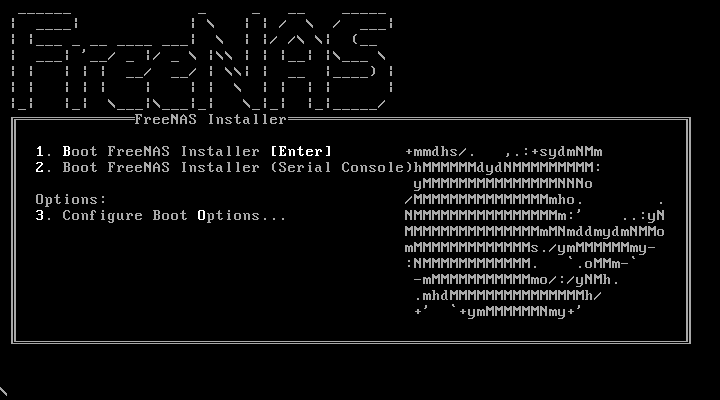

The FreeNAS® installer automatically boots into the default
option after ten seconds. If needed, choose another boot option by
pressing the `Spacebar` to stop the timer and then enter the number of
the desired option.

Tip

The `Serial Console` option is useful on systems which do not have a
keyboard or monitor, but are accessed through a serial port, *Serial
over LAN*, or `IPMI`.

Note

If the installer does not boot, verify that the installation device is
listed first in the boot order in the BIOS. When booting from a CD, some
motherboards may require connecting the CD device to SATA0 (the first
connector) to boot from CD. If the installer stalls during bootup,
double-check the SHA256 hash of the `.iso` file. If the hash does not
match, re-download the file. If the hash is correct, burn the CD again
at a lower speed or write the file to a different USB stick.

Once the installer has finished booting, the installer menu is displayed
as shown in `Figure %s <installer_menu_fig>`.

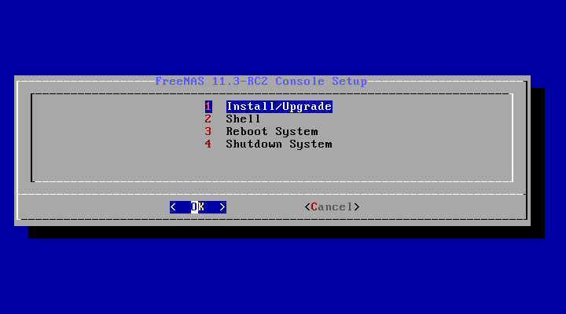

Press `Enter` to select the default option, `1 Install/Upgrade`. The
next menu, shown in `Figure %s <select_drive_fig>`, lists all available
drives. This includes any inserted operating system devices, which have
names beginning with *da*.

Note

A minimum of 8 GiB of RAM is required and the installer will present a
warning message if less than 8 GiB is detected.

In this example, the user is performing a test installation using
VirtualBox and has created a 16 GiB virtual disk to hold the operating
system.

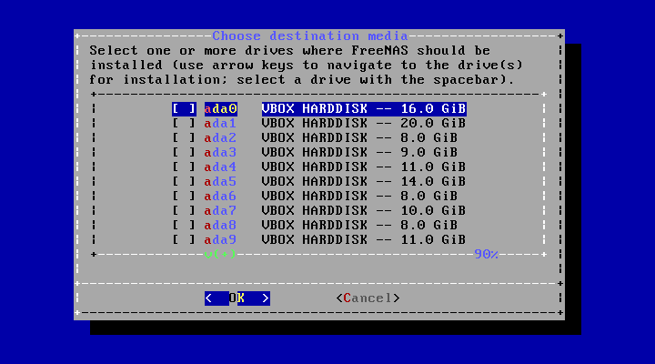

Use the arrow keys to highlight the destination SSD, hard drive, USB
stick, or virtual disk. Press the `spacebar` to select it.

To mirror the operating system device, move to additional devices and
press `spacebar` to select them also. If all of the selected devices are
larger than 64 GiB and none are connected through USB, a 16 GiB swap
partition is also created.

After making selections, press `Enter`. The warning shown in
`Figure %s <install_warning_fig>` is displayed, a reminder not to
install the operating system on a drive that is meant for storage. Press
`Enter` to continue on to the screen shown in
`Figure %s <set_root_pass_fig>`.

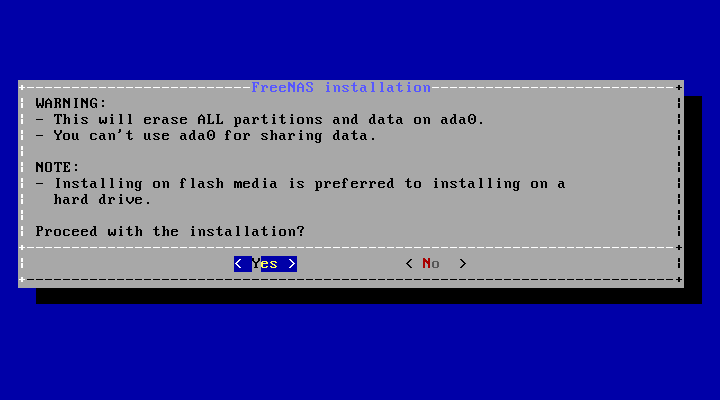

See the `operating system device <The Operating System Device>` section
to ensure the minimum requirements are met.

The installer recognizes existing installations of previous versions of
FreeNAS®. When an existing installation is present, the menu
shown in `Figure %s <fresh_install_fig>` is displayed. To overwrite an
existing installation, use the arrows to move to `Fresh Install` and
press `Enter` twice to continue to the screen shown in
`Figure %s <set_root_pass_fig>`.

The screen shown in `Figure %s <set_root_pass_fig>` prompts for the
*root* password which is used to log in to the web interface.

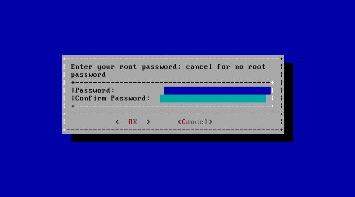

Setting a password is mandatory and the password cannot be blank. Since
this password provides access to the web interface, it needs to be hard
to guess. Enter the password, press the down arrow key, and confirm the
password. Then press `Enter` to continue with the installation. Choosing
`Cancel` skips setting a root password during the installation, but the
web interface will require setting a root password when logging in for
the first time.

Note

For security reasons, the SSH service and *root* SSH logins are disabled
by default. Unless these are set, the only way to access a shell as
*root* is to gain physical access to the console menu or to access the
web shell within the web interface. This means that the
FreeNAS® system needs to be kept physically secure and that
the web interface needs to be behind a properly configured firewall and
protected by a secure password.

FreeNAS® can be configured to boot with the standard BIOS
boot mechanism or UEFI booting as shown `Figure %s <uefi_or_bios_fig>`.
BIOS booting is recommended for legacy and enterprise hardware. UEFI is
used on newer consumer motherboards.

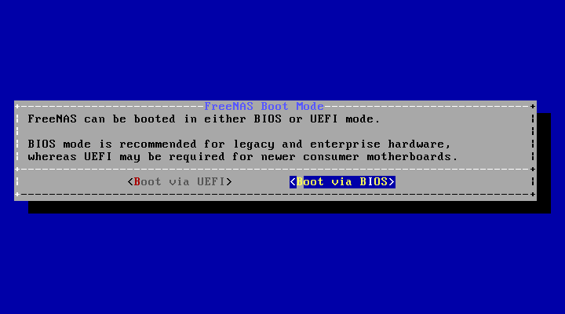

Note

Most UEFI systems can also boot in BIOS mode if CSM (Compatibility
Support Module) is enabled in the UEFI setup screens.

The message in `Figure %s <install_complete_fig>` is shown after the
installation is complete.

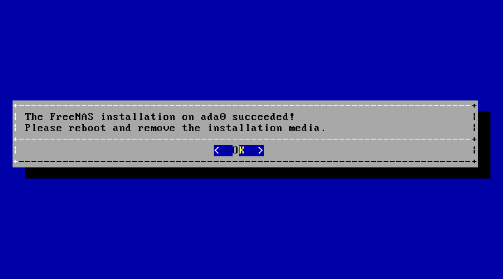

Press `Enter` to return to `installer_menu_fig`. Highlight
`3 Reboot System` and press `Enter`. If booting from CD, remove the
CDROM. As the system reboots, make sure that the device where
FreeNAS® was installed is listed as the first boot entry in
the BIOS so the system will boot from it.

FreeNAS® boots into the `Console Setup` menu described in
`Booting` after waiting five seconds in the `boot menu <boot_menu_fig>`.
Press the `Spacebar` to stop the timer and use the boot menu.

Installation Troubleshooting
----------------------------

If the system does not boot into FreeNAS®, there are several
things that can be checked to resolve the situation.

Check the system BIOS and see if there is an option to change the USB
emulation from CD/DVD/floppy to hard drive. If it still will not boot,
check to see if the card/drive is UDMA compliant.

If the system BIOS does not support EFI with BIOS emulation, see if it
has an option to boot using legacy BIOS mode.

When the system starts to boot but hangs with this repeated error
message:

    run_interrupt_driven_hooks: still waiting after 60 seconds for xpt_config

go into the system BIOS and look for an onboard device configuration for
a 1394 Controller. If present, disable that device and try booting
again.

If the system starts to boot but hangs at a *mountroot&gt;* prompt,
follow the instructions in [Workaround/Semi-Fix for Mountroot Issues
with
9.3](https://forums.freenas.org/index.php?threads/workaround-semi-fix-for-mountroot-issues-with-9-3.26071/).

If the burned image fails to boot and the image was burned using a
Windows system, wipe the USB stick before trying a second burn using a
utility such as [Active@ KillDisk](http://how-to-erase-hard-drive.com/).
Otherwise, the second burn attempt will fail as Windows does not
understand the partition which was written from the image file. Be very
careful to specify the correct USB stick when using a wipe utility!

Upgrade

Upgrading
---------

FreeNAS® provides flexibility for keeping the operating
system up-to-date:

1.  Upgrades to major releases, for example from version 9.3 to 9.10,
    can still be performed using either an ISO or the web interface.
    Unless the Release Notes for the new major release indicate that the
    current version requires an ISO upgrade, either upgrade method can
    be used.
2.  Minor releases have been replaced with signed updates. This means
    that it is not necessary to wait for a minor release to update the
    system with a system update or newer versions of drivers and
    features. It is also no longer necessary to manually download an
    upgrade file and its associated checksum to update the system.
3.  The updater automatically creates a boot environment, making updates
    a low-risk operation. Boot environments provide the option to return
    to the previous version of the operating system by rebooting the
    system and selecting the previous boot environment from the boot
    menu.

This section describes how to perform an upgrade from an earlier version
of FreeNAS® to . After has been installed, use the
instructions in `Update` to keep the system updated.

### Caveats

Be aware of these caveats **before** attempting an upgrade to :

-   **Warning: upgrading the ZFS pool can make it impossible to go back
    to a previous version.** For this reason, the update process does
    not automatically upgrade the ZFS pool, though the `Alert` system
    shows when newer `ZFS Feature Flags` are available for a pool.
    Unless a new feature flag is needed, it is safe to leave the pool at
    the current version and uncheck the alert. If the pool is upgraded,
    it will not be possible to boot into a previous version that does
    not support the newer feature flags.
-   Upgrading the firmware of Broadcom SAS HBAs to the latest version is
    recommended.
-   If upgrading from 9.3.x, read the [FAQ: Updating from 9.3 to
    9.10](https://forums.freenas.org/index.php?threads/faq-updating-from-9-3-to-9-10.54260/)
    first.
-   **Upgrades from** FreeNAS® **0.7x are not supported.**
    The system has no way to import configuration settings from 0.7x
    versions of FreeNAS®. The configuration must be manually
    recreated. If supported, the FreeNAS® 0.7x pools or disks
    must be manually imported.
-   **Upgrades on 32-bit hardware are not supported.** However, if the
    system is currently running a 32-bit version of FreeNAS®
    **and** the hardware supports 64-bit, the system can be upgraded.
    Any archived reporting graphs will be lost during the upgrade.
-   **UFS is not supported.** If the data currently resides on **one**
    UFS-formatted disk, create a ZFS pool using **other** disks after
    the upgrade, then use the instructions in `Importing a Disk` to moun
    t the UFS-formatted disk and copy the data to the ZFS pool. With
    only one disk, back up its data to another system or media before
    the upgrade, format the disk as ZFS after the upgrade, then restore
    the backup. If the data currently resides on a UFS RAID of disks, it
    is not possible to directly import that data to the ZFS pool.
    Instead, back up the data before the upgrade, create a ZFS pool
    after the upgrade, then restore the data from the backup.

### Initial Preparation

Before upgrading the operating system, perform the following steps:

1.  **Back up the** FreeNAS® **configuration** in
    `System --> General --> Save Config`.
2.  If any pools are encrypted, **remember** to set a passphrase and
    download a copy of the encryption key and the latest recovery key.
    After the upgrade is complete, use the instructions in
    `Importing a Pool` to import the encrypted pools.
3.  Warn users that the FreeNAS® shares will be unavailable
    during the upgrade; it is recommended to schedule the upgrade for a
    time that will least impact users.
4.  Stop all services in `Services`.

### Upgrading Using the ISO

To perform an upgrade using this method,
[download](http://download.freenas.org/latest/) the `.iso` to the
computer that will be used to prepare the installation media. Burn the
downloaded `.iso` file to a CD or USB stick using the instructions in
`Preparing the Media`.

Insert the prepared media into the system and boot from it. The
installer waits ten seconds in the
`installer boot menu <installer_boot_menu_fig>` before booting the
default option. If needed, press the `Spacebar` to stop the timer and
choose another boot option. After the media finishes booting into the
installation menu, press `Enter` to select the default option of
`1 Install/Upgrade.` The installer presents a screen showing all
available drives.

Warning

*All* drives are shown, including boot drives and storage drives. Only
choose boot drives when upgrading. Choosing the wrong drives to upgrade
or install will cause loss of data. If unsure about which drives contain
the FreeNAS® operating system, reboot and remove the install
media. In the FreeNAS® web interface, use `System --> Boot`
to identify the boot drives. More than one drive is shown when a mirror
has been used.

Move to the drive where FreeNAS® is installed and press the
`Spacebar` to mark it with a star. If a mirror has been used for the
operating system, mark all of the drives where the FreeNAS®
operating system is installed. Press `Enter` when done.

The installer recognizes earlier versions of FreeNAS®
installed on the boot drive or drives and presents the message shown in
`Figure %s <upgrade_install_fig>`.

To perform an upgrade, press `Enter` to accept the default of
`Upgrade Install`. Again, the installer will display a reminder that the
operating system should be installed on a disk that is not used for
storage.

The updated system can be installed in a new boot environment, or the
entire operating system device can be formatted to start fresh.
Installing into a new boot environment preserves the old code, allowing
a roll-back to previous versions if necessary. Formatting the boot
device is usually not necessary but can reclaim space. User data and
settings are preserved when installing to a new boot environment and
also when formatting the operating system device. Move the highlight to
one of the options and press `Enter` to start the upgrade.

The installer unpacks the new image and displays the menu shown in
`Figure %s <preserve_migrate_fig>`. The database file that is preserved
and migrated contains your FreeNAS® configuration settings.

Press `Enter`. FreeNAS® indicates that the upgrade is
complete and a reboot is required. Press `OK`, highlight
`3 Reboot System`, then press `Enter` to reboot the system. If the
upgrade installer was booted from CD, remove the CD.

During the reboot there can be a conversion of the previous
configuration database to the new version of the database. This happens
during the "Applying database schema changes" line in the reboot cycle.
This conversion can take a long time to finish, sometimes fifteen
minutes or more, and can cause the system to reboot again. The system
will start normally afterwards. If database errors are shown but the web
interface is accessible, go to `Settings --> General` and use the
`UPLOAD CONFIG` button to upload the configuration that was saved before
starting the upgrade.

### Upgrading From the Web Interface

To perform an upgrade using this method, go to `System --> Update`. See
`Update` for more information on upgrading the system.

The connection is lost temporarily when the update is complete. It
returns after the FreeNAS® system reboots into the new
version of the operating system. The FreeNAS® system normally
receives the same IP address from the DHCP server. Refresh the browser
after a moment to see if the system is accessible.

### If Something Goes Wrong

If an update fails, an alert is issued and the details are written to
`/data/update.failed`.

To return to a previous version of the operating system, physical or
IPMI access to the FreeNAS® console is needed. Reboot the
system and watch for the boot menu:

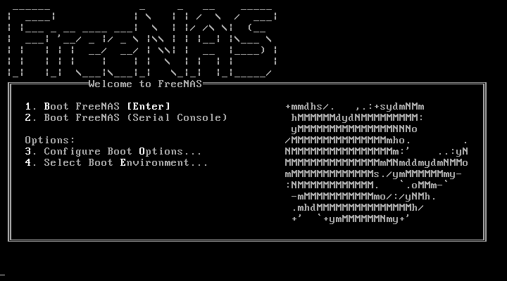

FreeNAS® waits five seconds before booting into the default
boot environment. Press the `Spacebar` to stop the automatic boot timer.
Press `4` to display the available boot environments and press `3` as
needed to scroll through multiple pages.

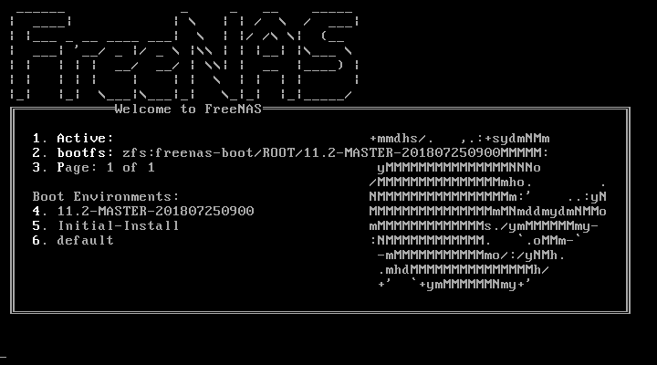

In the example shown in `Figure %s <boot_env_fig>`, the first entry in
`Boot Environments` is `11.2-MASTER-201807250900`. This is the current
version of the operating system, after the update was applied. Since it
is the first entry, it is the default selection.

The next entry is `Initial-Install`. This is the original boot
environment created when FreeNAS® was first installed. Since
there are no other entries between the initial installation and the
first entry, only one update has been applied to this system since its
initial installation.

To boot into another version of the operating system, enter the number
of the boot environment to set it as `Active`. Press `Backspace` to
return to the `Boot Menu <boot_menu_fig>` and press `Enter` to boot into
the chosen `Active` boot environment.

If an operating system device fails and the system no longer boots,
don't panic. The data is still on the disks and there is still a copy of
the saved configuration. The system can be recovered with a few steps:

1.  Perform a fresh installation on a new operating system device.
2.  Import the pools in `Storage --> Auto Import Pool`.
3.  Restore the configuration in `System --> General --> Upload Config`.

Note

It is not possible to restore a saved configuration that is newer than
the installed version. For example, if a reboot into an older version of
the operating system is performed, a configuration created in a later
version cannot be restored.

Upgrade ZFS Pool

### Upgrading a ZFS Pool

In FreeNAS®, ZFS pools can be upgraded from the graphical
administrative interface.

Before upgrading an existing ZFS pool, be aware of these caveats first:

-   the pool upgrade is a one-way street, meaning that **if you change
    your mind you cannot go back to an earlier ZFS version or downgrade
    to an earlier version of the software that does not support those
    ZFS features.**
-   before performing any operation that may affect the data on a
    storage disk, **always back up all data first and verify the
    integrity of the backup.** While it is unlikely that the pool
    upgrade will affect the data, it is always better to be safe than
    sorry.
-   upgrading a ZFS pool is **optional**. Do not upgrade the pool if the
    the possibility of reverting to an earlier version of
    FreeNAS® or repurposing the disks in another operating
    system that supports ZFS is desired. It is not necessary to upgrade
    the pool unless the end user has a specific need for the newer
    `ZFS Feature Flags`. If a pool is upgraded to the latest feature
    flags, it will not be possible to import that pool into another
    operating system that does not yet support those feature flags.

To perform the ZFS pool upgrade, go to `Storage --> Pools` and click
ui-settings to upgrade. Click the `Upgrade Pool` button as shown in
`Figure %s <upgrading_pool_fig>`.

Note

If the `Upgrade Pool` button does not appear, the pool is already at the
latest feature flags and does not need to be upgraded.

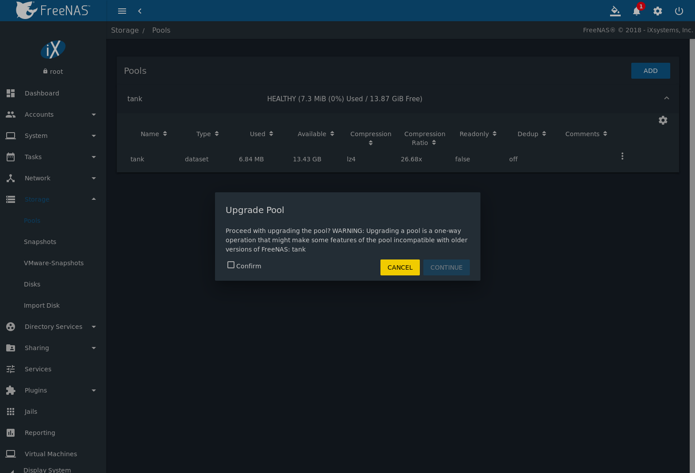

The warning serves as a reminder that a pool upgrade is not reversible.
Click `OK` to proceed with the upgrade.

The upgrade itself only takes a few seconds and is non-disruptive. It is
not necessary to stop any sharing services to upgrade the pool. However,
it is best to upgrade when the pool is not being heavily used. The
upgrade process will suspend I/O for a short period, but is nearly
instantaneous on a quiet pool.

Virtualization, VM

Virtualization
--------------

FreeNAS® can be run inside a virtual environment for
development, experimentation, and educational purposes. Note that
running FreeNAS® in production as a virtual machine is [not
recommended](https://forums.freenas.org/index.php?threads/please-do-not-run-freenas-in-production-as-a-virtual-machine.12484/).
When using FreeNAS® within a virtual environment, [read this
post
first](https://forums.freenas.org/index.php?threads/absolutely-must-virtualize-freenas-a-guide-to-not-completely-losing-your-data.12714/)
as it contains useful guidelines for minimizing the risk of losing data.

To install or run FreeNAS® within a virtual environment,
create a virtual machine that meets these minimum requirements:

-   **at least** 8192 MiB (8 GiB) base memory size
-   a virtual disk **at least 8 GiB in size** to hold the operating
    system and boot environments
-   at least one additional virtual disk **at least 4 GiB in size** to
    be used as data storage
-   a bridged network adapter

This section demonstrates how to create and access a virtual machine
within VirtualBox and VMware ESXi environments.

### VirtualBox

[VirtualBox](https://www.virtualbox.org/) is an open source
virtualization program originally created by Sun Microsystems.
VirtualBox runs on Windows, BSD, Linux, Macintosh, and OpenSolaris. It
can be configured to use a downloaded FreeNAS® `.iso` file,
and makes a good testing environment for practicing configurations or
learning how to use the features provided by FreeNAS®.

To create the virtual machine, start VirtualBox and click the `New`
button, shown in `Figure %s <vb_initial_fig>`, to start the new virtual
machine wizard.

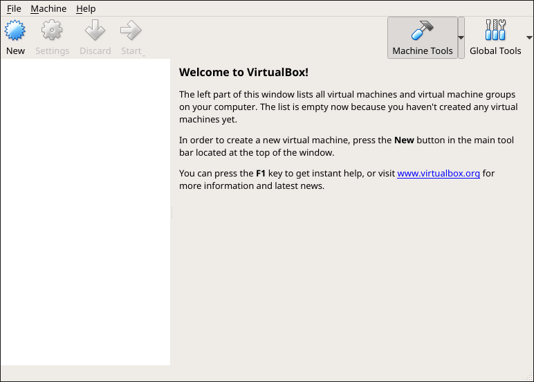

Click the `Next` button to see the screen in
`Figure %s <vb_nameos_fig>`. Enter a name for the virtual machine, click
the `Operating System` drop-down menu and select BSD, and select
`FreeBSD (64-bit)` from the `Version` dropdown.

Click `Next` to see the screen in `Figure %s <vb_mem_fig>`. The base
memory size must be changed to **at least 8192 MiB**. When finished,
click `Next` to see the screen in `Figure %s <vb_hd_fig>`.

Click `Create` to launch the `Create Virtual Hard Drive Wizard` shown in
`Figure %s <vb_virt_drive_fig>`.

Select `VDI` and click the `Next` button to see the screen in
`Figure %s <vb_virt_type_fig>`.

Choose either `Dynamically allocated` or `Fixed-size` storage. The first
option uses disk space as needed until it reaches the maximum size that
is set in the next screen. The second option creates a disk the full
amount of disk space, whether it is used or not. Choose the first option
to conserve disk space; otherwise, choose the second option, as it
allows VirtualBox to run slightly faster. After selecting `Next`, the
screen in `Figure %s <vb_virt_filename_fig>` is shown.

This screen is used to set the size (or upper limit) of the virtual
disk. **Set the default size to a minimum of 8 GiB**. Use the folder
icon to browse to a directory on disk with sufficient space to hold the
virtual disk files. Remember that there will be a system disk of at
least 8 GiB and at least one data storage disk of at least 4 GiB.

Use the `Back` button to return to a previous screen if any values need
to be modified. After making a selection and pressing `Create`, the new
VM is created. The new virtual machine is listed in the left frame, as
shown in the example in `Figure %s <vb_new_vm_fig>`. Open the
`Machine Tools` drop-down menu and select `Details` to see extra
information about the VM.

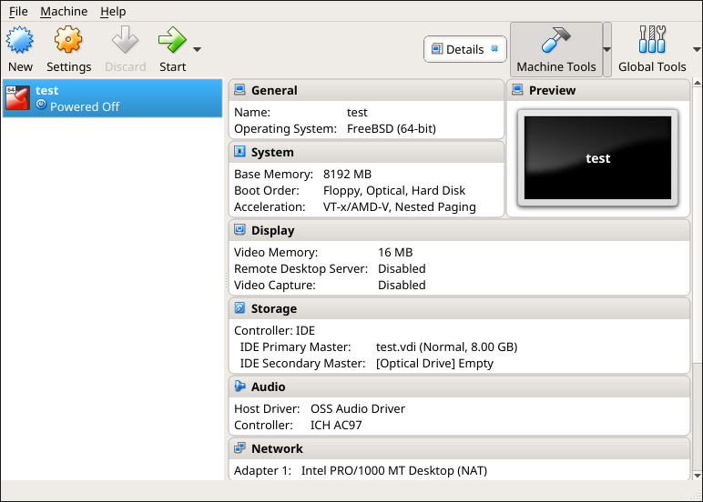

Create the virtual disks to be used for storage. Highlight the VM and
click `Settings` to open the menu. Click the `Storage` option in the
left frame to access the storage screen seen in
`Figure %s <vb_storage_settings_fig>`.

Click the `Add Attachment` button, select `Add Hard Disk` from the
pop-up menu, then click the `Create new disk` button. This launches the
`Create Virtual Hard Disk` wizard seen in
`Figure %s <vb_virt_drive_fig>` and `%s <vb_virt_type_fig>`.

Create a disk large enough to hold the desired data. The minimum size is
**4 GiB.** To practice with RAID configurations, create as many virtual
disks as needed. Two disks can be created on each IDE controller. For
additional disks, click the `Add Controller` button to create another
controller for attaching additional disks.

Create a device for the installation media. Highlight the word "Empty",
then click the `CD` icon as shown in `Figure %s <vb_config_iso_fig>`.

Click `Choose Virtual Optical Disk File...` to browse to the location of
the `.iso` file. If the `.iso` was burned to CD, select the detected
`Host Drive`.

Depending on the extensions available in the host CPU, it might not be
possible to boot the VM from an `.iso`. If "your CPU does not support
long mode" is shown when trying to boot the `.iso`, the host CPU either
does not have the required extension or AMD-V/VT-x is disabled in the
system BIOS.

Note

If there is a kernel panic when booting into the ISO, stop the virtual
machine. Then, go to `System` and check the box `Enable IO APIC`.

To configure the network adapter, go to
`Settings --> Network --> Adapter 1`. In the `Attached to` drop-down
menu select `Bridged Adapter`, then choose the name of the physical
interface from the `Name` drop-down menu. In the example shown in
`Figure %s <vb_bridged_fig>`, the Intel Pro/1000 Ethernet card is
attached to the network and has a device name of *em0*.

After configuration is complete, click the `Start` arrow and install
FreeNAS® as described in `Performing the Installation`. After
FreeNAS® is installed, press `F12` when the VM starts to boot
to access the boot menu. Select the primary hard disk as the boot
option. You can permanently boot from disk by removing the `Optical`
device in `Storage` or by unchecking `Optical` in the `Boot Order`
section of `System`.

### VMware ESXi

ESXi is a bare-metal hypervisor architecture created by VMware Inc.
Commercial and free versions of the VMware vSphere Hypervisor operating
system (ESXi) are available from the [VMware
website](https://www.vmware.com/products/esxi-and-esx.html).

Install and use the VMware vSphere client to connect to the ESXi server.
Enter the username and password created when installing ESXi to log in
to the interface. After logging in, go to *Storage* to upload the
FreeNAS® `.iso`. Click `Datastore browser` and select a
datastore for the FreeNAS® `.iso`. Click `Upload` and choose
the FreeNAS® `.iso` from the host system.

Click `Create / Register VM` to create a new VM. The *New virtual
machine* wizard opens:

1.  **Select creation type**: Select `Create a new virtual machine` and
    click `Next`.

    

    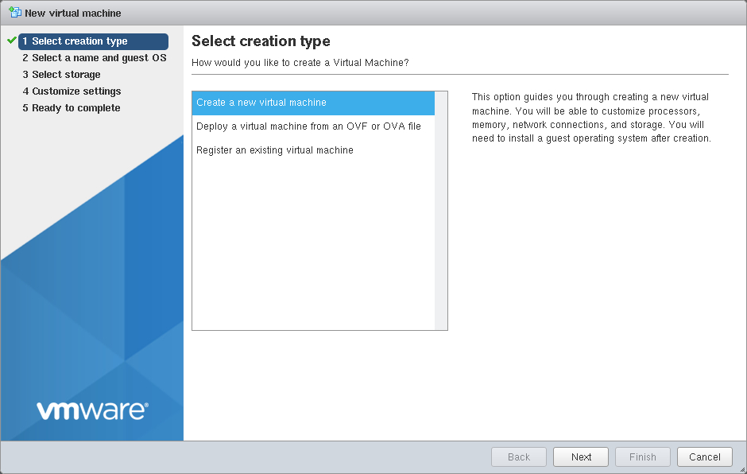

    

2.  **Select a name and guest OS**: Enter a name for the VM. Leave ESXi
    compatibility version at the default. Select `Other` as the Guest OS
    family. Select `FreeBSD12 or later versions (64-bit)` as the Guest
    OS version. Click `Next`.

    

    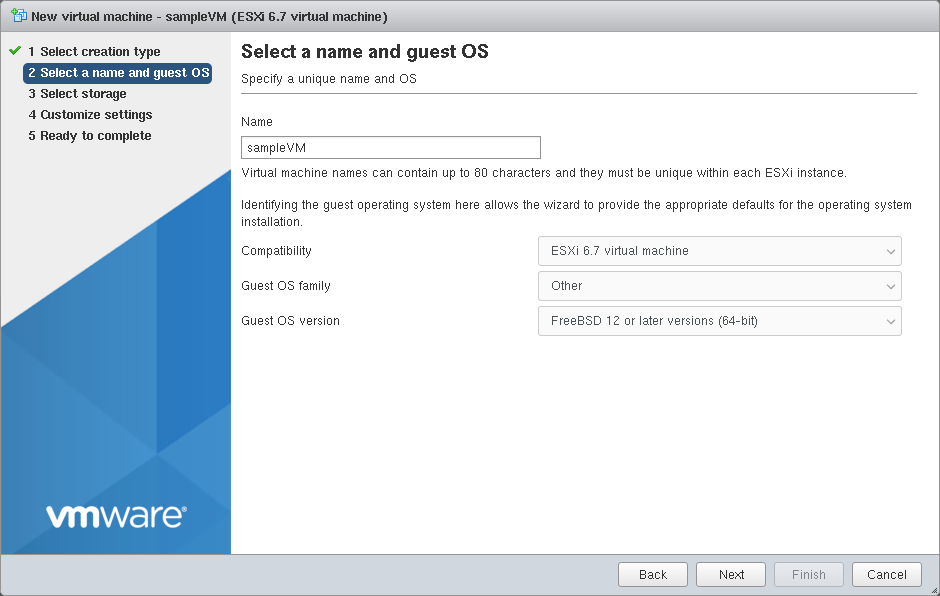

    

3.  **Select storage**: Select a datastore for the VM. The datastore
    must be at least 32 GiB.

    

    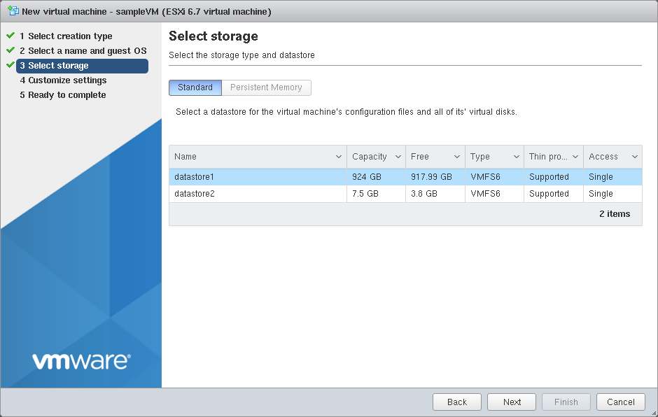

    

4.  **Customize settings**: Enter the recommended minimums of at least
    *8 GiB* of memory and *32 GiB* of storage. Select
    `Datastore ISO file` from the `CD/DVD Drive 1` drop-down. Use the
    Datastore browser to select the uploaded FreeNAS® `.iso`.
    Click `Next`.

    

    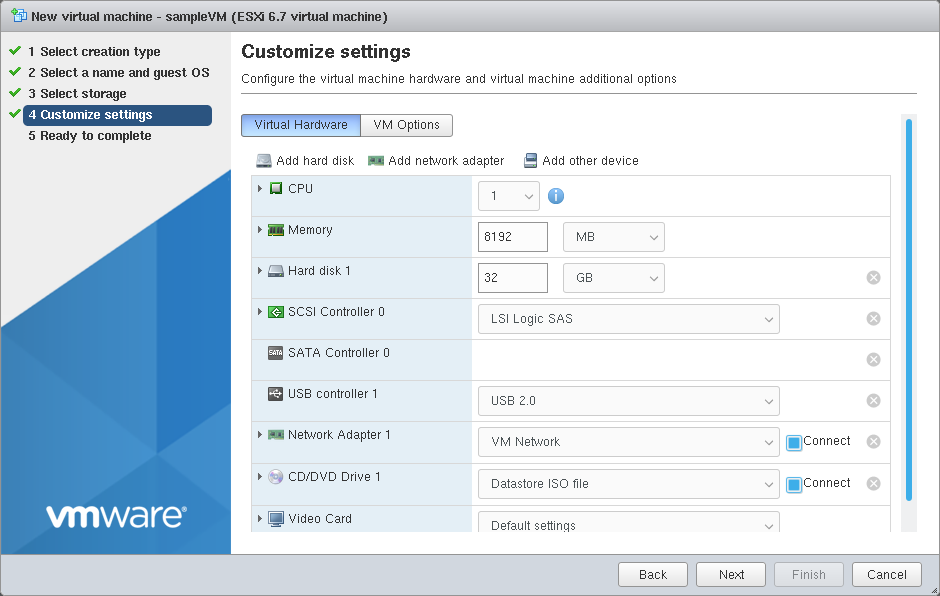

    

5.  **Ready to complete**: Review the VM settings. Click `Finish` to
    create the new VM.

    

    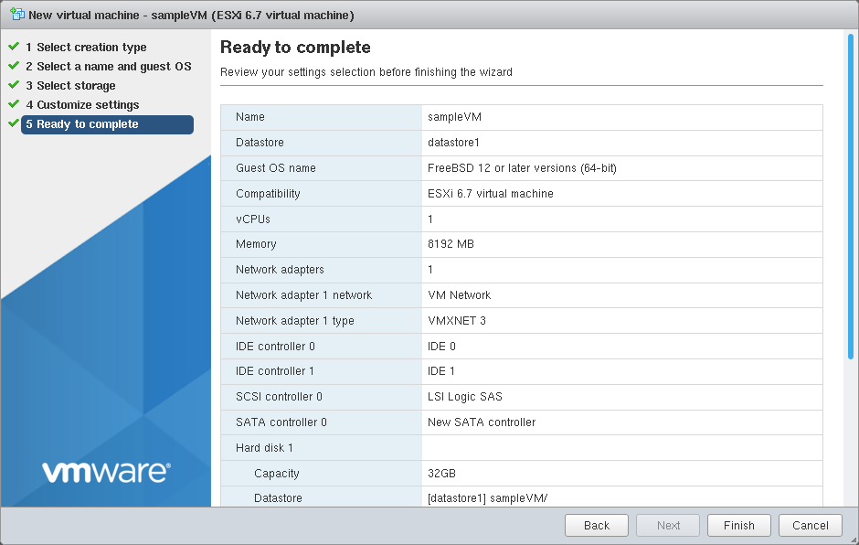

    

To add more disks to a VM, right-click the VM and click `Edit Settings`.

Click `Add hard disk --> New standard hard disk`. Enter the desired
capacity and click `Save`.

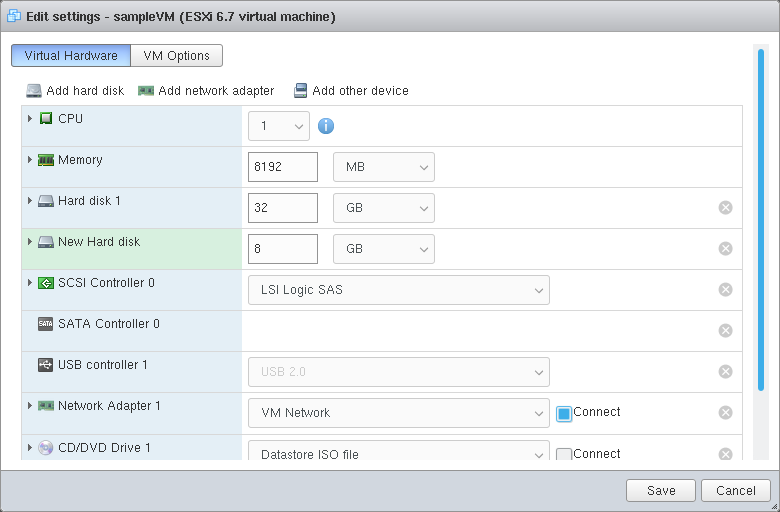

Virtual HPET hardware can prevent the virtual machine from booting on
some older versions of VMware. If the virtual machine does not boot,
remove the virtual HPET hardware:

-   On ESXi, right-click the VM and click `Edit Settings`. Click
    `VM Options --> Advanced --> Edit Configuration...`. Change
    `hpet0.present` from *TRUE* to *FALSE* and click `OK`. Click `Save`
    to save the new settings.
-   On Workstation or Player, while in `Edit Settings`, click
    `Options --> Advanced --> File Locations`. Locate the path for the
    Configuration file named `filename.vmx`. Open the file in a text
    editor and change `hpet0.present` from *true* to *false*, then save
    the change.
