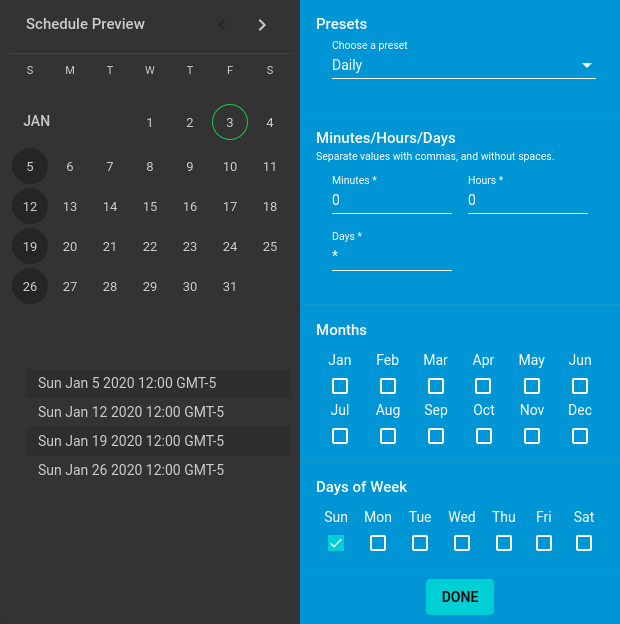
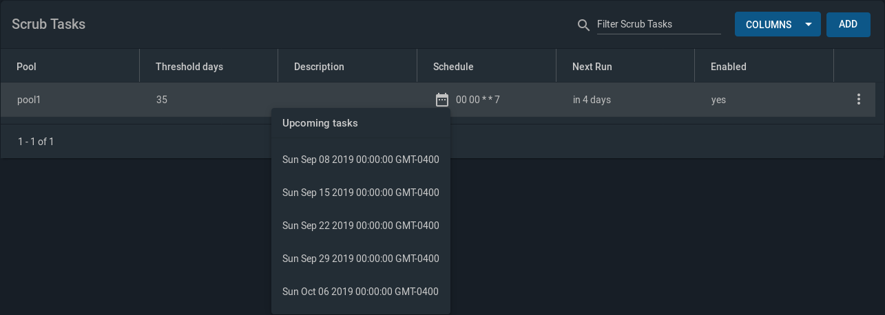

Note

Starting with version 12.0, [FreeNAS and TrueNAS are
unifying](https://www.ixsystems.com/blog/freenas-truenas-unification/.)
into "TrueNAS". Documentation for TrueNAS 12.0 and later releases has
been unified and moved to the [TrueNAS Documentation
Hub](https://www.truenas.com/docs/).

FreeNAS® is © 2011-2020 iXsystems

FreeNAS® and the FreeNAS® logo are registered
trademarks of iXsystems

FreeBSD® is a registered trademark of the FreeBSD Foundation

Written by users of the FreeNAS® network-attached storage
operating system.

Version

Copyright © 2011-2020 [iXsystems](https://www.ixsystems.com/)

This Guide covers the installation and use of FreeNAS® .

The FreeNAS® User Guide is a work in progress and relies on
the contributions of many individuals. If you are interested in helping
us to improve the Guide, read the instructions in the
[README](https://github.com/freenas/freenas-docs/blob/master/README.md).
IRC Freenode users are welcome to join the *\#freenas* channel where you
will find other FreeNAS® users.

The FreeNAS® User Guide is freely available for sharing and
redistribution under the terms of the [Creative Commons Attribution
License](https://creativecommons.org/licenses/by/3.0/). This means that
you have permission to copy, distribute, translate, and adapt the work
as long as you attribute iXsystems as the original source of the Guide.

FreeNAS® and the FreeNAS® logo are registered
trademarks of iXsystems.

Active Directory® is a registered trademark or trademark of
Microsoft Corporation in the United States and/or other countries.

Apple, Mac and Mac OS are trademarks of Apple Inc., registered in the
U.S. and other countries.

Asigra Inc. Asigra, the Asigra logo, Asigra Cloud Backup, Recovery is
Everything, Recovery Tracker and Attack-Loop are trademarks of Asigra
Inc.

Broadcom is a trademark of Broadcom Corporation.

Chelsio® is a registered trademark of Chelsio Communications.

Cisco® is a registered trademark or trademark of Cisco
Systems, Inc. and/or its affiliates in the United States and certain
other countries.

Django® is a registered trademark of Django Software
Foundation.

Facebook® is a registered trademark of Facebook Inc.

FreeBSD® and the FreeBSD® logo are registered
trademarks of the FreeBSD Foundation®.

Intel, the Intel logo, Pentium Inside, and Pentium are trademarks of
Intel Corporation in the U.S. and/or other countries.

LinkedIn® is a registered trademark of LinkedIn Corporation.

Linux® is a registered trademark of Linus Torvalds.

Oracle is a registered trademark of Oracle Corporation and/or its
affiliates.

Twitter is a trademark of Twitter, Inc. in the United States and other
countries.

UNIX® is a registered trademark of The Open Group.

VirtualBox® is a registered trademark of Oracle.

VMware® is a registered trademark of VMware, Inc.

Wikipedia® is a registered trademark of the Wikimedia
Foundation, Inc., a non-profit organization.

Windows® is a registered trademark of Microsoft Corporation
in the United States and other countries.

**Typographic Conventions**

The FreeNAS® User Guide uses these typographic conventions:

&gt;{RaggedRight}p{dimexpr 0.50linewidth-2tabcolsep}\|

| Item                                                           | Visual Example                          |
|----------------------------------------------------------------|-----------------------------------------|
| Graphical elements: buttons, icons, fields, columns, and boxes | Click the `Import CA` button.           |
| Menu selections                                                | Select `System --> Information`.        |
| Commands                                                       | Use the `scp` command.                  |
| File names and pool and dataset names                          | Locate the `/etc/rc.conf` file.         |
| Keyboard keys                                                  | Press the `Enter` key.                  |
| Important points                                               | **This is important.**                  |
| Values entered into fields, or device names                    | Enter *127.0.0.1* in the address field. |

Text Format Examples

&gt;{RaggedRight}p{dimexpr 0.65linewidth-2tabcolsep}\|

<table>
<caption>FreeNAS® Icons</caption>
<colgroup>
<col style="width: 34%" />
<col style="width: 65%" />
</colgroup>
<thead>
<tr class="header">
<th>Icon</th>
<th>Usage</th>
</tr>
</thead>
<tbody>
<tr class="odd">
<td><code class="interpreted-text" role="guilabel">ADD</code></td>
<td><blockquote>

Add a new item.

</blockquote></td>
</tr>
<tr class="even">
<td>ui-settings | S</td>
<td>how a settings menu.</td>
</tr>
<tr class="odd">
<td>ui-options | S</td>
<td>how an Options menu.</td>
</tr>
<tr class="even">
<td>ui-browse | S</td>
<td>hows an expandable view of system directories.</td>
</tr>
<tr class="odd">
<td>ui-power | S</td>
<td>how a power options menu.</td>
</tr>
<tr class="even">
<td>ui-password-show | R</td>
<td>eveal characters in a password field.</td>
</tr>
<tr class="odd">
<td>ui-password-hide | H</td>
<td>ide characters in a password field.</td>
</tr>
<tr class="even">
<td>ui-configure | E</td>
<td>dit settings.</td>
</tr>
<tr class="odd">
<td>ui-launch | L</td>
<td>aunch a service.</td>
</tr>
<tr class="even">
<td>ui-jail-start | S</td>
<td>tart jails.</td>
</tr>
<tr class="odd">
<td>ui-jail-stop | S</td>
<td>top jails.</td>
</tr>
<tr class="even">
<td>ui-jail-update | U</td>
<td>pdate jails.</td>
</tr>
<tr class="odd">
<td>ui-jail-delete | D</td>
<td>elete jails.</td>
</tr>
<tr class="even">
<td>pool-lock | E</td>
<td>ncryption options for a pool.</td>
</tr>
<tr class="odd">
<td>help-pin | P</td>
<td>in a help box to the screen.</td>
</tr>
<tr class="even">
<td>help-close | Cl</td>
<td>ose a help box.</td>
</tr>
</tbody>
</table>

FreeNAS® Icons

Introduction
============

FreeNAS® is an embedded open source network-attached storage
(NAS) operating system based on FreeBSD and released under a [2-clause
BSD license](https://opensource.org/licenses/BSD-2-Clause). A NAS has an
operating system optimized for file storage and sharing.

FreeNAS® provides a browser-based, graphical configuration
interface. The built-in networking protocols provide storage access to
multiple operating systems. A plugin system is provided for extending
the built-in features by installing additional software.

New Features in
---------------

FreeNAS® is a feature release, which includes new significant
features, many improvements and bug fixes to existing features, and
version updates to the operating system, base applications, and drivers.
Users are encouraged to `Update` to this release in order to take
advantage of these improvements and bug fixes.

**Major New Features and Improvements**

The replication framework has been redesigned, adding new back-end
systems, files, and screen options to the
`Replication system <Replication Tasks>` and `Periodic Snapshot Tasks`.
The redesign adds these features:

-   New peers/credentials API for creating and managing credentials. The
    `SSH Connections` and `SSH Keypairs` screens have been added and a
    wizard makes it easy to generate new keypairs. Existing SFTP and SSH
    replication keys created in 11.2 or earlier will be automatically
    added as entries to `SSH Keypairs` during upgrade.
-   New transport API adds netcat support, for greatly improved speed of
    transfer.
-   Snapshot creation has been decoupled from replication tasks,
    allowing replication of manually created snapshots.
-   The ability to use custom names for snapshots.
-   Configurable snapshot retention on the remote side.
-   A new replication wizard makes it easy to configure replication
    scenarios, including local replication and replication to systems
    running legacy replication (pre-11.3).
-   Replication is resumable and failed replication tasks will
    automatically try to resume from a previous checkpoint. Each task
    has its own log which can be accessed from the `State` column.
-   Replications run in parallel as long as they do not conflict with
    each other. Completion time depends on the number and size of
    snapshots and the bandwidth available between the source and
    destination computers.

`Network interface management <Interfaces>` has been redesigned to
streamline management of both physical and virtual interfaces using one
screen. VLANs and LAGGs are now classified as interface types and
support for the `Bridge interface <Bridges>` type has been added. The
addressing details for all physical interfaces, including DHCP, are now
displayed but are read-only if the interface is a member of a LAGG. When
applying interface changes, the web interface provides a window to
cancel the change and revert to the previous network configuration. A
new MTU field makes it easier to set the MTU as it no longer has to be
typed in as an Auxiliary Parameter.

[Automatic Certificate Management Environment
(ACME)](https://ietf-wg-acme.github.io/acme/draft-ietf-acme-acme.html)
support has been added. ACME simplifies the process of issuing and
renewing certificates using a set of DNS challenges to verify a user is
the owner of the domain. While the new API supports the addition of
multiple DNS authenticators, support for [Amazon Route
53](https://aws.amazon.com/route53/) has been added as the initial
implementation. The `ACME DNS` screen is used for authenticator
configuration which adds the `ACME Certificates` option for Certificate
Signing Requests. Once configured, FreeNAS® will
automatically renew ACME certificates as they expire.

Support for collecting daily anonymous usage statistics has been added.
Collected non-identifying data includes hardware information such as CPU
type, number and size of disks, and configured NIC types as well as an
indication of which services, types of shares, and Plugins are
configured. The collected data will assist in determining where to best
focus engineering and testing efforts. Collection is enabled by default.
To opt-out, unset `System --> General --> Usage collection.`

The `Alert` system has been improved:

-   Support for one-shot critical alerts has been added. These alerts
    remain active until dismissed by the user.
-   `Alert Settings` has been reorganized: alerts are grouped
    functionally rather than alphabetically and per-alert severity and
    alert thresholds are configurable.
-   Periodic alert scripts have been replaced by the `Alert` framework.
    Periodic alert emails are disabled by default and previous email
    alert conditions have been added to the FreeNAS® alert
    system. E-mail or other alert methods can be configured in
    `Alert Services`.

A `Task Manager` in the top menu bar displays the status and progress of
configured tasks.

The Dashboard has been rewritten to provide an overview of the current
state of the system rather than repeat the historical data found in
`Reporting`. It now uses middleware to handle data collection and
provide the web interface with real-time events. Line charts have been
replaced with meters and gauges. CPU graphs have been consolidated into
a single widget which provides average usage and per-thread statistics
for both temperature and usage. Interfaces are represented as a separate
card per physical NIC unless they are part of a LAGG card. Pool and
Interface widgets feature mobile-inspired lateral navigation, allowing
users to “drill down” into the data without leaving the page.

`Reporting` has been greatly improved. Data is now prepared on the
backend by the middleware and operating system. Any remaining data
manipulation is done in a web worker, keeping expensive processing off
of the main UI thread/context. The SVG-based charting library was
replaced with a GPU-accelerated canvas-based library. Virtual scroll and
lazy loading prevent overloading the browser and eliminate the need for
a pager. Users can zoom by X or Y axis and reset the zoom level with a
double click. Graphs do not display if there is no related data. Support
for UPS and NFS statistics has been added.

Options for configuring the reporting database have been moved to
`System --> Reporting`. This screen adds the ability to configure
`Graph Age` as well as the number of points for each hourly, daily,
weekly, monthly, or yearly graph (`Graph Points`). The location of the
reporting database defaults to tmpfs and a configurable alert if the
database exceeds 1 GiB has been added to `Alert Settings`.

The web interface has received many improvements and bug fixes.
Usability enhancements include: ability to move, pin, and copy help
text, persistent layout customizations, customizable column views, size
units which accept humanized input, improved caching and browser
support, and improved error messages, popup dialogs, and help text. An
iX Official theme has been added which is the default for new
installations.

NAT support has been added as the default for most `Plugins`. With NAT,
a plugin is contained in its own network and does not require any
knowledge of the physical network to work properly. This removes the
need to manually configure IP addresses or have a DHCP server running.
When installing a plugin into a virtualized environment, NAT removes the
requirement to enable Promiscuous Mode for the network.

The `Plugins` page has been streamlined so that most operations can be
performed without having to go to the `Jails` page. Support for
collections has been added to differentiate between iXsystems plugins,
which receive updates every few weeks, and Community plugins. In
addition, there have been many bug fixes and improvements to iocage, the
Plugins backend, resulting in a much better Plugins user experience.

An `ACL Manager <ACL Management>` has been added to
`Storage --> Pools -->` ui-options and the
`permissions editor <Setting Permissions>` has been redesigned.

A new iSCSI wizard in `Block (iSCSI)` makes it easy to configure iSCSI
shares.

There have been several `Pool Manager <Pools>` improvements. The labels
and tooltips for encryption operations are clearer. Disk type, rotation
rate, and manufacturer information makes it easier to differentiate
between selectable disks when creating a pool. A `REPEAT` button makes
it easy to create large pools using the same vdev layout, such as a
series of striped mirrors.

Significant improvements to [SMB
sharing](https://jira.ixsystems.com/browse/NAS-102108) include ZFS user
quotas support, web service discovery support, and improved directory
listing performance for newly-created shares.

The middleware and websockets APIv2 rewrite is complete. APIv1 remains
for backwards compatibility but will be deprecated and no longer
available in the next major release.

**Deprecated and Removed Features**

-   The legacy web interface has been removed and no longer appears as
    an option in the `login screen <login_fig>`.
-   Warden has been removed along with all CLI and web interface support
    for warden jails or plugins installed using FreeNAS® 11.1
    or earlier.
-   Hipchat has been removed from `Alert Services` as it has been
    [discontinued](https://www.atlassian.com/partnerships/slack). The
    web interface can still be used to delete an existing Hipchat
    configuration.
-   `Domain Controller` has been removed from `Services`.
-   `Netdata` has been removed from `Services` due to a long-standing
    upstream memory leak.
    [TrueCommand](https://www.ixsystems.com/truecommand/) provides
    similar reporting plus advanced management capabilities for single
    or multiple FreeNAS® systems and is free to use to manage
    up to 50 drives.
-   The built-in Docker template has been removed from
    `Virtual Machines <VMs>`. Instructions for manually installing
    Docker can be found in `Installing Docker`.

**New or Updated Software**

-   The FreeBSD operating system has been patched up to
    [EN-19:18](https://www.freebsd.org/security/advisories/FreeBSD-EN-19:18.tzdata.asc)
    and
    [SA-19:26](https://security.freebsd.org/advisories/FreeBSD-SA-19:26.mcu.asc).
-   OS support for reporting the CPU temperature of AMD Family 15h,
    Model &gt;=60h has been added.
-   QLogic 10 Gigabit Ethernet driver support has been added with
    [qlxgbe(4)](https://www.freebsd.org/cgi/man.cgi?query=qlxgbe).
-   The base FreeBSD ports have been updated to their latest versions as
    of September 24, 2019.
-   Python has been updated to version
    [3.7.5](https://www.python.org/downloads/release/python-375/) to
    address
    [CVE-2019-15903](https://nvd.nist.gov/vuln/detail/CVE-2019-15903).
-   Angular has been updated to version
    [8.2.13](https://github.com/angular/angular/blob/master/CHANGELOG.md).
-   Samba has been updated to version
    [4.10.10](https://www.samba.org/samba/history/samba-4.10.10.html).
-   Netatalk has been updated to version
    [3.1.12\_2,1](http://netatalk.sourceforge.net/3.1/ReleaseNotes3.1.12.html).
-   Rclone has been updated to version
    [1.49.4](https://rclone.org/changelog/#v1-49-4-2019-09-29).
-   collectd has been updated to version
    [5.8.1\_1](https://collectd.org/wiki/index.php/Version_5.8).
-   sudo has been updated to version 1.8.29 to address
    [CVE-2019-14287](https://nvd.nist.gov/vuln/detail/CVE-2019-14287).
-   [p7zip](http://p7zip.sourceforge.net/) has been added.
-   The [zettarepl](https://github.com/freenas/zettarepl) replication
    tool has been added.

**Misc UI Changes**

-   The `Hostname` and `Domain` set in `Global Configuration` are shown
    under the iXsystems logo at the top left of the web interface.
-   The web interface now indicates when a
    `system update is in progress <Update in Progress>`.
-   `Directory Services Monitor <Directory Services>` has been added to
    the top toolbar row.
-   The `Theme Selector` has been removed from the top navigation bar.
    The theme is now selected in `Preferences`.
-   The redundant `Account` entry has been removed from the gear icon of
    the top navigation bar.
-   `Add to Favorites`, `Enable Help Text`, and
    `Enable "Save Configuration" Dialog Before Upgrade` have been
    removed from `Preferences`.
-   `Reset Table Columns to Default` has been added to `Preferences`.
-   Right-click help dialog has been added to the `Shell`.

**System**

-   The `GUI SSL Certificate`, `WebGUI HTTP -> HTTPS Redirect`,
    `Usage collection`, and `Crash reporting` fields have been added to
    and the `Protocol` field has been removed from `General`.
-   The `WebGUI IPv4 Address` and `WebGUI IPv6 Address` fields in the
    `General` system options have been updated to allow selecting
    multiple IP addresses.
-   The `Language` field can now be sorted by `Name` or `Language code`.
-   An `Export Pool Encryption Keys` option has been added to the
    `SAVE CONFIG dialog <saveconfig>`.
-   `System --> Boot Environments` has been renamed to `Boot`.
    `Automatic scrub interval (in days)` and information about the
    operating system device have been moved to
    `ACTIONS --> Stats/Settings`.
-   `Periodic Notification User` has been removed from the `Advanced`
    system options because periodic script notifications have been
    replaced by alerts.
-   `Show tracebacks in case of fatal error` has been removed from the
    `Advanced` system options.
-   Setting `messages` in the `Advanced` system options provides a
    button to show console messages on busy spinner dialogs.
-   `Remote Graphite Server Hostname` and
    `Report CPU usage in percentage` have been moved to
    `System Reporting <System Reporting>`.
-   `From Name` has been added to `Email`.
-   `Reporting Database` has moved from `System Dataset` to
    `System --> Reporting`.
-   `Level` has been added and the `SHOW SETTINGS` button removed from
    the `Alert Services` options.
-   `API URL` has been added to the
    `OpsGenie alert service options <Alert Services>`.
-   SNMP Trap has been added to `Alert Services`.
-   `IPMI SEL Low Space Left`, `IPMI System Event`,
    `Device is Causing Slow I/O on Pool`, `Rsync Task Failed`, and
    `Rsync Task Succeeded` have been added to `Alert Settings`.
    `Clear All Alerts` has been changed to `Dismiss All Alerts`.
-   `OAuth Client ID` and `OAuth Client Secret` have been removed from
    the *Box*, *Dropbox*, *Microsoft OneDrive*, *pCloud*, and *Yandex*
    providers in the `Cloud Credentials` options.
-   `VERIFY CREDENTIAL` has been added to the `Cloud Credentials`
    options.
-   `Region` has been added to the *Amazon S3* `Cloud Credentials`
    options.
-   `PEM-encoded private key file path` has been changed to
    `Private Key ID` in the
    `SFTP cloud credential options <cloud_cred_tab>`.
-   `Comment` has been changed to `Description` in `Tunables`.
-   `FETCH AND INSTALL UPDATES` has been renamed to `DOWNLOAD UPDATES`
    in `Update`.
-   [Elliptic Curve Cryptography
    (ECC)](https://en.wikipedia.org/wiki/Elliptic-curve_cryptography)
    key support has been added to the options for
    `Certificate Authorities <internal_ca_opts_tab>` and
    `Certificates <cert_create_opts_tab>`.
-   `Organizational Unit` has been added to the `CAs` and `Certificates`
    options.
-   `Import Certificate Signing Request` has been added to the
    `Certificates` options.

**Tasks**

-   The ui-calendar `icon <Schedule Calendar>` has been added to the
    `Schedule` column for created `Tasks`.
-   `Timeout` has been added to the
    `Init/Shutdown Scripts options <tasks_init_opt_tab>`.
-   The log entries for individual `Rsync Tasks` can be displayed and
    downloaded by clicking the `Status` of the task.
-   The FreeBSD `path and name length <Path and Name Lengths>` criteria
    have been applied to the `Path` field in
    `rsync tasks <tasks_rsync_opts_tab>`.
-   `All Disks` has been added to the
    `S.M.A.R.T. Tests options <tasks_smart_opts_tab>`.
-   `Exclude`, `Snapshot Lifetime`, and `Allow taking empty snapshots`
    have been added to the
    `Periodic Snapshot task options <zfs_periodic_snapshot_opts_tab>`.
-   `Minutes` can be specifed in *Custom*
    `Periodic Snapshot schedules <zfs_periodic_snapshot_opts_tab>`.
-   The replication log has been moved to `/var/log/zettarepl.log`. The
    log entries for individual `Replication Tasks` can be displayed and
    downloaded by clicking the `State` of the task.
-   A `Last Snapshot` column has been added to `Replication Tasks`.
-   `Name`, `Properties`, and `Hold Pending Snapshots` have been added
    to the
    `Replication Task options <zfs_add_replication_task_opts_tab>`.
-   `Limit (KiBs)` has been renamed to
    `Limit (Ex. 500 KiB/s, 500M, 2 TB)` in the
    `Replication Task options <zfs_add_replication_task_opts_tab>` and
    accepts various size units like `K` and `M`.
-   `Stream Compression` in
    `Replication Task options <zfs_add_replication_task_opts_tab>`. only
    appears when *SSH* is chosen for `Transport` type.
-   `Storage Class`, `Use --fast-list`, `Take Snapshot`, `Stop`,
    `Pre-script`, `Post-script`, `Transfers`, `Follow Symlinks`,
    `Bandwidth Limit`, `Upload Chunk Size (MiB)`, and `Exclude` have
    been added to the
    `Cloud Sync Task options <tasks_cloudsync_opts_tab>`.
-   The log entries for individual `Cloud Sync Tasks` can be displayed
    and downloaded by clicking the `Status` of the task.

**Network**

-   The `Interface name` field has been renamed to `Description` and the
    `MTU` and `Disable Hardware Offloading` fields have been added to
    `Interfaces options <net_interface_config_tab>`.

**Storage**

-   Disk type, rotation rate, and manufacturer information can be viewed
    on the `Disks` page and when `creating a pool <Creating Pools>`.
-   The `Export/Disconnect Pool <ExportDisconnect a Pool>` dialog shows
    system services that are affected by the export action.
-   The dataset `permissions editor <Setting Permissions>` has been
    redesigned. The `ACL Type`, `Apply User`, `Apply Group`, and
    `Apply Access Mode` fields have been removed and `Traverse` has been
    added.
-   `ACL Mode` has been added to the
    `Add Dataset advanced mode <zfs_dataset_opts_tab>`.
-   A dataset deletion confirmation dialog with a force delete option
    has been added to the
    `Delete Dataset dialog <storage dataset options>`.
-   `Time Remaining` displays when the pool has an active scrub in
    `Pool Status <Viewing Pool Scrub Status>`.
-   `Naming Schema` has been added to the
    `single snapshot <Creating a Single Snapshot>` options.
-   `Critical`, `Difference`, `Informational`, and `Clear SED Password`
    fields have been added to `Disk Options <zfs_disk_opts_tab>`.
-   `Detach` and `REFRESH` options have been added to
    `Pool Status <Replacing a Failed Disk>`.
-   The `Filesystem type` option behavior in
    `Import Disk <Importing a Disk>` has been updated to select the
    detected filesystem of the chosen disk. After importing a disk, a
    dialog allows viewing or downloading the disk import log.
-   `Adding a dataset <Adding Datasets>` shows
    `options to configure warning or critical alerts <zfs_dataset_opts_tab>`
    when a dataset reaches a certain percent of the quota.

**Directory Services**

-   `Computer Account OU` has been added and the `Enable AD monitoring`,
    `UNIX extensions`, `Domain Controller`, `Global Catalog Server`,
    `Connectivity Check`, and `Recovery Attempts` fields have been
    removed from `Active Directory <ad_tab>`.
-   `Leave Domain` dynamically appears in `Active Directory` when the
    FreeNAS® system is joined to an Active Directory domain.
-   `fruit` and `tdb2` have been removed from the
    `Idmap backend options <id_map_backends_tab>`.
-   `Validate Certificate` has been added to `Active Directory <ad_tab>`
    and `LDAP <ldap_config_tab>` configuration options.
-   The `Disable LDAP User/Group Cache` checkbox has been added and the
    `User Suffix`, `Group Suffix`, `Password Suffix`, `Machine Suffix`,
    `SUDO Suffix`, `Netbios Name`, and `Netbios alias` fields have been
    removed from `LDAP configuration options <ldap_config_tab>`.
-   The `Hostname` in `LDAP` supports multiple hostnames as a failover
    priority list.

**Sharing**

-   `Enable Shadow Copies` has been added to the
    `Windows Shares (SMB) options <smb_share_opts_tab>`.
    `Default Permissions` has been removed from `Windows (SMB) Shares`
    as permissions are now configured using
    `ACL manager <ACL Management>`.
-   The *acl\_tdb*, *acl\_xattr*, *aio\_fork*, *cacheprime*, *cap*,
    *commit*, *default\_quota*, *expand\_msdfs*, *extd\_audit*,
    *fake\_perms*, *linux\_xfs\_sgid*, *netatalk*, *posix\_eadb*,
    *readahead*, *readonly*, *shadow\_copy*, *shadow\_copy\_zfs*,
    *shell\_snap*, *streams\_depot*, *syncops*, *time\_audit*,
    *unityed\_media*, *virusfilter*, *worm*, and *xattr\_tdb*
    `VFS objects <avail_vfs_objects_tab>` have been removed and the
    *shadow\_copy2* VFS object has been added.
-   `Comment` has been renamed to `Description` for `Block (iSCSI)`
    Portals, Initiators, and Extents.

**Services**

-   `Email` has been removed from the
    `S.M.A.R.T. Service Options <S.M.A.R.T.>`. S.M.A.R.T. alerts are
    configured as part of an `alert service <Alert Services>`. Note that
    email addresses previously configured to receive S.M.A.R.T. alerts
    now receive all FreeNAS® `alerts <Alert>`.
-   `Time Server for Domain`, `File Mask`, `Directory Mask`,
    `Allow Empty Password`, `DOS Charset`, and `Allow Execute Always`
    have been removed from the
    `SMB service options <global_smb_config_opts_tab>`.
-   `Unix Extensions`, `Domain logons`, and `Obey pam restrictions` have
    been removed from the
    `SMB services options <global_smb_config_opts_tab>`. These options
    are now dynamically enabled.
-   `Expose zilstat via SNMP` has been added to the
    `SNMP service options <snmp_config_opts_tab>`.
-   `Host Sync` has been added to the
    `UPS service options <ups_config_opts_tab>`, search functionality
    has been added to `Driver`, and USB port detection has been added to
    the `Port or Hostname`.
-   UPS events now generate `Alerts <Alert>`.
-   [NUT](http://networkupstools.org/) (Network UPS Tools) now listens
    on `::1` (IPv6 localhost) in addition to 127.0.0.1 (IPv4 localhost).

**Virtual Machines**

-   Grub boot loader support has been added for virtual machines that
    will not boot with other loaders.
-   `Description` and `System Clock` have been added to the
    `Virtual Machines wizard <vms_add_opts_tab>`. The Wizard now
    displays system memory and `Delay VM boot Until VNC Connects` has
    been added to the first step of the Wizard.
-   An optional, custom name can be specifed when
    `cloning Virtual Machines <VMs>`.
-   Log files for each VM are stored in `/var/log/vm/`. Log files have
    the same name as the VM.

**Plugins and Jails**

-   `Browse a Collection`, `REFRESH INDEX`, and `POST INSTALL NOTES`
    have been added to `Plugins`.
-   `Template jails <Creating Template Jails>` can now be created from
    the web interface.
-   `allow_vmm`, `allow_mount_fusefs`, `ip_hostname`,
    `assign_localhost`, `Autoconfigure IPv6 with rtsold`, and `NAT`
    options have been added in `Advanced Jail Creation`.
-   `NAT Port Forwarding` and the associated `Protocol`,
    `Jail Port Number`, and `Host Port Number` fields have been added to
    the `Network Properties` section of `Advanced Jail Creation`.
-   `ip6_saddrsel` and `ip4_saddresel` in `Advanced Jail Creation` have
    been renamed to `ip6.saddrsel` and `ip4.saddresel`.
-   Log files for jail status and command output are stored in
    `/var/log/iocage.log`.

### U1

U1 is the first maintenance release to 11.3-RELEASE, including nearly
one hundred bug fixes and other improvements. For a detailed change
list, see the completed tickets in the [FreeNAS/TrueNAS Jira
Project](https://jira.ixsystems.com/issues/?jql=project%20%3D%20NAS%20AND%20resolution%20in%20(Complete%2C%20Done)%20AND%20fixVersion%20%3D%2011.3-U1).

### U2

This release nearly includes a combined 150 bug fixes, updates, and
improvements. Some highlights of this version include:

-   An update to Samba, version 4.10.13
    ([NAS-105349](https://jira.ixsystems.com/browse/NAS-105349))
-   Bug fix when importing a pool
    ([NAS-105297](https://jira.ixsystems.com/browse/NAS-105297))
-   Fix for a middleware memory leak
    ([NAS-104437](https://jira.ixsystems.com/browse/NAS-104437))
-   Mitigation for specific LSI 9X00 cards
    ([NAS-105568](https://jira.ixsystems.com/browse/NAS-105568))

For a complete, detailed list of updates, see the list of [FreeNAS
11.3-U2 Jira
tickets](https://jira.ixsystems.com/issues/?filter=-4&jql=fixVersion%20IN%20(11303)).

The 11.3-U2.1 release is a hotfix that only addresses a critical issue
when exporting and destroying pools
([NAS-105782](https://jira.ixsystems.com/browse/NAS-105782)).

### U3

FreeNAS 11.3-U3 is a maintenance release that includes over one hundred
bug fixes and quality of life improvements for the software. Notable
fixes include:

-   Network Interfaces section updates
    ([NAS-105964](https://jira.ixsystems.com/browse/NAS-105964),
    [NAS-105963](https://jira.ixsystems.com/browse/NAS-105963),
    [NAS-105960](https://jira.ixsystems.com/browse/NAS-105960),
    [NAS-105959](https://jira.ixsystems.com/browse/NAS-105959),
    [NAS-105958](https://jira.ixsystems.com/browse/NAS-105958),
    [NAS-105965](https://jira.ixsystems.com/browse/NAS-105965))
-   Allow mounting NFS shares with either Kerberos or default security
    when **Require Kerberos for NFSv4** is disabled.
    ([NAS-105956](https://jira.ixsystems.com/browse/NAS-105956))
-   Import a Samba 4 patch for an Apple Time Machine bug
    ([NAS-105911](https://jira.ixsystems.com/browse/NAS-105911))
-   UI visual improvements
    ([NAS-105909](https://jira.ixsystems.com/browse/NAS-105909),
    [NAS-105916](https://jira.ixsystems.com/browse/NAS-105916),
    [NAS-105927](https://jira.ixsystems.com/browse/NAS-105927),
    [NAS-105907](https://jira.ixsystems.com/browse/NAS-105907),
    [NAS-105862](https://jira.ixsystems.com/browse/NAS-105862),
    [NAS-105800](https://jira.ixsystems.com/browse/NAS-105800),
    [NAS-105713](https://jira.ixsystems.com/browse/NAS-105713),
    [NAS-105661](https://jira.ixsystems.com/browse/NAS-105661),
    [NAS-105601](https://jira.ixsystems.com/browse/NAS-105601),
    [NAS-105513](https://jira.ixsystems.com/browse/NAS-105513))
-   Improve Active Directory auto-rejoin
    ([NAS-105853](https://jira.ixsystems.com/browse/NAS-105853))
-   Merge FreeBSD patches and update FreeNAS Kernel to 11.3-RELEASE-p8
    ([NAS-105837](https://jira.ixsystems.com/browse/NAS-105837))
-   Improvements to the alert system
    ([NAS-105785](https://jira.ixsystems.com/browse/NAS-105785),
    [NAS-105792](https://jira.ixsystems.com/browse/NAS-105792),
    [NAS-105833](https://jira.ixsystems.com/browse/NAS-105833),
    [NAS-105876](https://jira.ixsystems.com/browse/NAS-105876),
    [NAS-105715](https://jira.ixsystems.com/browse/NAS-105715),
    [NAS-105684](https://jira.ixsystems.com/browse/NAS-105684),
    [NAS-105664](https://jira.ixsystems.com/browse/NAS-105664),
    [NAS-105660](https://jira.ixsystems.com/browse/NAS-105660))
-   Make fstab handling for Jail mount points more robust
    ([NAS-105735](https://jira.ixsystems.com/browse/NAS-105735))
-   Temperature reporting fallback for drives on a SCSI HBA
    ([NAS-105656](https://jira.ixsystems.com/browse/NAS-105656))
-   SMB sharing improvements
    ([NAS-105395](https://jira.ixsystems.com/browse/NAS-105395),
    [NAS-105443](https://jira.ixsystems.com/browse/NAS-105782),
    [NAS-105443](https://jira.ixsystems.com/browse/NAS-105443),
    [NAS-105445](https://jira.ixsystems.com/browse/NAS-105445),
    [NAS-105951](https://jira.ixsystems.com/browse/NAS-105951),
    [NAS-105578](https://jira.ixsystems.com/browse/NAS-105578),
    [NAS-105703](https://jira.ixsystems.com/browse/NAS-105703),
    [NAS-105833](https://jira.ixsystems.com/browse/NAS-105833),
    [NAS-105835](https://jira.ixsystems.com/browse/NAS-105835),
    [NAS-105911](https://jira.ixsystems.com/browse/NAS-105911),
    [NAS-106049](https://jira.ixsystems.com/browse/NAS-106049),
    [NAS-106047](https://jira.ixsystems.com/browse/NAS-106047))

The [Jira FreeNAS
11.3-U3](https://jira.ixsystems.com/issues/?filter=-4&jql=fixVersion%20IN%20(11901))
issue tracker has a full list of changes included in this release.

Note

There is a current issue where the UI can become unresponsive after
upgrading. If this occurs, clear the site data and refresh the page.

### U4

FreeNAS 11.3-U4 is another maintenance release of FreeNAS 11.3 that has
over one hundred and thirty bug fixes to the FreeNAS middleware and user
interface, including:

-   Updating Samba to 4.10.16
    ([NAS-106500](https://jira.ixsystems.com/browse/NAS-106500))
-   Merging FreeBSD Security Advisory SA-20:17
    ([NAS-106415](https://jira.ixsystems.com/browse/NAS-106415))
-   Using a Google Team Drive with Cloud Sync Tasks
    ([NAS-106195](https://jira.ixsystems.com/browse/NAS-106195))
-   Unlocking Self-Encrypting Drives (SEDs)
    ([NAS-106004](https://jira.ixsystems.com/browse/NAS-106004))
-   Cloud sync to Backblaze B2
    ([NAS-106541](https://jira.ixsystems.com/browse/NAS-106541))
-   Recursive Replication
    ([NAS-106435](https://jira.ixsystems.com/browse/NAS-106435))
-   OAuth client ID and Secret for Google Drive and Onedrive
    ([NAS-106407](https://jira.ixsystems.com/browse/NAS-106407))
-   Deleting expired snapshots
    ([NAS-105966](https://jira.ixsystems.com/browse/NAS-105966))

For full release notes for FreeNAS 11.3-U4, see
<https://www.truenas.com/docs/hub/intro/release-notes/>.

### U5

iXsystems is pleased to announce the general availability of the fifth
update to FreeNAS version 11.3! 11.3-U5 is a maintenance release that
has over 100 bug fixes to the Middleware and Web Interface. This is now
the most stable and performant release of FreeNAS 11.3, and users are
encouraged to update immediately! Here is the full changelog for FreeNAS
11.3-U5:

**Bug Fixes**

| Key                                                        | Summary                                                                                                                                              | Component/s                   |
|------------------------------------------------------------|------------------------------------------------------------------------------------------------------------------------------------------------------|-------------------------------|
| [NAS-107603](https://jira.ixsystems.com/browse/NAS-107603) | Replication that worked in 11.3-U4 and 12.0-Beta2 fails in 12.0-RC1                                                                                  | Replication                   |
| [NAS-107544](https://jira.ixsystems.com/browse/NAS-107544) | SMART and scrub tasks are not running                                                                                                                | Tasks                         |
| [NAS-107533](https://jira.ixsystems.com/browse/NAS-107533) | Unable to remove certificate in s3 service                                                                                                           | Certificates                  |
| [NAS-107531](https://jira.ixsystems.com/browse/NAS-107531) | Comment and restrict change of large blocks support in replication                                                                                   | Replication                   |
| [NAS-107506](https://jira.ixsystems.com/browse/NAS-107506) | Additional Domains don't show up on save                                                                                                             | Middleware, WebUI             |
| [NAS-107468](https://jira.ixsystems.com/browse/NAS-107468) | Cloud sync to Wasabi fails with "Can't mix absolute and relative paths"                                                                              | Tasks                         |
| [NAS-107411](https://jira.ixsystems.com/browse/NAS-107411) | No Task Manager Progress is shown                                                                                                                    | Replication                   |
| [NAS-107316](https://jira.ixsystems.com/browse/NAS-107316) | UPS Settings Saving Bug                                                                                                                              | WebUI                         |
| [NAS-107315](https://jira.ixsystems.com/browse/NAS-107315) | middlewared memory leak                                                                                                                              | Middleware                    |
| [NAS-107314](https://jira.ixsystems.com/browse/NAS-107314) | Replicated dataset is not set to read-only                                                                                                           | Replication                   |
| [NAS-107292](https://jira.ixsystems.com/browse/NAS-107292) | Unable to Delete Expired ACME Certificate                                                                                                            | Certificates                  |
| [NAS-107235](https://jira.ixsystems.com/browse/NAS-107235) | Error when updating a Jail 11.3-RELEASE-p6 to 11.3-RELEASE-p612                                                                                      | Middleware                    |
| [NAS-107160](https://jira.ixsystems.com/browse/NAS-107160) | Apparent crash on delete of share to invalid directory                                                                                               | Sharing                       |
| [NAS-107148](https://jira.ixsystems.com/browse/NAS-107148) | Generate a random default serial extent                                                                                                              | Sharing                       |
| [NAS-107133](https://jira.ixsystems.com/browse/NAS-107133) | unable to delete iscsi file extents                                                                                                                  | Sharing                       |
| [NAS-107128](https://jira.ixsystems.com/browse/NAS-107128) | When creating pool, adding vdev, then removing it, leaves debris                                                                                     | WebUI                         |
| [NAS-107121](https://jira.ixsystems.com/browse/NAS-107121) | failover\_aliases and failover\_virtual\_aliases are being overwritten as empty arrays | WebUI                         |
| [NAS-107120](https://jira.ixsystems.com/browse/NAS-107120) | change failover\_vhid to type select instead of input                                  | WebUI                         |
| [NAS-107116](https://jira.ixsystems.com/browse/NAS-107116) | allow editing empty interfaces                                                                                                                       | Network                       |
| [NAS-107108](https://jira.ixsystems.com/browse/NAS-107108) | Google Drive Cloud Sync tasks fail with exportSizeLimitExceeded                                                                                      | Cloud Credentials             |
| [NAS-107107](https://jira.ixsystems.com/browse/NAS-107107) | Clear any potential stale state after leaving AD domain                                                                                              | Active Directory              |
| [NAS-107104](https://jira.ixsystems.com/browse/NAS-107104) | ACME DNS renewals don't work                                                                                                                         | Certificates                  |
| [NAS-107100](https://jira.ixsystems.com/browse/NAS-107100) | Do not run check\_available in a tight loop in case an exception happens                                                                             | Middlware                     |
| [NAS-107099](https://jira.ixsystems.com/browse/NAS-107099) | Do not display previous replication task status after deleting it and…                                                                               | Replication                   |
| [NAS-107096](https://jira.ixsystems.com/browse/NAS-107096) | Custom sync schedule forgotten when editing task                                                                                                     | Tasks                         |
| [NAS-107090](https://jira.ixsystems.com/browse/NAS-107090) | Merge FreeBSD SA-20:21-30 EN-20:17-18                                                                                                                | Security                      |
| [NAS-107076](https://jira.ixsystems.com/browse/NAS-107076) | Expand regression tests for user api                                                                                                                 |                               |
| [NAS-107074](https://jira.ixsystems.com/browse/NAS-107074) | Permissions are incorrect on home directory move                                                                                                     | Middleware                    |
| [NAS-107067](https://jira.ixsystems.com/browse/NAS-107067) | Fix chown of skel directory contents for new local users                                                                                             | Middleware                    |
| [NAS-107055](https://jira.ixsystems.com/browse/NAS-107055) | Forums user reported logs filled with fruit error messages                                                                                           | SMB                           |
| [NAS-107053](https://jira.ixsystems.com/browse/NAS-107053) | Pool in dashboard omits special vdevs from count and status                                                                                          | WebUI                         |
| [NAS-107037](https://jira.ixsystems.com/browse/NAS-107037) | Have ftp reload method reload proftpd rather than restart it                                                                                         | Middleware                    |
| [NAS-107035](https://jira.ixsystems.com/browse/NAS-107035) | Swap size setting not honored on 4k sector disks                                                                                                     | WebUI                         |
| [NAS-107032](https://jira.ixsystems.com/browse/NAS-107032) | Unable to upload 8TB file to backblaze.                                                                                                              | Middleware                    |
| [NAS-107029](https://jira.ixsystems.com/browse/NAS-107029) | Unable to configure UPS on TrueNAS 12                                                                                                                | WebUI                         |
| [NAS-107023](https://jira.ixsystems.com/browse/NAS-107023) | Expand list of error strings that should trigger an AD rejoin                                                                                        | Middleware                    |
| [NAS-106993](https://jira.ixsystems.com/browse/NAS-106993) | Reassign sys.{stdout,stderr} after log rollover                                                                                                      | Middleware                    |
| [NAS-106984](https://jira.ixsystems.com/browse/NAS-106984) | "jls" hostname does not reflect modified hostname                                                                                                    | Middleware                    |
| [NAS-106978](https://jira.ixsystems.com/browse/NAS-106978) | Add regression tests for AD machine account keytab generation                                                                                        | Active Directory              |
| [NAS-106966](https://jira.ixsystems.com/browse/NAS-106966) | collectd: blank warning emails                                                                                                                       | Middleware                    |
| [NAS-106965](https://jira.ixsystems.com/browse/NAS-106965) | qBittorrent Plugin Not Installing                                                                                                                    | Plugins                       |
| [NAS-106948](https://jira.ixsystems.com/browse/NAS-106948) | Recycle bin versioning not enabled                                                                                                                   | Middleware                    |
| [NAS-106918](https://jira.ixsystems.com/browse/NAS-106918) | Replacing boot usb drive problem                                                                                                                     | Boot Environments             |
| [NAS-106866](https://jira.ixsystems.com/browse/NAS-106866) | Proper/better errno for failed authentication                                                                                                        | Middleware                    |
| [NAS-106864](https://jira.ixsystems.com/browse/NAS-106864) | SED doesn't work for nvme                                                                                                                            | Middleware                    |
| [NAS-106854](https://jira.ixsystems.com/browse/NAS-106854) | plugin boot checkbox re-enables itself                                                                                                               | WebUI                         |
| [NAS-106842](https://jira.ixsystems.com/browse/NAS-106842) | Setting IPMI to DHCP should gray-out IP addresses                                                                                                    | WebUI                         |
| [NAS-106840](https://jira.ixsystems.com/browse/NAS-106840) | setting invalid VHID value fails silently.                                                                                                           | HA, WebUI                     |
| [NAS-106808](https://jira.ixsystems.com/browse/NAS-106808) | Ensure monpwd/monuser fields are provided for UPS service                                                                                            | WebUI                         |
| [NAS-106798](https://jira.ixsystems.com/browse/NAS-106798) | api context /services/iscsi/targettoextent does not allow null value for iscsi\_lunid                                                                | API, iSCSI                    |
| [NAS-106797](https://jira.ixsystems.com/browse/NAS-106797) | Periodic Snapshot Tasks - "Enabled" checkboxes are not unique inputs                                                                                 | Snapshot, Tasks               |
| [NAS-106787](https://jira.ixsystems.com/browse/NAS-106787) | iSCSI webUI columns COMPLETELY break when edited                                                                                                     | iSCSI, WebUI                  |
| [NAS-106745](https://jira.ixsystems.com/browse/NAS-106745) | Cloud Sync Bandwidth Limit Field Validation                                                                                                          | WebUI                         |
| [NAS-106713](https://jira.ixsystems.com/browse/NAS-106713) | Cron job still runs despite being deactivated and then deleted                                                                                       | Tasks                         |
| [NAS-106690](https://jira.ixsystems.com/browse/NAS-106690) | Can't clear Kerberos Principal from GUI                                                                                                              | WebUI                         |
| [NAS-106682](https://jira.ixsystems.com/browse/NAS-106682) | Validation Error on creation of Manual SSH Connection for Replication Task                                                                           | Replication                   |
| [NAS-106675](https://jira.ixsystems.com/browse/NAS-106675) | dashboard is completely blank no widgets                                                                                                             | Dashboard                     |
| [NAS-106658](https://jira.ixsystems.com/browse/NAS-106658) | ZFS replication does not create datasets on target                                                                                                   | Replication, Tasks            |
| [NAS-106583](https://jira.ixsystems.com/browse/NAS-106583) | FreeNAS disks forget their assigned pool                                                                                                             | ZFS                           |
| [NAS-106496](https://jira.ixsystems.com/browse/NAS-106496) | System crash after middlewared.set\_sysctl():407 - Failed to set sysctl                                                                              | Middleware                    |
| [NAS-106133](https://jira.ixsystems.com/browse/NAS-106133) | Categories for support proxy                                                                                                                         | Middleware                    |
| [NAS-106110](https://jira.ixsystems.com/browse/NAS-106110) | UPS ups is on battery power alerts since upgrade to 11.3                                                                                             | Middleware                    |
| [NAS-106038](https://jira.ixsystems.com/browse/NAS-106038) | Replication progress report error                                                                                                                    | WebUI                         |
| [NAS-105099](https://jira.ixsystems.com/browse/NAS-105099) | Periodic Snapshot are missing the lifetime in its name                                                                                               | WebUI                         |
| [NAS-104906](https://jira.ixsystems.com/browse/NAS-104906) | Rsync tasks view shows incorrect remote path                                                                                                         | Tasks                         |
| [NAS-102808](https://jira.ixsystems.com/browse/NAS-102808) | Running Cloud Sync tasks keep on running after deletion in GUI                                                                                       | Cloud Credentials, Middleware |

Due to numerous improvements in the replication engine and ZFS,
FreeNAS/TrueNAS 11.3 will no longer replicate to FreeNAS/TrueNAS 9.10
systems (or earlier). Solution: update the destination system to
FreeNAS/TrueNAS 11.3 or newer.

**Known Issues**

| Key                                                        | Summary                                                                                                   | Workaround                                                                                                                                                             |
|------------------------------------------------------------|-----------------------------------------------------------------------------------------------------------|------------------------------------------------------------------------------------------------------------------------------------------------------------------------|
| N/A                                                        | The web interface can become unresponsive after upgrading.                                                | Clear the browser cache and refresh the page (Shift + F5).                                                                                                             |
| [NAS-106882](https://jira.ixsystems.com/browse/NAS-106882) | Some plugins are not showing their version.                                                               | None: some plugins remain unversioned and will be moved to the “Community” plugins list for TrueNAS 12.0 ([NAS-106610](https://jira.ixsystems.com/browse/NAS-106610)). |
| [NAS-107132](https://jira.ixsystems.com/browse/NAS-107132) | Replication from FreeNAS/TrueNAS 11.3 (and newer) to FreeNAS/TrueNAS 9.10 (or earlier) is not functional. | Update the destination system to FreeNAS/ TrueNAS 11.3 or newer.                                                                                                       |

Path and Name Lengths
---------------------

Names of files, directories, and devices are subject to some limits
imposed by the FreeBSD operating system. The limits shown here are for
names using plain-text characters that each occupy one byte of space.
Some UTF-8 characters take more than a single byte of space, and using
those characters reduces these limits proportionally. System overhead
can also reduce the length of these limits by one or more bytes.

&gt;{RaggedRight}p{dimexpr 0.12linewidth-2tabcolsep}

<table>
<caption>Path and Name Lengths</caption>
<colgroup>
<col style="width: 19%" />
<col style="width: 15%" />
<col style="width: 65%" />
</colgroup>
<thead>
<tr class="header">
<th>Type</th>
<th>Maximum Length</th>
<th>Description</th>
</tr>
</thead>
<tbody>
<tr class="odd">
<td>File Paths</td>
<td>1023 bytes</td>
<td>
Total file path length (<em>PATH_MAX</em>). The full path includes directory separator slash characters, subdirectory names, and the name of the file itself. For example, the path <code class="interpreted-text" role="file">/mnt/tank/mydataset/mydirectory/myfile.txt</code> is 42 bytes long.

Using very long file or directory names can be problematic. If a path with long directory and file names exceeds the 1023-byte limit, it prevents direct access to that file until the directory names or filename are shortened or the file is moved into a directory with a shorter total path length.
</td>
</tr>
<tr class="even">
<td>File and Directory Names</td>
<td>255 bytes</td>
<td>Individual directory or file name length (<em>NAME_MAX</em>).</td>
</tr>
<tr class="odd">
<td>Mounted Filesystem Paths</td>
<td>88 bytes</td>
<td>Mounted filesystem path length (<em>MNAMELEN</em>). Longer paths can prevent a device from being mounted.</td>
</tr>
<tr class="even">
<td>Device Filesystem Paths</td>
<td>63 bytes</td>
<td><a href="https://www.freebsd.org/cgi/man.cgi?query=devfs">devfs(8)</a> device path lengths (<em>SPECNAMELEN</em>). Longer paths can prevent a device from being created.</td>
</tr>
</tbody>
</table>

Path and Name Lengths

Note

88 bytes is equal to 88 ASCII characters. The number of characters
varies when using Unicode.

Warning

If the mounted path length for a snapshot exceeds 88 bytes, the data in
the snapshot is safe but inaccessible. When the mounted path length of
the snapshot is less than the 88 byte limit, the data will be accessible
again.

The 88 byte limit affects automatic and manual snapshot mounts in
slightly different ways:

-   **Automatic mount:** ZFS temporarily mounts a snapshot whenever a
    user attempts to view or search the files within the snapshot. The
    mountpoint used will be in the hidden directory
    `.zfs/snapshot/{name}` within the same ZFS dataset. For example, the
    snapshot `mypool/dataset/snap1@snap2` is mounted at
    `/mnt/mypool/dataset/.zfs/snapshot/snap2/`. If the length of this
    path exceeds 88 bytes the snapshot will not be automatically mounted
    by ZFS and the snapshot contents will not be visible or searchable.
    This can be resolved by renaming the ZFS pool or dataset containing
    the snapshot to shorter names (`mypool` or `dataset`), or by
    shortening the second part of the snapshot name (`snap2`), so that
    the total mounted path length does not exceed 88 bytes. ZFS will
    automatically perform any necessary unmount or remount of the file
    system as part of the rename operation. After renaming, the snapshot
    data will be visible and searchable again.
-   **Manual mount:** The same example snapshot is mounted manually from
    the `Shell` with `mount -t zfs
    mypool/dataset/snap1@snap2 /mnt/mymountpoint`. The path
    `/mnt/mountpoint/` must not exceed 88 bytes, and the length of the
    snapshot name is irrelevant. When renaming a manual mountpoint, any
    object mounted on the mountpoint must be manually unmounted with the
    `umount` command before renaming the mountpoint. It can be remounted
    afterwards.

Note

A snapshot that cannot be mounted automatically by ZFS can still be
mounted manually from the `Shell` with a shorter mountpoint path. This
makes it possible to mount and access snapshots that cannot be accessed
automatically in other ways, such as from the web interface or from
features such as "File History" or "Versions".

Using the web interface ------------------

### Tables and Columns

Tables show a subset of all available columns. Additional columns can be
shown or hidden with the `COLUMNS` button. Set a checkmark by the fields
to be shown in the table. Column settings are remembered from session to
session.

The original columns can be restored by clicking `Reset to Defaults` in
the column list.

Each row in a table can be expanded to show all the information by
clicking the ui-chevron-right button.

### Advanced Scheduler

When choosing a schedule for different FreeNAS® `Tasks`,
clicking `Custom` opens the custom schedule dialog.

Choosing a preset schedule fills in the rest of the fields. To customize
a schedule, enter
[crontab](https://www.freebsd.org/cgi/man.cgi?query=crontab&sektion=5)
values for the `Minutes/Hours/Days`.

These fields accept standard `cron` values. The simplest option is to
enter a single number in the field. The task runs when the time value
matches that number. For example, entering `10` means that the job runs
when the time is ten minutes past the hour.

An asterisk (`*`) means "match all values".

Specific time ranges are set by entering hyphenated number values. For
example, entering `30-35` in the `Minutes` field sets the task to run at
minutes 30, 31, 32, 33, 34, and 35.

Lists of values can also be entered. Enter individual values separated
by a comma (`,`). For example, entering `1,14` in the `Hours` field
means the task runs at 1:00 AM (0100) and 2:00 PM (1400).

A slash (`/`) designates a step value. For example, while entering `*`
in `Days` means the task runs every day of the month, `*/2` means the
task runs every other day.

Combining all these examples together creates a schedule running a task
each minute from 1:30-1:35 AM and 2:30-2:35 PM every other day.

There is an option to select which `Months` the task will run. Leaving
each month unset is the same as selecting every month.

The `Days of Week` schedules the task to run on specific days. This is
in addition to any listed `Days`. For example, entering `1` in `Days`
and setting `W` for `Days of Week` creates a schedule that starts a task
on the first day of the month **and** every Wednesday of the month.

`Schedule Preview` shows when the current schedule settings will cause
the task to run.

### Schedule Calendar

The `Schedule` column has a calendar icon (ui-calendar). Clicking this
icon opens a dialog showing scheduled dates and times for the related
task to run.

`Scrub tasks` can have a number of `Threshold days` set. The configured
scrub task continues to follow the displayed calendar schedule, but it
does not run until the configured number of threshold days have elapsed.

### Changing FreeNAS® Settings

It is important to use the web interface or the Console Setup menu for
all configuration changes. FreeNAS® stores configuration
settings in a database. Commands entered at the command line **do not
modify the settings database**. This means that changes made at the
command line will be lost after a restart and overwritten by the values
in the settings database.

web interface Troubleshooting
\~\~\~\~\~\~\~\~\~\~\~\~\~\~\~\~\~\~\~\~\~\~\~\~

If the web interface is shown but seems unresponsive or incomplete:

-   Make sure the browser allows cookies, Javascript, and custom fonts
    from the FreeNAS® system.
-   Try a different browser.
    [Firefox](https://www.mozilla.org/en-US/firefox/all/) is
    recommended.

If a web browser cannot connect to the FreeNAS® system by IP
address, DNS hostname, or mDNS name:

-   Check or disable proxy settings in the browser.
-   Verify the network connection by pinging the FreeNAS®
    system by IP address from another computer on the same network. For
    example, if the FreeNAS® system is at IP address
    192.168.1.19, enter `ping {192.168.1.19}` on the command line of the
    other computer. If there is no response, check network
    configuration.

### Help Text

Most fields and settings in the web interface have a help-text icon.
Additional information about the field or setting can be shown by
clicking help-text. The help text window can be dragged to any location,
and will remain there until help-closeor help-text is clicked to close
the window.

### Humanized Fields

Some numeric value fields accept *humanized* values. This means that the
field accepts numbers or numbers followed by a unit, like `M` or `MiB`
for megabytes or `G` or `GiB` for gigabytes. Entering `1048576` or `1M`
are equivalent. Units of KiB, MiB, GiB, TiB, and PiB are available, and
decimal values like `1.5 GiB` are supported when the field allows them.
Some fields have minimum or maximum limits on the values which can
restrict the units available.

### File Browser

Certain sections of the web interface have a built in file browser. The
file browser is used to traverse through directories and choose datasets
on the system. Datasets that have
`complex ACL permissions <ACL Management>` are tagged so they can be
distinguished from non-ACL datasets.

Hardware Recommendations

Hardware Recommendations
------------------------

FreeNAS® is based on FreeBSD 11.3 and supports the same
hardware found in the [FreeBSD Hardware Compatibility
List](https://www.freebsd.org/releases/11.3R/hardware.html). Supported
processors are listed in section [2.1
amd64](https://www.freebsd.org/releases/11.3R/hardware.html#proc).
FreeNAS® is only available for 64-bit processors. This
architecture is called *amd64* by AMD and *Intel 64* by Intel.

Note

FreeNAS® boots from a GPT partition. This means that the
system BIOS must be able to boot using either the legacy BIOS firmware
interface or EFI.

Actual hardware requirements vary depending on the workflow of your
FreeNAS® system. This section provides some starter
guidelines. The [FreeNAS® Hardware
Forum](https://www.ixsystems.com/community/forums/hardware-discussion/)
has performance tips from FreeNAS® users and is a place to
post questions regarding the hardware best suited to meet specific
requirements. [The Official FreeNAS® Hardware
Guide](https://www.ixsystems.com/blog/hardware-guide/) gives in-depth
recommendations for every component needed in a FreeNAS®
build. [Building, Burn-In, and Testing your FreeNAS®
system](https://forums.freenas.org/index.php?threads/building-burn-in-and-testing-your-freenas-system.17750/)
has detailed instructions on testing new hardware.

Note

The FreeNAS® team highly recommends [Western
Digital](https://shop.westerndigital.com/products/internal-drives/wd-red-pro-sata-hdd#WD4003FFBX)
disk drives with CMR technology as the preferred storage drives of
FreeNAS®.

### RAM

The best way to get the most out of a FreeNAS® system is to
install as much RAM as possible. More RAM allows ZFS to provide better
performance. The [iXsystems® Community
Forums](https://www.ixsystems.com/community/) provide anecdotal evidence
from users on how much performance can be gained by adding more RAM.

General guidelines for RAM:

-   **A minimum of 8 GiB of RAM is required.**

    Additional features require additional RAM, and large amounts of
    storage require more RAM for cache. A general recommendation is to
    start with 8 GiB RAM and add 1 GiB RAM for each drive above 8 in the
    system. For example, a system with 10 drives is recommended to have
    at least 10 GiB RAM.

-   To use Active Directory with many users, add an additional 2 GiB of
    RAM for the winbind internal cache.

-   For iSCSI, install at least 16 GiB of RAM if performance is not
    critical, or at least 32 GiB of RAM if good performance is a
    requirement.

-   `Jails` are very memory-efficient, but can still use memory that
    would otherwise be available for ZFS. If the system will be running
    many jails, or a few resource-intensive jails, adding 1 to 4
    additional gigabytes of RAM can be helpful. This memory is shared by
    the host and will be used for ZFS when not being used by jails.

-   `Virtual Machines <VMs>` require additional RAM beyond any amounts
    listed here. Memory used by virtual machines is not available to the
    host while the VM is running, and is not included in the amounts
    described above. For example, a system that will be running two VMs
    that each need 1 GiB of RAM requires an additional 2 GiB of RAM.

-   When installing FreeNAS® on a headless system, disable
    the shared memory settings for the video card in the BIOS.

-   For ZFS deduplication, ensure the system has at least 5 GiB of RAM
    per terabyte of storage to be deduplicated.

If the hardware supports it, install ECC RAM. While more expensive, ECC
RAM is highly recommended as it prevents in-flight corruption of data
before the error-correcting properties of ZFS come into play, thus
providing consistency for the checksumming and parity calculations
performed by ZFS. If your data is important, use ECC RAM. This [Case
Study](http://research.cs.wisc.edu/adsl/Publications/zfs-corruption-fast10.pdf)
describes the risks associated with memory corruption.

Do not use FreeNAS® to store data without at least 8 GiB of
RAM. Many users expect FreeNAS® to function with less memory,
just at reduced performance. The bottom line is that these minimums are
based on feedback from many users. Requests for help in the forums or
IRC are sometimes ignored when the installed system does not have at
least 8 GiB of RAM because of the abundance of information that
FreeNAS® may not behave properly with less memory.

### The Operating System Device

The FreeNAS® operating system is installed to at least one
device that is separate from the storage disks. The device can be an
SSD, a small hard drive, or a USB stick.

Note

To write the installation file to a USB stick, **two** USB ports are
needed, each with an inserted USB device. One USB stick contains the
installer, while the other USB stick is the destination for the
FreeNAS® installation. Be careful to select the correct USB
device for the FreeNAS® installation. FreeNAS®
cannot be installed onto the same device that contains the installer.
After installation, remove the installer USB stick. It might also be
necessary to adjust the BIOS configuration to boot from the new
FreeNAS® operating system device.

When determining the type and size of the target device where
FreeNAS® is to be installed, keep these points in mind:

-   The absolute *bare minimum* size is 8 GiB. That does not provide
    much room. The *recommended* minimum is 16 GiB. This provides room
    for the operating system and several boot environments created by
    updates. More space provides room for more boot environments and 32
    GiB or more is preferred.

-   SSDs (Solid State Disks) are fast and reliable, and make very good
    FreeNAS® operating system devices. Their one disadvantage
    is that they require a disk connection which might be needed for
    storage disks.

    Even a relatively large SSD (120 or 128 GiB) is useful as a boot
    device. While it might appear that the unused space is wasted, that
    space is instead used internally by the SSD for wear leveling. This
    makes the SSD last longer and provides greater reliability.

-   When planning to add your own boot environments, budget about 1 GiB
    of storage per boot environment. Consider deleting older boot
    environments after making sure they are no longer needed. Boot
    environments can be created and deleted using `System --> Boot`.

-   Use quality, name-brand USB sticks, as ZFS will quickly reveal
    errors on cheap, poorly-made sticks. USB sticks can also wear out or
    fail unexpectedly, causing system errors. It is recommended to
    regularly back up your system configuration and have replacement USB
    sticks prepared.

-   For a more reliable boot disk, use two identical devices and select
    them both during the installation. This will create a mirrored boot
    device.

Note

Current versions of FreeNAS® run directly from the operating
system device. Early versions of FreeNAS® ran from RAM, but
that has not been the case for years.

### Storage Disks and Controllers

The [Disk
section](https://www.freebsd.org/releases/11.3R/hardware.html#disk) of
the FreeBSD Hardware List shows supported disk controllers.

FreeNAS® supports hot-pluggable SATA drives when AHCI is
enabled in the BIOS. The FreeNAS® team highly recommends
[Western Digital
Red](https://www.westerndigital.com/products/internal-drives/wd-red-hdd)
NAS Disk Drives as the preferred storage drive of FreeNAS®.

Suggestions for testing disks can be found in this [forum
post](https://forums.freenas.org/index.php?threads/checking-new-hdds-in-raid.12082/#post-55936).
[badblocks](https://linux.die.net/man/8/badblocks) is installed with
FreeNAS® for disk testing.

ZFS [Disk Space Requirements for ZFS Storage
Pools](https://docs.oracle.com/cd/E19253-01/819-5461/6n7ht6r12/index.html)
recommends a minimum of 16 GiB of disk space. FreeNAS®
allocates 2 GiB of swap space on each drive.

New ZFS users purchasing hardware should read through [ZFS Storage Pools
Recommendations](https://web.archive.org/web/20161028084224/http://www.solarisinternals.com/wiki/index.php/ZFS_Best_Practices_Guide#ZFS_Storage_Pools_Recommendations)
first.

ZFS *vdevs*, groups of disks that act like a single device, can be
created using disks of different sizes. However, the capacity available
on each disk is limited to the same capacity as the smallest disk in the
group. For example, a vdev with one 2 TiB and two 4 TiB disks will only
be able to use 2 TiB of space on each disk. In general, use disks that
are the same size for the best space usage and performance.

The [ZFS Drive Size and Cost Comparison
spreadsheet](https://forums.freenas.org/index.php?threads/zfs-drive-size-and-cost-comparison-spreadsheet.38092/)
is available to compare usable space provided by different quantities
and sizes of disks.

### Network Interfaces

The [Ethernet
section](https://www.freebsd.org/releases/11.3R/hardware.html#ethernet)
of the FreeBSD Hardware Notes indicates which interfaces are supported
by each driver. While many interfaces are supported, FreeNAS®
users have seen the best performance from Intel and Chelsio interfaces,
so consider these brands when purchasing a new NIC. Realtek cards often
perform poorly under CPU load as interfaces with these chipsets do not
provide their own processors.

At a minimum, a GigE interface is recommended. While GigE interfaces and
switches are affordable for home use, modern disks can easily saturate
their 110 MiB/s throughput. For higher network throughput, multiple GigE
cards can be bonded together using the LACP type of `Link Aggregations`.
The Ethernet switch must support LACP, which means a more expensive
managed switch is required.

When network performance is a requirement and there is some money to
spend, use 10 GigE interfaces and a managed switch. Managed switches
with support for LACP and jumbo frames are preferred, as both can be
used to increase network throughput. Refer to the [10 Gig Networking
Primer](https://forums.freenas.org/index.php?threads/10-gig-networking-primer.25749/)
for more information.

Note

At present, these are not supported: InfiniBand, FibreChannel over
Ethernet, or wireless interfaces.

Both hardware and the type of shares can affect network performance. On
the same hardware, SMB is slower than FTP or NFS because Samba is
[single-threaded](https://www.samba.org/samba/docs/old/Samba3-Developers-Guide/architecture.html).
So a fast CPU can help with SMB performance.

Wake on LAN (WOL) support depends on the FreeBSD driver for the
interface. If the driver supports WOL, it can be enabled using
[ifconfig(8)](https://www.freebsd.org/cgi/man.cgi?query=ifconfig). To
determine if WOL is supported on a particular interface, use the
interface name with the following command. In this example, the
capabilities line indicates that WOL is supported for the *igb0*
interface:

    [root@freenas ~]# ifconfig -m igb0
    igb0: flags=8943<UP,BROADCAST,RUNNING,PROMISC,SIMPLEX,MULTICAST> metric 0 mtu 1500
            options=6403bb<RXCSUM,TXCSUM,VLAN_MTU,VLAN_HWTAGGING,JUMBO_MTU,VLAN_HWCSUM,
    TSO4,TSO6,VLAN_HWTSO,RXCSUM_IPV6,TXCSUM_IPV6>
            capabilities=653fbb<RXCSUM,TXCSUM,VLAN_MTU,VLAN_HWTAGGING,JUMBO_MTU,
    VLAN_HWCSUM,TSO4,TSO6,LRO,WOL_UCAST,WOL_MCAST,WOL_MAGIC,VLAN_HWFILTER,VLAN_HWTSO,
    RXCSUM_IPV6,TXCSUM_IPV6>

If WOL support is shown but not working for a particular interface,
create a bug report using the instructions in `Support`.

Getting Started with ZFS
------------------------

Readers new to ZFS should take a moment to read the `ZFS Primer`.
