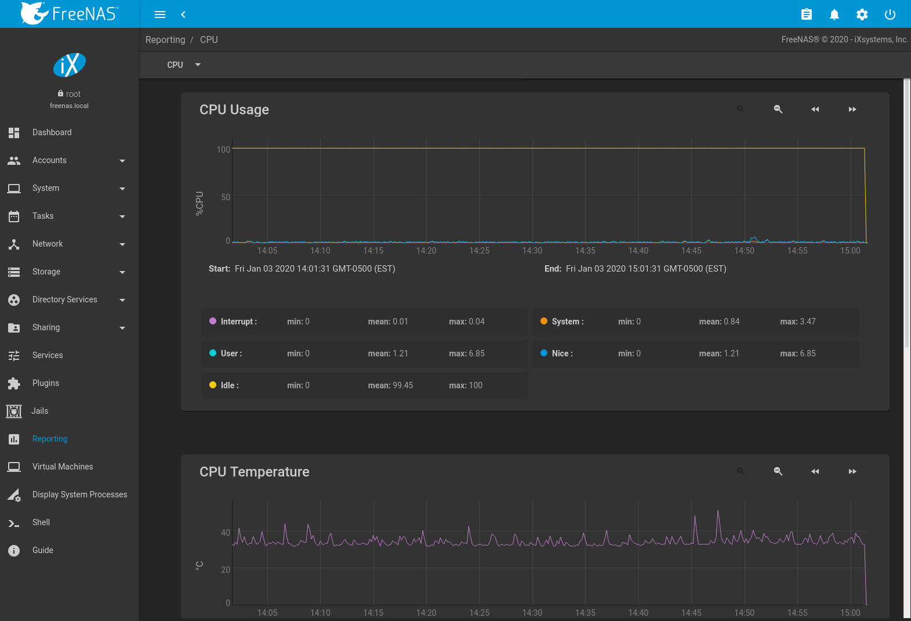

Reporting

Reporting
=========

Reporting displays several graphs, as seen in
`Figure %s <reporting_graphs_fig>`. Choose a category from the drop-down
menu to view those graphs. There are also options to change the graph
view and number of graphs on each page.

FreeNAS® uses [collectd](https://collectd.org/) to provide
reporting statistics. For a clearer picture, hover over a point in the
graph to show exact numbers for that point in time. Use the magnifier
buttons next to each graph to increase or decrease the displayed time
increment from 10 minutes, hourly, daily, weekly, or monthly. The `<<`
and `>>` buttons scroll through the output.

Note

Reporting graphs do not appear if there is no related data.

Graphs are grouped by category on the Reporting page:

-   `CPU`

    -   [CPU](https://collectd.org/wiki/index.php/Plugin:CPU) shows the
        amount of time spent by the CPU in various states such as
        executing user code, executing system code, and being idle.
        Graphs of short-, mid-, and long-term load are shown, along with
        CPU temperature graphs.

-   `Disk`

    -   [Disk](https://collectd.org/wiki/index.php/Plugin:Disk) shows
        read and write statistics on I/O, percent busy, latency,
        operations per second, pending I/O requests, and disk
        temperature. Choose the `DEVICES` and `METRICS` to view the
        selected metrics for the chosen devices.

    

    

    Note

    

    Temperature monitoring for the disk is disabled if `HDD Standby` is
    enabled in `Disks`.

    

-   `Memory`

    -   [Memory](https://collectd.org/wiki/index.php/Plugin:Memory)
        displays memory usage.
    -   [Swap](https://collectd.org/wiki/index.php/Plugin:Swap) displays
        the amount of free and used swap space.

-   `Network`

    -   [Interface](https://collectd.org/wiki/index.php/Plugin:Interface)
        shows received and transmitted traffic in megabytes per second
        for each configured interface.

-   `NFS`

    -   [NFS](https://collectd.org/wiki/index.php/Plugin:NFS) shows
        information about the number of procedure calls for each
        procedure and whether the system is a server or client.

-   `Partition`

    -   [Disk space](https://collectd.org/wiki/index.php/Plugin:DF)
        displays free, used, and reserved space for each pool and
        dataset. However, the disk space used by an individual zvol is
        not displayed as it is a block device.

-   `System`

    -   [Processes](https://collectd.org/wiki/index.php/Plugin:Processes)
        displays the number of processes. It is grouped by state.

-   `Target`

    -   Target shows bandwidth statistics for iSCSI ports.

-   `UPS`

    -   [UPS](https://collectd.org/wiki/index.php/Plugin:NUT) displays
        statistics about an uninterruptible power supply (UPS) using
        [Network UPS tools](https://networkupstools.org/). Statistics
        include voltages, currents, power, frequencies, load, and
        temperatures.

-   `ZFS`

    -   [ZFS](https://collectd.org/wiki/index.php/Plugin:ZFS_ARC) shows
        compressed physical ARC size, hit ratio, demand data, demand
        metadata, and prefetch data.

Reporting data is saved to permit viewing and monitoring usage trends
over time. This data is preserved across system upgrades and restarts.

Data files are saved in `/var/db/collectd/rrd/`.

Warning

Reporting data is frequently written and should not be stored on the
boot pool or operating system device.

