

Services

Services
========

Services that ship with FreeNAS® are configured, started, or
stopped in `Services`. FreeNAS® includes these built-in
services:

-   `AFP`
-   `Dynamic DNS`
-   `FTP`
-   `iSCSI`
-   `LLDP`
-   `NFS`
-   `Rsync`
-   `S3`
-   `S.M.A.R.T.`
-   `SMB`
-   `SNMP`
-   `SSH`
-   `TFTP`
-   `UPS`
-   `WebDAV`

This section demonstrates starting a FreeNAS® service and the
available configuration options for each FreeNAS® service.

Start Service, Stop Service

Configure Services
------------------

The `Services` page, shown in `Figure %s <control_services_fig>`, lists
all services. The list has options to activate the service, set a
service to `Start Automatically` at system boot, and configure a
service. The S.M.A.R.T. service is enabled by default, but only runs if
the storage devices support [S.M.A.R.T.
data](https://en.wikipedia.org/wiki/S.M.A.R.T.). Other services default
to *off* until started.

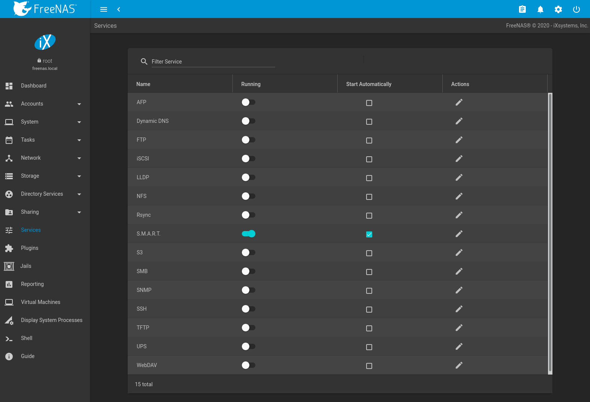

Stopped services show the sliding button on the left. Active services
show the sliding button on the right. Click the slider to start or stop
a service. Stopping a service shows a confirmation dialog.

Tip

Using a proxy server can prevent the list of services from being
displayed. If a proxy server is used, do not configure it to proxy local
network or websocket connections. VPN software can also cause problems.
If the list of services is displayed when connecting on the local
network but not when connecting through the VPN, check the VPN software
configuration.

Services are configured by clicking ui-configure.

If a service does not start, go to `System --> Advanced` and enable
`Show console messages`. Console messages appear at the bottom of the
browser. Clicking the console message area makes it into a pop-up
window, allowing scrolling through or copying the messages. Watch these
messages for errors when stopping or starting the problematic service.

To read the system logs for more information about a service failure,
open `Shell` and type `more /var/log/messages`.

AFP, Apple Filing Protocol

AFP
---

The settings that are configured when creating AFP shares in are
specific to each configured AFP share. An AFP share is created by
navigating to `Sharing --> Apple (AFP)`, and clicking `ADD`. In
contrast, global settings which apply to all AFP shares are configured
in `Services --> AFP --> Configure`.

`Figure %s <global_afp_config_fig>` shows the available global AFP
configuration options which are described in
`Table %s <global_afp_config_opts_tab>`.

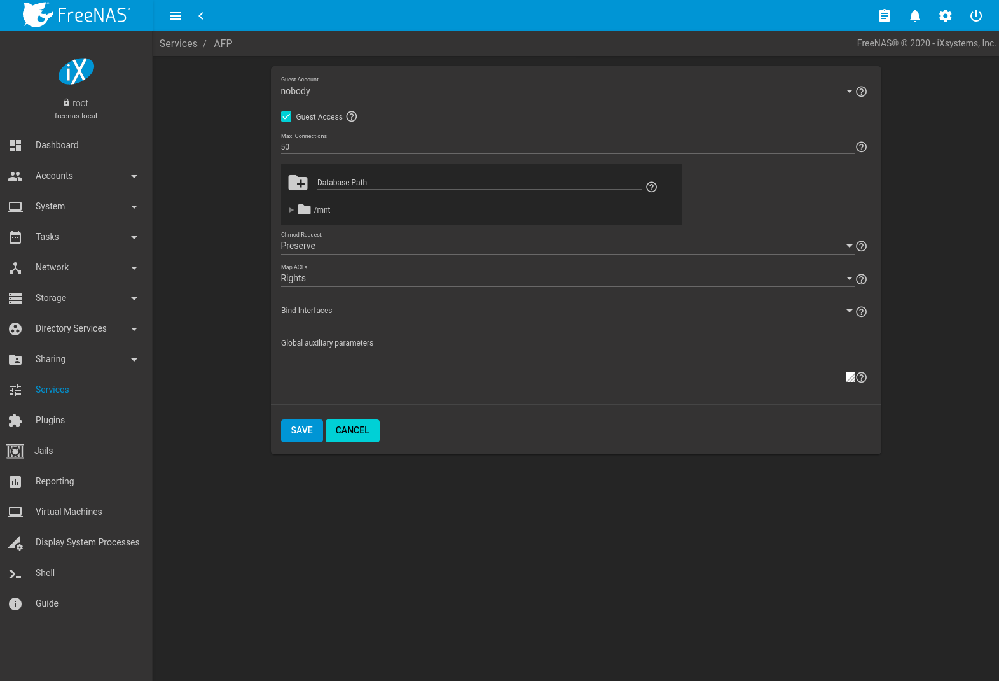

&gt;{RaggedRight}p{dimexpr 0.20linewidth-2tabcolsep}

| Setting                     | Value          | Description                                                                                                                                       |
|-----------------------------|----------------|---------------------------------------------------------------------------------------------------------------------------------------------------|
| Guest Account               | drop-down menu | Select an account to use for guest access. The account must have permissions to the pool or dataset being shared.                                 |
| Guest Access                | checkbox       | If enabled, clients are not prompted to authenticate before accessing AFP shares.                                                                 |
| Max. Connections            | integer        | Maximum number of simultaneous connections permited via AFP. The default limit is 50.                                                             |
| Database Path               | browse button  | Sets the database information to be stored in the path. Default is the root of the pool. The path must be writable even if the pool is read only. |
| Chmod Request               | drop-down menu | Set how ACLs are handled. Choices are: *Ignore*, *Preserve*, or *Simple*.                                                                         |
| Map ACLs                    | drop-down menu | Choose mapping of effective permissions for authenticated users: *Rights* (default, Unix-style permissions), *Mode* (ACLs), or *None*.            |
| Bind Interfaces             | selection      | Specify the IP addresses to listen for FTP connections. Select the desired IP addresses in the list to add them to the `Bind Interfaces` list.    |
| Global auxiliary parameters | string         | Additional [afp.conf(5)](https://www.freebsd.org/cgi/man.cgi?query=afp.conf) parameters not covered elsewhere in this screen.                     |

Global AFP Configuration Options

### Troubleshooting AFP

Check for error messages in `/var/log/afp.log`.

Determine which users are connected to an AFP share by typing
`afpusers`.

If `Something wrong with the volume's CNID DB` is shown, run this
command from `Shell`, replacing the path to the problematic AFP share:

    dbd -rf /path/to/share

This command can take some time, depending upon the size of the pool or
dataset being shared. The CNID database is wiped and rebuilt from the
CNIDs stored in the AppleDouble files.

Dynamic DNS, DDNS

Dynamic DNS
-----------

Dynamic DNS (DDNS) is useful if the FreeNAS® system is
connected to an ISP that periodically changes the IP address of the
system. With dynamic DNS, the system can automatically associate its
current IP address with a domain name, allowing access to the
FreeNAS® system even if the IP address changes. DDNS requires
registration with a DDNS service such as [DynDNS](https://dyn.com/dns/).

`Figure %s <config_ddns_fig>` shows the DDNS configuration screen and
`Table %s <ddns_config_opts_tab>` summarizes the configuration options.
The values for these fields are provided by the DDNS provider. After
configuring DDNS, remember to start the DDNS service in
`Services --> Dynamic DNS`.

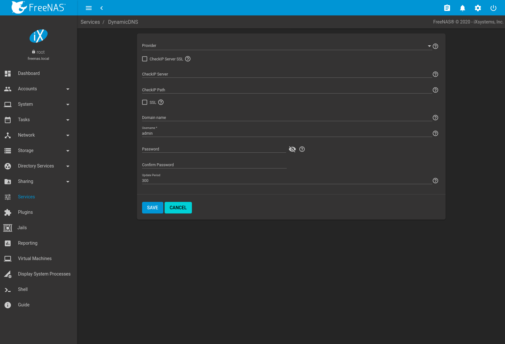

&gt;{RaggedRight}p{dimexpr 0.20linewidth-2tabcolsep}

| Setting            | Value          | Description                                                                                                                                                                                                                                                                                                                                              |
|--------------------|----------------|----------------------------------------------------------------------------------------------------------------------------------------------------------------------------------------------------------------------------------------------------------------------------------------------------------------------------------------------------------|
| Provider           | drop-down menu | Several providers are supported. If a specific provider is not listed, select *Custom Provider* and enter the information in the `Custom Server` and `Custom Path` fields.                                                                                                                                                                               |
| CheckIP Server SSL | checkbox       | Use HTTPS for the connection to the *CheckIP Server*.                                                                                                                                                                                                                                                                                                    |
| CheckIP Server     | string         | Name and port of the server that reports the external IP address. For example, entering `checkip.dyndns.org:80` uses [Dyn IP detection](https://help.dyn.com/remote-access-api/checkip-tool/) to discover the remote socket IP address.                                                                                                                  |
| CheckIP Path       | string         | Path to the `CheckIP Server`. For example, *no-ip.com* uses a `CheckIP Server` of `dynamic.zoneedit.com` and `CheckIP Path` of `/checkip.html`.                                                                                                                                                                                                          |
| SSL                | checkbox       | Use HTTPS for the connection to the server that updates the DNS record.                                                                                                                                                                                                                                                                                  |
| Custom Server      | string         | DDNS server name. For example, `members.dyndns.org` denotes a server similar to dyndns.org.                                                                                                                                                                                                                                                              |
| Custom Path        | string         | DDNS server path. Path syntax varies by provider and must be obtained from that provider. For example, `/update?hostname=` is a simple path for the `update.twodns.de` `Custom Server`. The hostname is automatically appended by default. More examples are in the [In-A-Dyn documentation](https://github.com/troglobit/inadyn#custom-ddns-providers). |
| Domain name        | string         | Fully qualified domain name of the host with the dynamic IP addess. Separate multiple domains with a space, comma (`,`), or semicolon (`;`). Example: *myname.dyndns.org; myothername.dyndns.org*                                                                                                                                                        |
| Username           | string         | Username for logging in to the provider and updating the record.                                                                                                                                                                                                                                                                                         |
| Password           | string         | Password for logging in to the provider and updating the record.                                                                                                                                                                                                                                                                                         |
| Update period      | integer        | How often the IP is checked in seconds.                                                                                                                                                                                                                                                                                                                  |

DDNS Configuration Options

When using the `he.net` `Provider`, enter the domain name for `Username`
and enter the DDNS key generated for that domain's A entry at the
[he.net](https://he.net) website for `Password`.

FTP, File Transfer Protocol

FTP
---

FreeNAS® uses the [proftpd](http://www.proftpd.org/) FTP
server to provide FTP services. Once the FTP service is configured and
started, clients can browse and download data using a web browser or FTP
client software. The advantage of FTP is that easy-to-use cross-platform
utilities are available to manage uploads to and downloads from the
FreeNAS® system. The disadvantage of FTP is that it is
considered to be an insecure protocol, meaning that it should not be
used to transfer sensitive files. If concerned about sensitive data, see
`Encrypting FTP`.

This section provides an overview of the FTP configuration options. It
then provides examples for configuring anonymous FTP, specified user
access within a chroot environment, encrypting FTP connections, and
troubleshooting tips.

`Figure %s <configuring_ftp_fig>` shows the configuration screen for
`Services --> FTP --> Configure`. Some settings are only available in
`ADVANCED MODE`. To see these settings, either click the `ADVANCED MODE`
button or configure the system to always display these settings by
setting the `Show advanced fields by default` option in
`System --> Advanced`.

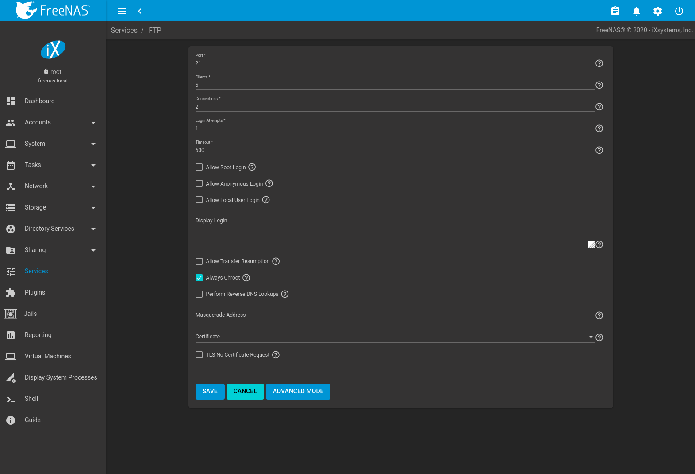

`Table %s <ftp_config_opts_tab>` summarizes the available options when
configuring the FTP server.

&gt;{RaggedRight}p{dimexpr 0.14linewidth-2tabcolsep}
&gt;{RaggedRight}p{dimexpr 0.54linewidth-2tabcolsep}\|

| Setting                                                            | Value          | Advanced Mode | Description                                                                                                                                                                                                                                                       |
|--------------------------------------------------------------------|----------------|---------------|-------------------------------------------------------------------------------------------------------------------------------------------------------------------------------------------------------------------------------------------------------------------|
| Port                                                               | integer        |               | Set the port the FTP service listens on.                                                                                                                                                                                                                          |
| Clients                                                            | integer        |               | Maximum number of simultaneous clients.                                                                                                                                                                                                                           |
| Connections                                                        | integer        |               | Set the maximum number of connections per IP address. *0* means unlimited.                                                                                                                                                                                        |
| Login Attempts                                                     | integer        |               | Enter the maximum number of attempts before the client is disconnected. Increase this if users are prone to typos.                                                                                                                                                |
| Timeout                                                            | integer        |               | Maximum client idle time in seconds before client is disconnected.                                                                                                                                                                                                |
| Allow Root Login                                                   | checkbox       |               | Setting this option is discouraged as it increases security risk.                                                                                                                                                                                                 |
| Allow Anonymous Login                                              | checkbox       |               | Allow anonymous FTP logins with access to the directory specified in the `Path`.                                                                                                                                                                                  |
| Path                                                               | browse button  |               | Set the root directory for anonymous FTP connections.                                                                                                                                                                                                             |
| Allow Local User Login                                             | checkbox       |               | Allow any local user to log in. By default, only members of the `ftp` group are allowed to log in.                                                                                                                                                                |
| Display Login                                                      | string         |               | Specify the message displayed to local login users after authentication. Not displayed to anonymous login users.                                                                                                                                                  |
| Allow Transfer Resumption                                          | checkbox       |               | Set to allow FTP clients to resume interrupted transfers.                                                                                                                                                                                                         |
| Always Chroot                                                      | checkbox       |               | When set a local user is only allowed access to their home directory when they are a member of the *wheel* group.                                                                                                                                                 |
| Perform Reverse DNS Lookups                                        | checkbox       |               | Set to perform reverse DNS lookups on client IPs. Can cause long delays if reverse DNS is not configured.                                                                                                                                                         |
| Masquerade address                                                 | string         |               | Public IP address or hostname. Set if FTP clients cannot connect through a NAT device.                                                                                                                                                                            |
| Certificate                                                        | drop-down menu |               | Select the SSL certificate to be used for TLS FTP connections. Go to `System --> Certificates` to create a certificate.                                                                                                                                           |
| TLS No Certificate Request                                         | checkbox       |               | Set if the client cannot connect, and it is suspected the client is not properly handling server certificate requests.                                                                                                                                            |
| File Permission                                                    | checkboxes     | ✓             | Sets default permissions for newly created files.                                                                                                                                                                                                                 |
| Directory Permission                                               | checkboxes     | ✓             | Sets default permissions for newly created directories.                                                                                                                                                                                                           |
| Enable [FXP](https://en.wikipedia.org/wiki/File_eXchange_Protocol) | checkbox       | ✓             | Set to enable the File eXchange Protocol. This is discouraged as it makes the server vulnerable to FTP bounce attacks.                                                                                                                                            |
| Require IDENT Authentication                                       | checkbox       | ✓             | Setting this option results in timeouts if `identd` is not running on the client.                                                                                                                                                                                 |
| Minimum Passive Port                                               | integer        | ✓             | Used by clients in PASV mode, default of *0* means any port above 1023.                                                                                                                                                                                           |
| Maximum Passive Port                                               | integer        | ✓             | Used by clients in PASV mode, default of *0* means any port above 1023.                                                                                                                                                                                           |
| Local User Upload Bandwidth                                        | integer        | ✓             | Defined in KiB/s, default of *0* means unlimited.                                                                                                                                                                                                                 |
| Local User Download Bandwidth                                      | integer        | ✓             | Defined in KiB/s, default of *0* means unlimited.                                                                                                                                                                                                                 |
| Anonymous User Upload Bandwidth                                    | integer        | ✓             | Defined in KiB/s, default of *0* means unlimited.                                                                                                                                                                                                                 |
| Anonymous User Download Bandwidth                                  | integer        | ✓             | Defined in KiB/s, default of *0* means unlimited.                                                                                                                                                                                                                 |
| Enable TLS                                                         | checkbox       | ✓             | Set to enable encrypted connections. Requires a certificate to be created or imported using `Certificates`.                                                                                                                                                       |
| TLS Policy                                                         | drop-down menu | ✓             | The selected policy defines whether the control channel, data channel, both channels, or neither channel of an FTP session must occur over SSL/TLS. The policies are described [here](http://www.proftpd.org/docs/directives/linked/config_ref_TLSRequired.html). |
| TLS Allow Client Renegotiations                                    | checkbox       | ✓             | Setting this option is **not** recommended as it breaks several security measures. For this and the rest of the TLS fields, refer to [mod\_tls](http://www.proftpd.org/docs/contrib/mod_tls.html) for more details.                                               |
| TLS Allow Dot Login                                                | checkbox       | ✓             | If set, the user home directory is checked for a `.tlslogin` file which contains one or more PEM-encoded certificates. If not found, the user is prompted for password authentication.                                                                            |
| TLS Allow Per User                                                 | checkbox       | ✓             | If set, the user password may be sent unencrypted.                                                                                                                                                                                                                |
| TLS Common Name Required                                           | checkbox       | ✓             | When set, the common name in the certificate must match the FQDN of the host.                                                                                                                                                                                     |
| TLS Enable Diagnostics                                             | checkbox       | ✓             | If set when troubleshooting a connection, logs more verbosely.                                                                                                                                                                                                    |
| TLS Export Certificate Data                                        | checkbox       | ✓             | If set, exports the certificate environment variables.                                                                                                                                                                                                            |
| TLS No Certificate Request                                         | checkbox       | ✓             | Set if the client cannot connect and it is suspected the client is poorly handling the server certificate request.                                                                                                                                                |
| TLS No Empty Fragments                                             | checkbox       | ✓             | Setting this option is **not** recommended as it bypasses a security mechanism.                                                                                                                                                                                   |
| TLS No Session Reuse Required                                      | checkbox       | ✓             | Setting this option reduces the security of the connection. Only use if the client does not understand reused SSL sessions.                                                                                                                                       |
| TLS Export Standard Vars                                           | checkbox       | ✓             | If enabled, sets several environment variables.                                                                                                                                                                                                                   |
| TLS DNS Name Required                                              | checkbox       | ✓             | If set, the client DNS name must resolve to its IP address and the cert must contain the same DNS name.                                                                                                                                                           |
| TLS IP Address Required                                            | checkbox       | ✓             | If set, the client certificate must contain the IP address that matches the IP address of the client.                                                                                                                                                             |
| Auxiliary Parameters                                               | string         | ✓             | Used to add [proftpd(8)](https://www.freebsd.org/cgi/man.cgi?query=proftpd) parameters not covered elsewhere in this screen.                                                                                                                                      |

FTP Configuration Options

This example demonstrates the auxiliary parameters that prevent all
users from performing the FTP DELETE command:

    <Limit DELE>
    DenyAll
    </Limit>

### Anonymous FTP

Anonymous FTP may be appropriate for a small network where the
FreeNAS® system is not accessible from the Internet and
everyone in the internal network needs easy access to the stored data.
Anonymous FTP does not require a user account for every user. In
addition, passwords are not required so it is not necessary to manage
changed passwords on the FreeNAS® system.

To configure anonymous FTP:

1.  Give the built-in ftp user account permissions to the pool or
    dataset to be shared in `Storage --> Pools --> Edit Permissions`:

    -   `User`: select the built-in *ftp* user from the drop-down menu
    -   `Group`: select the built-in *ftp* group from the drop-down menu
    -   `Mode`: review that the permissions are appropriate for the
        share

    

    

    Note

    

    For FTP, the type of client does not matter when it comes to the
    type of ACL. This means that Unix ACLs are used even if Windows
    clients are accessing FreeNAS® via FTP.

    

2.  Configure anonymous FTP in `Services --> FTP --> Configure` by
    setting these attributes:

    -   `Allow Anonymous Login`: set this option
    -   `Path`: browse to the pool/dataset/directory to be shared

3.  Start the FTP service in `Services`. Click the sliding button on the
    `FTP` row. The FTP service takes a second or so to start. The
    sliding button moves to the right when the service is running.

4.  Test the connection from a client using a utility such as
    [Filezilla](https://filezilla-project.org/).

In the example shown in `Figure %s <ftp_filezilla_fig>`, The user has
entered this information into the Filezilla client:

-   IP address of the FreeNAS® server: *192.168.1.113*
-   `Username`: *anonymous*
-   `Password`: the email address of the user

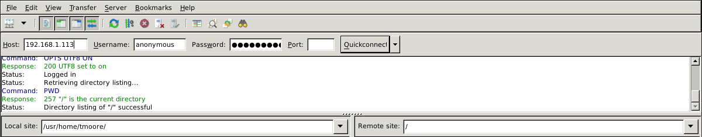

The messages within the client indicate the FTP connection is
successful. The user can now navigate the contents of the root folder on
the remote site. This is the pool or dataset specified in the FTP
service configuration. The user can also transfer files between the
local site (their system) and the remote site (the FreeNAS®
system).

### FTP in chroot

If users are required to authenticate before accessing the data on the
FreeNAS® system, either create a user account for each user
or import existing user accounts using `Active Directory` or `LDAP`.
Create a ZFS dataset for *each* user, then chroot each user so they are
limited to the contents of their own home directory. Datasets provide
the added benefit of configuring a quota so that the size of a user home
directory is limited to the size of the quota.

To configure this scenario:

1.  Create a ZFS dataset for each user in `Storage --> Pools`. Click the
    ui-options button, then `Add Dataset`. Set an appropriate quota for
    each dataset. Repeat this process to create a dataset for every user
    that needs access to the FTP service.

2.  When `Active Directory` or `LDAP` are not being used, create a user
    account for each user by navigating to `Accounts --> Users`, and
    clicking `ADD`. For each user, browse to the dataset created for
    that user in the `Home Directory` field. Repeat this process to
    create a user account for every user that needs access to the FTP
    service, making sure to assign each user their own dataset.

3.  Set the permissions for each dataset by navigating to
    `Storage --> Pools`, and clicking the ui-options on the desired
    dataset. Click the `Edit Permissions` button, then assign a user
    account as `User` of that dataset. Set the desired permissions for
    that user. Repeat for each dataset.

    

    

    Note

    

    For FTP, the type of client does not matter when it comes to the
    type of ACL. This means Unix ACLs are always used, even if Windows
    clients will be accessing FreeNAS® via FTP.

    

4.  Configure FTP in `Services --> FTP --> Configure` with these
    attributes:

    -   `Path`: browse to the parent pool containing the datasets.
    -   Make sure the options for `Allow Root Login` and
        `Allow Anonymous Login` are **unselected**.
    -   Select the `Allow Local User Login` option to enable it.
    -   Select the `Always Chroot` option to enable it.

5.  Start the FTP service in `Services --> FTP`. Click the sliding
    button on the `FTP` row. The FTP service takes a second or so to
    start. The sliding button moves to the right to show the service is
    running.

6.  Test the connection from a client using a utility such as Filezilla.

To test this configuration in Filezilla, use the *IP address* of the
FreeNAS® system, the *Username* of a user that is associated
with a dataset, and the *Password* for that user. The messages will
indicate the authorization and the FTP connection are successful. The
user can now navigate the contents of the root folder on the remote
site. This time it is not the entire pool but the dataset created for
that user. The user can transfer files between the local site (their
system) and the remote site (their dataset on the FreeNAS®
system).

### Encrypting FTP

To configure any FTP scenario to use encrypted connections:

1.  Import or create a certificate authority using the instructions in
    `CAs`. Then, import or create the certificate to use for encrypted
    connections using the instructions in `Certificates`.
2.  In `Services --> FTP --> Configure`, click `ADVANCED`, choose the
    certificate in `Certificate`, and set the `Enable TLS` option.
3.  Specify secure FTP when accessing the FreeNAS® system.
    For example, in Filezilla enter *ftps://IP\_address* (for an
    implicit connection) or *ftpes://IP\_address* (for an explicit
    connection) as the Host when connecting. The first time a user
    connects, they will be presented with the certificate of the
    FreeNAS® system. Click `SAVE` to accept the certificate
    and negotiate an encrypted connection.
4.  To force encrypted connections, select *On* for the `TLS Policy`.

### Troubleshooting FTP

The FTP service will not start if it cannot resolve the system hostname
to an IP address with DNS. To see if the FTP service is running, open
`Shell` and issue the command:

    sockstat -4p 21

If there is nothing listening on port 21, the FTP service is not
running. To see the error message that occurs when FreeNAS®
tries to start the FTP service, go to `System --> Advanced`, enable
`Show console messages`, and click `SAVE`. Go to `Services` and switch
the FTP service off, then back on. Watch the console messages at the
bottom of the browser for errors.

If the error refers to DNS, either create an entry in the local DNS
server with the FreeNAS® system hostname and IP address, or
add an entry for the IP address of the FreeNAS® system in the
`Network --> Global Configuration` `Host name database` field.

iSCSI
-----

Refer to `Block (iSCSI)` for instructions on configuring iSCSI. Start
the iSCSI service in `Services` by clicking the sliding button in the
`iSCSI` row.

Note

A warning message is shown the iSCSI service stops when initiators are
connected. Open the `Shell` and type `ctladm islist` to determine the
names of the connected initiators.

LLDP, Link Layer Discovery Protocol

LLDP
----

The Link Layer Discovery Protocol (LLDP) is used by network devices to
advertise their identity, capabilities, and neighbors on an Ethernet
network. FreeNAS® uses the
[ladvd](https://github.com/sspans/ladvd) LLDP implementation. If the
network contains managed switches, configuring and starting the LLDP
service will tell the FreeNAS® system to advertise itself on
the network.

`Figure %s <config_lldp_fig>` shows the LLDP configuration screen and
`Table %s <lldP_config_opts_tab>` summarizes the configuration options
for the LLDP service.

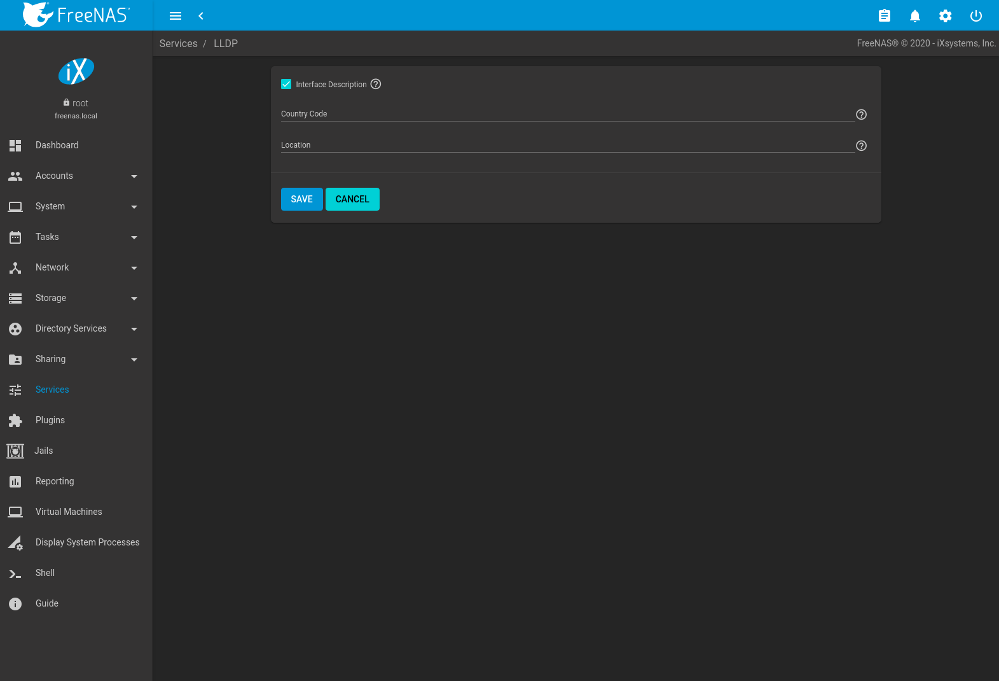

&gt;{RaggedRight}p{dimexpr 0.20linewidth-2tabcolsep}

| Setting               | Value    | Description                                                                                     |
|-----------------------|----------|-------------------------------------------------------------------------------------------------|
| Interface Description | checkbox | Set to enable receive mode and to save and received peer information in interface descriptions. |
| Country Code          | string   | Required for LLDP location support. Enter a two-letter ISO 3166 country code.                   |
| Location              | string   | Optional. Specify the physical location of the host.                                            |

LLDP Configuration Options

NFS, Network File System

NFS
---

The settings that are configured when creating NFS shares in are
specific to each configured NFS share. An NFS share is created by going
to `Sharing --> Unix (NFS) Shares` and clicking `ADD`. Global settings
which apply to all NFS shares are configured in
`Services --> NFS --> Configure`.

`Figure %s <config_nfs_fig>` shows the configuration screen and
`Table %s <nfs_config_opts_tab>` summarizes the configuration options
for the NFS service.

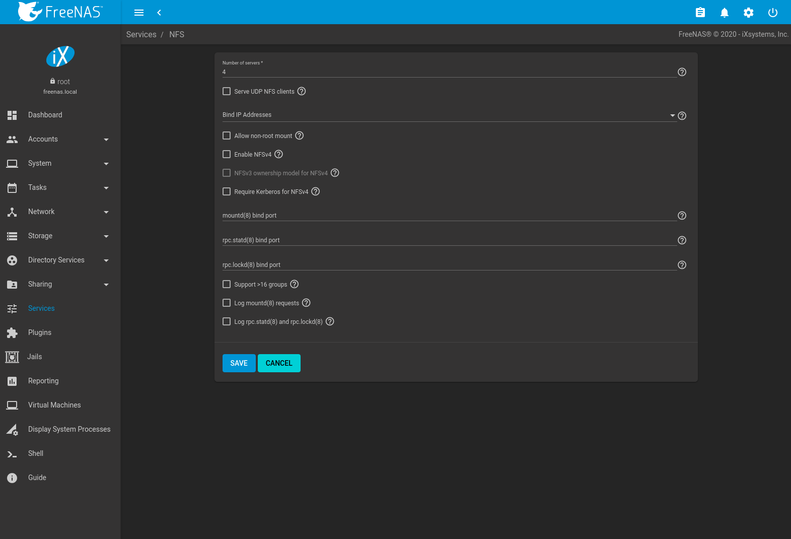

&gt;{RaggedRight}p{dimexpr 0.20linewidth-2tabcolsep}

| Setting                           | Value     | Description                                                                                                                                                                                                                          |
|-----------------------------------|-----------|--------------------------------------------------------------------------------------------------------------------------------------------------------------------------------------------------------------------------------------|
| Number of servers                 | integer   | Specify how many servers to create. Increase if NFS client responses are slow. To limit CPU context switching, keep this number less than or equal to the number of CPUs reported by `sysctl -n kern.smp.cpus`.                      |
| Serve UDP NFS clients             | checkbox  | Set if NFS clients need to use UDP.                                                                                                                                                                                                  |
| Bind IP Addresses                 | drop-down | Select IP addresses to listen on for NFS requests. When all options are unset, NFS listens on all available addresses.                                                                                                               |
| Allow non-root mount              | checkbox  | Set only if required by the NFS client.                                                                                                                                                                                              |
| Enable NFSv4                      | checkbox  | Set to switch from NFSv3 to NFSv4. The default is NFSv3.                                                                                                                                                                             |
| NFSv3 ownership model for NFSv4   | checkbox  | Grayed out unless `Enable NFSv4` is selected and, in turn, grays out `Support>16 groups` which is incompatible. Set this option if NFSv4 ACL support is needed without requiring the client and the server to sync users and groups. |
| Require Kerberos for NFSv4        | checkbox  | Set to force NFS shares to fail if the Kerberos ticket is unavailable. Disabling this option allows using either default NFS or Kerberos authentication.                                                                             |
| mountd(8) bind port               | integer   | Optional. Specify the port that [mountd(8)](https://www.freebsd.org/cgi/man.cgi?query=mountd) binds to.                                                                                                                              |
| rpc.statd(8) bind port            | integer   | Optional. Specify the port that [rpc.statd(8)](https://www.freebsd.org/cgi/man.cgi?query=rpc.statd) binds to.                                                                                                                        |
| rpc.lockd(8) bind port            | integer   | Optional. Specify the port that [rpc.lockd(8)](https://www.freebsd.org/cgi/man.cgi?query=rpc.lockd) binds to.                                                                                                                        |
| Support &gt;16 groups             | checkbox  | Set this option if any users are members of more than 16 groups (useful in AD environments). Note this assumes group membership is configured correctly on the NFS server.                                                           |
| Log mountd(8) requests            | checkbox  | Enable logging of [mountd(8)](https://www.freebsd.org/cgi/man.cgi?query=mountd) requests by syslog.                                                                                                                                  |
| Log rpc.statd(8) and rpc.lockd(8) | checkbox  | Enable logging of [rpc.statd(8)](https://www.freebsd.org/cgi/man.cgi?query=rpc.statd) and [rpc.lockd(8)](https://www.freebsd.org/cgi/man.cgi?query=rpc.lockd) requests by syslog.                                                    |

NFS Configuration Options

Note

NFSv4 sets all ownership to *nobody:nobody* if user and group do not
match on client and server.

Rsync

Rsync
-----

`Services --> Rsync` is used to configure an rsync server when using
rsync module mode. Refer to `Rsync Module Mode` for a configuration
example.

This section describes the configurable options for the `rsyncd` service
and rsync modules.

### Configure Rsyncd

To configure the `rsyncd` server, go to `Services` and click ui-edit for
the `Rsync` service.

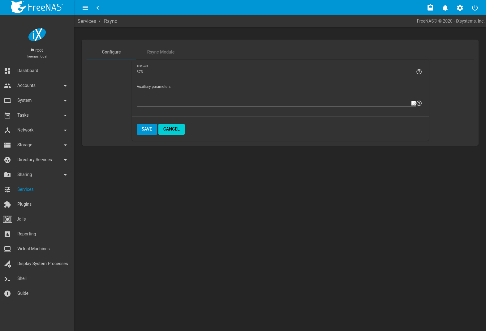

`Table %s <rsyncd_config_opts_tab>` summarizes the configuration options
for the rsync daemon:

&gt;{RaggedRight}p{dimexpr 0.20linewidth-2tabcolsep}

| Setting              | Value   | Description                                                                                                   |
|----------------------|---------|---------------------------------------------------------------------------------------------------------------|
| TCP Port             | integer | `rsyncd` listens on this port. The default is *873*.                                                          |
| Auxiliary parameters | string  | Enter any additional parameters from [rsyncd.conf(5)](https://www.freebsd.org/cgi/man.cgi?query=rsyncd.conf). |

Rsyncd Configuration Options

### Rsync Modules

To add a new Rsync module, go to `Services`, click ui-edit for the
`Rsync` service, select the `Rsync Module` tab, and click `ADD`.

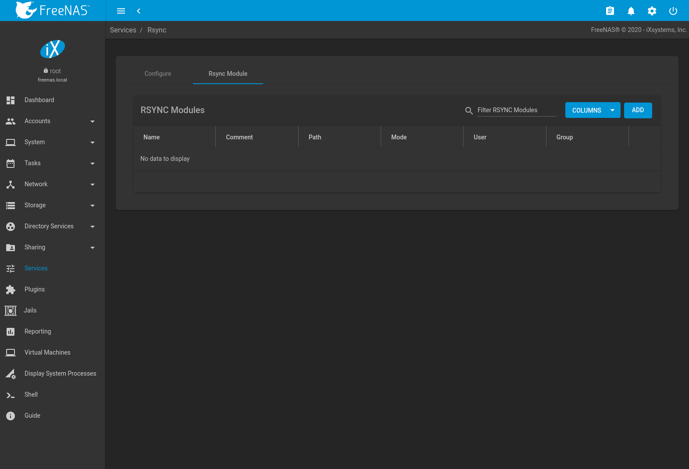

`Table %s <rsync_module_opts_tab>` summarizes the configuration options
available when creating a rsync module.

&gt;{RaggedRight}p{dimexpr 0.20linewidth-2tabcolsep}

| Setting              | Value          | Description                                                                                                                                                                                                                                                          |
|----------------------|----------------|----------------------------------------------------------------------------------------------------------------------------------------------------------------------------------------------------------------------------------------------------------------------|
| Name                 | string         | Module name that matches the name requested by the rsync client.                                                                                                                                                                                                     |
| Comment              | string         | Describe this module.                                                                                                                                                                                                                                                |
| Path                 | file browser   | Browse to the pool or dataset to store received data.                                                                                                                                                                                                                |
| Access Mode          | drop-down menu | Choose permissions for this rsync module.                                                                                                                                                                                                                            |
| Maximum connections  | integer        | Maximum connections to this module. *0* is unlimited.                                                                                                                                                                                                                |
| User                 | drop-down menu | User to run as during file transfers to and from this module.                                                                                                                                                                                                        |
| Group                | drop-down menu | Group to run as during file transfers to and from this module.                                                                                                                                                                                                       |
| Hosts Allow          | string         | From [rsyncd.conf(5)](https://www.freebsd.org/cgi/man.cgi?query=rsyncd.conf). A list of patterns to match with the hostname and IP address of a connecting client. The connection is rejected if no patterns match. Separate patterns with whitespace or a comma.    |
| Hosts Deny           | string         | From [rsyncd.conf(5)](https://www.freebsd.org/cgi/man.cgi?query=rsyncd.conf). A list of patterns to match with the hostname and IP address of a connecting client. The connection is rejected when the patterns match. Separate patterns with whitespace or a comma. |
| Auxiliary parameters | string         | Enter any additional parameters from [rsyncd.conf(5)](https://www.freebsd.org/cgi/man.cgi?query=rsyncd.conf).                                                                                                                                                        |

Rsync Module Configuration Options

S3, Minio

S3
--

S3 is a distributed or clustered filesystem protocol compatible with
Amazon S3 cloud storage. The FreeNAS® S3 service uses
[Minio](https://minio.io/) to provide S3 storage hosted on the
FreeNAS® system itself. Minio also provides features beyond
the limits of the basic Amazon S3 specifications.

`Figure %s <config_s3_fig>` shows the S3 service configuration screen
and `Table %s <s3_config_opts_tab>` summarizes the configuration
options. After configuring the S3 service, start it in `Services`.

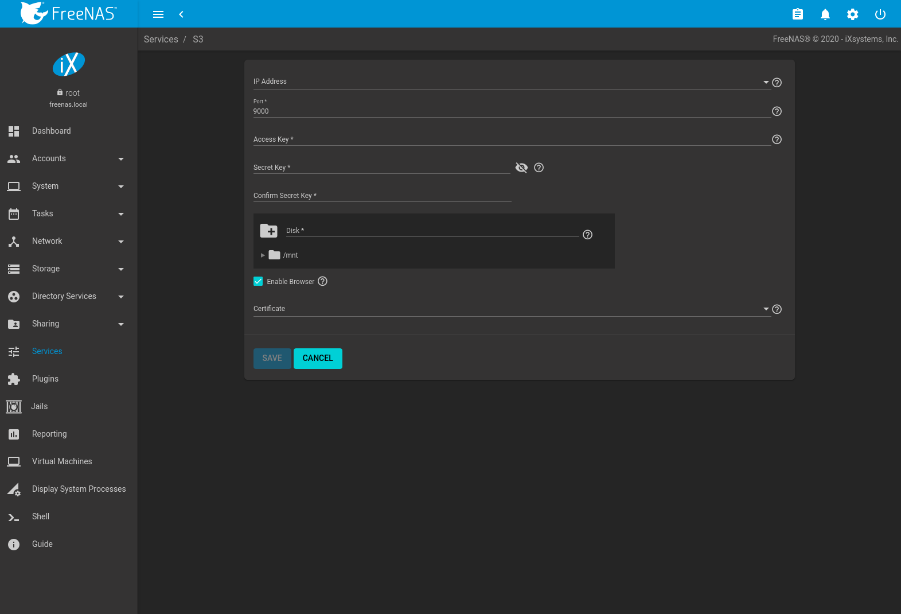

&gt;{RaggedRight}p{dimexpr 0.20linewidth-2tabcolsep}

| Setting            | Value          | Description                                                                                                                                                                                                                                                |
|--------------------|----------------|------------------------------------------------------------------------------------------------------------------------------------------------------------------------------------------------------------------------------------------------------------|
| IP Address         | drop-down menu | Enter the IP address to run the S3 service. *0.0.0.0* sets the server to listen on all addresses.                                                                                                                                                          |
| Port               | string         | Enter the TCP port on which to provide the S3 service. Default is *9000*.                                                                                                                                                                                  |
| Access Key         | string         | Enter the S3 access ID. See [Access keys](https://docs.aws.amazon.com/general/latest/gr/aws-sec-cred-types.html#access-keys-and-secret-access-keys) for more information.                                                                                  |
| Secret Key         | string         | Enter the S3 secret access key. See [Access keys](https://docs.aws.amazon.com/general/latest/gr/aws-sec-cred-types.html#access-keys-and-secret-access-keys) for more information.                                                                          |
| Confirm Secret Key | string         | Re-enter the S3 password to confirm.                                                                                                                                                                                                                       |
| Disk               | browse         | Directory where the S3 filesystem will be mounted. Ownership of this directory and all subdirectories is set to *minio:minio*. `Create a separate dataset<Adding Datasets>` for Minio to avoid issues with conflicting directory permissions or ownership. |
| Enable Browser     | checkbox       | Set to enable the web user interface for the S3 service. Access the minio web interface by entering the IP address and port number separated by a colon in the browser address bar.                                                                        |
| Certificate        | drop-down menu | Add the `SSL certificate <Certificates>` to be used for secure S3 connections.                                                                                                                                                                             |

S3 Configuration Options

S.M.A.R.T.

S.M.A.R.T.
----------

[S.M.A.R.T., or Self-Monitoring, Analysis, and Reporting
Technology](https://en.wikipedia.org/wiki/S.M.A.R.T.), is an industry
standard for disk monitoring and testing. Drives can be monitored for
status and problems, and several types of self-tests can be run to check
the drive health.

Tests run internally on the drive. Most tests can run at the same time
as normal disk usage. However, a running test can greatly reduce drive
performance, so they should be scheduled at times when the system is not
busy or in normal use. It is very important to avoid scheduling
disk-intensive tests at the same time. For example, do not schedule
S.M.A.R.T. tests to run at the same time, or preferably, even on the
same days as `Scrub Tasks`.

Of particular interest in a NAS environment are the *Short* and *Long*
S.M.A.R.T. tests. Details vary between drive manufacturers, but a
*Short* test generally does some basic tests of a drive that takes a few
minutes. The *Long* test scans the entire disk surface, and can take
several hours on larger drives.

FreeNAS® uses the
[smartd(8)](https://www.smartmontools.org/browser/trunk/smartmontools/smartd.8.in)
service to monitor S.M.A.R.T. information, including disk temperature. A
complete configuration consists of:

1.  Scheduling when S.M.A.R.T. tests are run. S.M.A.R.T tests are
    created by navigating to `Tasks --> S.M.A.R.T. Tests`, and clicking
    `ADD`.
2.  Enabling or disabling S.M.A.R.T. for each disk member of a pool in
    `Storage --> Pools`. This setting is enabled by default for disks
    that support S.M.A.R.T.
3.  Checking the configuration of the S.M.A.R.T. service as described in
    this section.
4.  Starting the S.M.A.R.T. service in `Services`.

`Figure %s <smart_config_opts_fig>` shows the configuration screen that
appears after going to `Services --> S.M.A.R.T` and clicking
ui-configure.

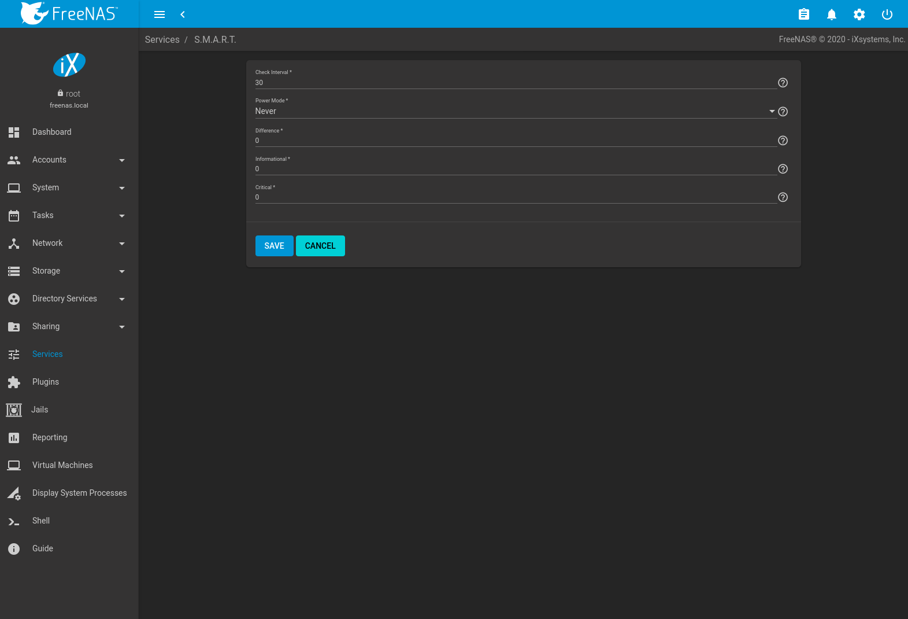

Note

`smartd` wakes up at the configured `Check Interval`. It checks the
times configured in `Tasks --> S.M.A.R.T. Tests` to see if a test must
begin. Since the smallest time increment for a test is an hour, it does
not make sense to set a `Check Interval` value higher than 60 minutes.
For example, if the `Check Interval` is set to *120* minutes and the
smart test to every hour, the test will only be run every two hours
because `smartd` only activates every two hours.

`Table %s <smart_config_opts_tab>` summarizes the options in the
S.M.A.R.T configuration screen.

&gt;{RaggedRight}p{dimexpr 0.20linewidth-2tabcolsep}

| Setting        | Value                      | Description                                                                                                                                                                                            |
|----------------|----------------------------|--------------------------------------------------------------------------------------------------------------------------------------------------------------------------------------------------------|
| Check Interval | integer                    | Define in minutes how often `smartd` activates to check if any tests are configured to run.                                                                                                            |
| Power Mode     | drop-down menu             | Tests are only performed when *Never* is selected. Choices are: *Never*, *Sleep*, *Standby*, or *Idle*.                                                                                                |
| Difference     | integer in degrees Celsius | Enter number of degrees in Celsius. S.M.A.R.T reports if the temperature of a drive has changed by N degrees Celsius since the last report. Default of *0* disables this option.                       |
| Informational  | integer in degrees Celsius | Enter a threshold temperature in Celsius. S.M.A.R.T will message with a log level of LOG\_INFO if the temperature is higher than the threshold. Default of *0* disables this option.                   |
| Critical       | integer in degrees Celsius | Enter a threshold temperature in Celsius. S.M.A.R.T will message with a log level of LOG\_CRIT and send an email if the temperature is higher than the threshold. Default of *0* disables this option. |

S.M.A.R.T Configuration Options

CIFS, Samba, Windows File Share, SMB

SMB
---

Note

After starting the SMB service, it can take several minutes for the
[master browser
election](https://www.samba.org/samba/docs/old/Samba3-HOWTO/NetworkBrowsing.html#id2581357)
to occur and for the FreeNAS® system to become available in
Windows Explorer.

`Figure %s <global_smb_config_fig>` shows the global configuration
options which apply to all SMB shares. This configuration screen
displays the configurable options from
[smb4.conf](https://www.freebsd.org/cgi/man.cgi?query=smb4.conf).

These options are described in `Table %s <global_smb_config_opts_tab>`.

> Global SMB Configuration

&gt;{RaggedRight}p{dimexpr 0.20linewidth-2tabcolsep}

Changes to SMB settings take effect immediately. Changes to share
settings only take effect after the client and server negotiate a new
session.

Note

Do not set the *directory name cache size* as an `Auxiliary Parameter`.
Due to differences in how Linux and BSD handle file descriptors,
directory name caching is disabled on BSD systems to improve
performance.

Note

`SMB` cannot be disabled while `Active Directory` is enabled.

### Troubleshooting SMB

Connecting to SMB shares as `root`, and adding the root user in the SMB
user database is not recommended.

Samba is single threaded, so CPU speed makes a big difference in SMB
performance. A typical 2.5Ghz Intel quad core or greater should be
capable of handling speeds in excess of Gb LAN while low power CPUs such
as Intel Atoms and AMD C-30sE-350E-450 will not be able to achieve more
than about 30-40MB/sec typically. Remember that other loads such as ZFS
will also require CPU resources and may cause Samba performance to be
less than optimal.

Windows automatically caches file sharing information. If changes are
made to an SMB share or to the permissions of a pool or dataset being
shared by SMB and the share becomes inaccessible, log out and back in to
the Windows system. Alternately, users can type `net use /delete` from
the command line to clear their SMB sessions.

Windows also automatically caches login information. To require users to
log in every time they access the system, reduce the cache settings on
the client computers.

Where possible, avoid using a mix of case in filenames as this can cause
confusion for Windows users. [Representing and resolving filenames with
Samba](https://www.oreilly.com/openbook/samba/book/ch05_04.html)
explains in more detail.

If the SMB service will not start, run this command from `Shell` to see
if there is an error in the configuration:

    testparm /usr/local/etc/smb4.conf

Using a dataset for SMB sharing is recommended. When creating the
dataset, make sure that the `Share type` is set to *SMB*.

**Do not** use `chmod` to attempt to fix the permissions on a SMB share
as it destroys the Windows ACLs. The correct way to manage permissions
on a SMB share is to use the `ACL manager <ACL Management>`.

The Samba [Performance
Tuning](https://wiki.samba.org/index.php/Performance_Tuning) page
describes options to improve performance.

Directory listing speed in folders with a large number of files is
sometimes a problem. A few specific changes can help improve the
performance. However, changing these settings can affect other usage. In
general, the defaults are adequate. **Do not change these settings
unless there is a specific need.**

-   `Log Level` can also have a performance penalty. When not needed, it
    can be disabled or reduced in the
    `global SMB service options <global_smb_config_opts_tab>`.
-   Create as SMB-style dataset and enable the `ixnas` auxiliary
    parameter
-   Disable as many `VFS Objects` as possible in the
    `share settings <smb_share_opts_tab>`. Many have performance
    overhead.

SNMP, Simple Network Management Protocol

SNMP
----

SNMP (Simple Network Management Protocol) is used to monitor
network-attached devices for conditions that warrant administrative
attention. FreeNAS® uses
[Net-SNMP](http://net-snmp.sourceforge.net/) to provide SNMP. When
starting the SNMP service, this port will be enabled on the
FreeNAS® system:

-   UDP 161 (listens here for SNMP requests)

Available MIBS are located in `/usr/local/share/snmp/mibs`.

`Figure %s <config_snmp_fig>` shows the
`Services --> SNMP --> Configure` screen.
`Table %s <snmp_config_opts_tab>` summarizes the configuration options.

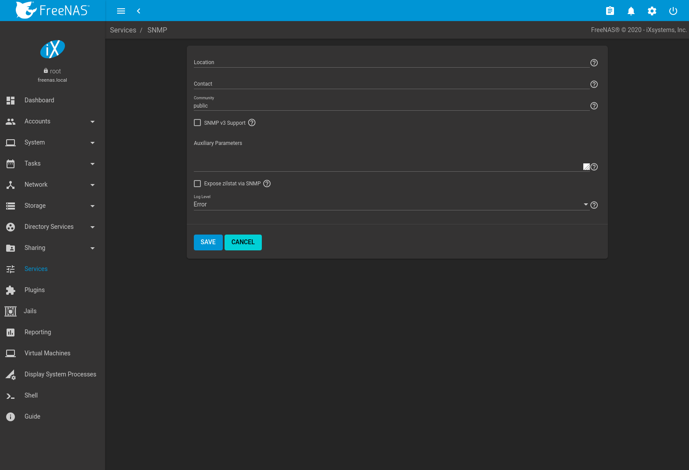

&gt;{RaggedRight}p{dimexpr 0.20linewidth-2tabcolsep}

| Setting                 | Value          | Description                                                                                                                                                                                                                                                                                                |
|-------------------------|----------------|------------------------------------------------------------------------------------------------------------------------------------------------------------------------------------------------------------------------------------------------------------------------------------------------------------|
| Location                | string         | Enter the location of the system.                                                                                                                                                                                                                                                                          |
| Contact                 | string         | Enter an email address to receive messages from the SNMP service.                                                                                                                                                                                                                                          |
| Community               | string         | Change from *public* to increase system security. Can only contain alphanumeric characters, underscores, dashes, periods, and spaces. This can be left empty for SNMPv3 networks.                                                                                                                          |
| SNMP v3 Support         | checkbox       | Set to enable support for [SNMP version 3](https://tools.ietf.org/html/rfc3410). See [snmpd.conf(5)](http://net-snmp.sourceforge.net/docs/man/snmpd.conf.html) for more information about configuring this and the `Authentication Type`, `Password`, `Privacy Protocol`, and `Privacy Passphrase` fields. |
| Username                | string         | Only applies if `SNMP v3 Support` is set. Enter a username to register with this service.                                                                                                                                                                                                                  |
| Authentication Type     | drop-down menu | Only applies if `SNMP v3 Support` is enabled. Choices are *MD5* or *SHA*.                                                                                                                                                                                                                                  |
| Password                | string         | Only applies if `SNMP v3 Support` is enabled. Enter and confirm a password of at least eight characters.                                                                                                                                                                                                   |
| Privacy Protocol        | drop-down menu | Only applies if `SNMP v3 Support` is enabled. Choices are *AES* or *DES*.                                                                                                                                                                                                                                  |
| Privacy Passphrase      | string         | Enter a separate privacy passphrase. `Password` is used when this is left empty.                                                                                                                                                                                                                           |
| Auxiliary Parameters    | string         | Enter additional [snmpd.conf(5)](https://www.freebsd.org/cgi/man.cgi?query=snmpd.conf) options. Add one option for each line.                                                                                                                                                                              |
| Expose zilstat via SNMP | checkbox       | Enabling this option may have pool performance implications.                                                                                                                                                                                                                                               |
| Log Level               | drop-down menu | Choose how many log entries to create. Choices range from the least log entries (Emergency) to the most (Debug).                                                                                                                                                                                           |

SNMP Configuration Options

[Zenoss](https://www.zenoss.com/) provides a seamless monitoring service
through SNMP for FreeNAS® called [TrueNAS
ZenPack](https://www.zenoss.com/product/zenpacks/truenas).

SSH, Secure Shell

SSH
---

Secure Shell (SSH) is used to transfer files securely over an encrypted
network. When a FreeNAS® system is used as an SSH server, the
users in the network must use [SSH client
software](https://en.wikipedia.org/wiki/Comparison_of_SSH_clients) to
transfer files with SSH.

This section shows the FreeNAS® SSH configuration options,
demonstrates an example configuration that restricts users to their home
directory, and provides some troubleshooting tips.

`Figure %s <ssh_config_fig>` shows the `Services --> SSH --> Configure`
screen.

Note

After configuring SSH, remember to start it in `Services` by clicking
the sliding button in the `SSH` row. The sliding button moves to the
right when the service is running.

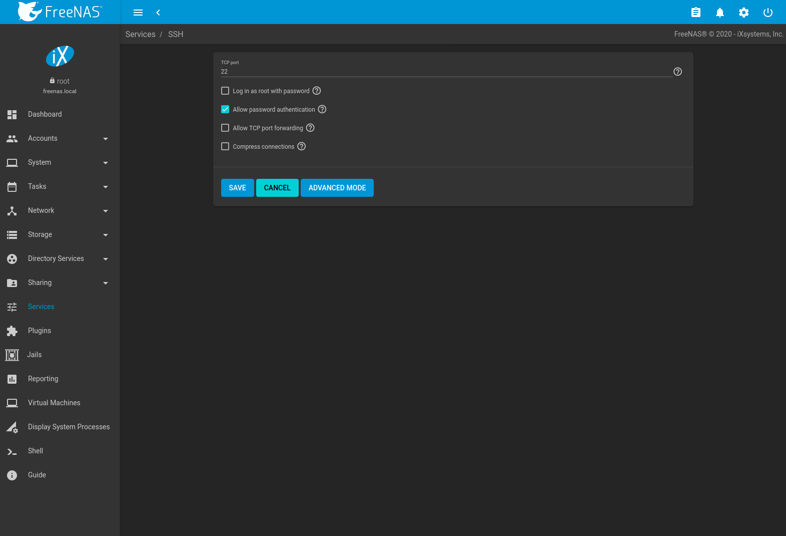

`Table %s <ssh_conf_opts_tab>` summarizes the configuration options.
Some settings are only available in `Advanced Mode`. To see these
settings, either click the `ADVANCED MODE` button, or configure the
system to always display these settings by enabling the
`Show advanced fields by default` option in `System --> Advanced`.

&gt;{RaggedRight}p{dimexpr 0.14linewidth-2tabcolsep}
&gt;{RaggedRight}p{dimexpr 0.54linewidth-2tabcolsep}\|

| Setting                       | Value          | Advanced Mode | Description                                                                                                                                                                                                                                |
|-------------------------------|----------------|---------------|--------------------------------------------------------------------------------------------------------------------------------------------------------------------------------------------------------------------------------------------|
| Bind interfaces               | selection      | ✓             | By default, SSH listens on all interfaces unless specific interfaces are selected in this drop-down menu.                                                                                                                                  |
| TCP port                      | integer        |               | Port to open for SSH connection requests. *22* by default.                                                                                                                                                                                 |
| Log in as root with password  | checkbox       |               | **As a security precaution, root logins are discouraged and disabled by default.** If enabled, password must be set for the *root* user in `Users`.                                                                                        |
| Allow password authentication | checkbox       |               | Unset to require key-based authentication for all users. This requires [additional setup](http://the.earth.li/~sgtatham/putty/0.55/htmldoc/Chapter8.html) on both the SSH client and server.                                               |
| Allow kerberos authentication | checkbox       | ✓             | Ensure `Kerberos Realms` and `Kerberos Keytabs` are configured and FreeNAS® can communicate with the Kerberos Domain Controller (KDC) before enabling this option.                                                              |
| Allow TCP port forwarding     | checkbox       |               | Set to allow users to bypass firewall restrictions using the SSH [port forwarding feature](https://www.symantec.com/connect/articles/ssh-port-forwarding).                                                                                 |
| Compress connections          | checkbox       |               | Set to attempt to reduce latency over slow networks.                                                                                                                                                                                       |
| SFTP log level                | drop-down menu | ✓             | Select the [syslog(3)](https://www.freebsd.org/cgi/man.cgi?query=syslog) level of the SFTP server.                                                                                                                                         |
| SFTP log facility             | drop-down menu | ✓             | Select the [syslog(3)](https://www.freebsd.org/cgi/man.cgi?query=syslog) facility of the SFTP server.                                                                                                                                      |
| Extra options                 | string         | ✓             | Add any additional [sshd\_config(5)](https://www.freebsd.org/cgi/man.cgi?query=sshd_config) options not covered in this screen, one per line. These options are case-sensitive and misspellings can prevent the SSH service from starting. |

SSH Configuration Options

Here are some recommendations for the `Extra options`:

-   Add `NoneEnabled no` to disable the insecure `none` cipher.
-   Increase the `ClientAliveInterval` if SSH connections tend to drop.
-   `ClientMaxStartup` defaults to *10*. Increase this value when more
    concurrent SSH connections are required.

SCP, Secure Copy

### SCP Only

When SSH is configured, authenticated users with a user account can use
`ssh` to log into the FreeNAS® system over the network. User
accounts are created by navigating to `Accounts --> Users`, and clicking
`ADD`. The user home directory is the pool or dataset specified in the
`Home Directory` field of the FreeNAS® account for that user.
While the SSH login defaults to the user home directory, users are able
to navigate outside their home directory, which can pose a security
risk.

It is possible to allow users to use `scp` and `sftp` to transfer files
between their local computer and their home directory on the
FreeNAS® system, while restricting them from logging into the
system using `ssh`. To configure this scenario, go to
`Accounts --> Users`, click ui-options for the user, and then `Edit`.
Change the `Shell` to *scponly*. Repeat for each user that needs
restricted SSH access.

Test the configuration from another system by running the `sftp`, `ssh`,
and `scp` commands as the user. `sftp` and `scp` will work but `ssh`
will fail.

Note

Some utilities like WinSCP and Filezilla can bypass the scponly shell.
This section assumes users are accessing the system using the command
line versions of `scp` and `sftp`.

### Troubleshooting SSH

Keywords listed in
[sshd\_config(5)](https://www.freebsd.org/cgi/man.cgi?query=sshd_config)
are case sensitive. This is important to remember when adding any
`Extra options`. The configuration will not function as intended if the
upper and lowercase letters of the keyword are not an exact match.

If clients are receiving "reverse DNS" or timeout errors, add an entry
for the IP address of the FreeNAS® system in the
`Host name database` field of `Network --> Global Configuration`.

When configuring SSH, always test the configuration as an SSH user
account to ensure the user is limited by the configuration and they have
permission to transfer files within the intended directories. If the
user account is experiencing problems, the SSH error messages are
specific in describing the problem. Type this command within `Shell` to
read these messages as they occur:

    tail -f /var/log/messages

Additional messages regarding authentication errors are found in
`/var/log/auth.log`.

TFTP, Trivial File Transfer Protocol

TFTP
----

Trivial File Transfer Protocol (TFTP) is a light-weight version of FTP
typically used to transfer configuration or boot files between machines,
such as routers, in a local environment. TFTP provides an extremely
limited set of commands and provides no authentication.

If the FreeNAS® system will be used to store images and
configuration files for network devices, configure and start the TFTP
service. Starting the TFTP service opens UDP port 69.

`Figure %s <tftp_config_fig>` shows the TFTP configuration screen and
`Table %s <tftp_config_opts_tab>` summarizes the available options.

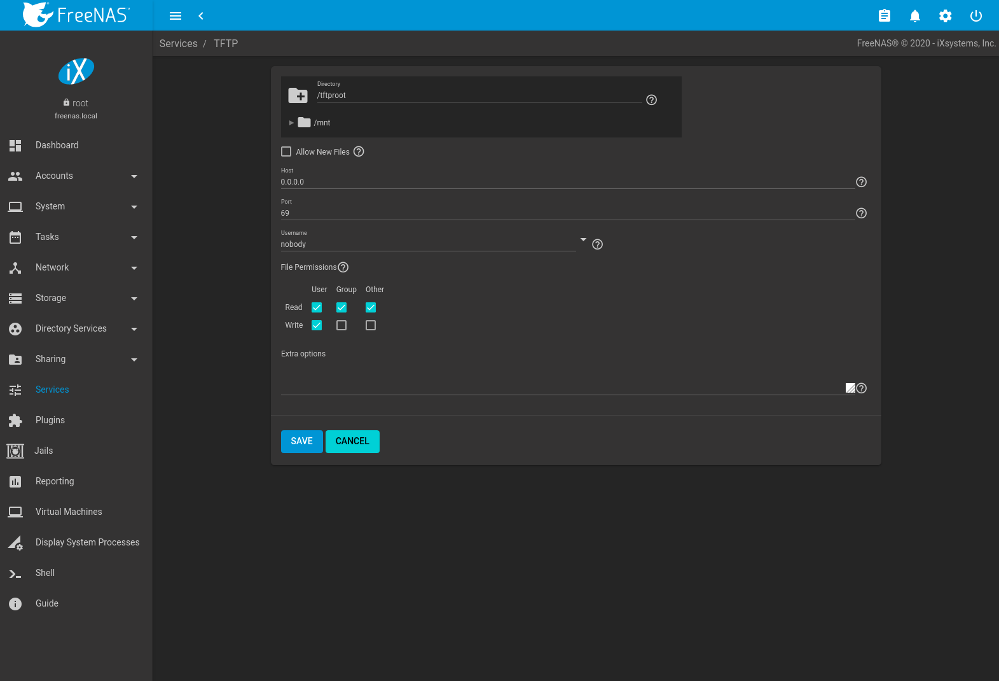

&gt;{RaggedRight}p{dimexpr 0.12linewidth-2tabcolsep}

| Setting          | Value          | Description                                                                                                                                                |
|------------------|----------------|------------------------------------------------------------------------------------------------------------------------------------------------------------|
| Directory        | Browse button  | Browse to an **existing** directory to be used for storage. Some devices require a specific directory name, refer to the device documentation for details. |
| Allow New Files  | checkbox       | Set when network devices need to send files to the system. For example, to back up their configuration.                                                    |
| Host             | IP address     | The default host to use for TFTP transfers. Enter an IP address. Example: *192.0.2.1*.                                                                     |
| Port             | integer        | The UDP port number that listens for TFTP requests. Example: *8050*.                                                                                       |
| Username         | drop-down menu | Select the account to use for TFTP requests. This account must have permission to the `Directory`.                                                         |
| File Permissions | checkboxes     | Set permissions for newly created files. The default is everyone can read and only the owner can write. Some devices require less strict permissions.      |
| Extra options    | string         | Add more options from [tftpd(8)](https://www.freebsd.org/cgi/man.cgi?query=tftpd) Add one option on each line.                                             |

TFTP Configuration Options

UPS, Uninterruptible Power Supply

UPS
---

FreeNAS® uses [NUT](https://networkupstools.org/) (Network
UPS Tools) to provide UPS support. If the FreeNAS® system is
connected to a UPS device, configure the UPS service in
`Services --> UPS --> Configure`.

`Figure %s <ups_config_fig>` shows the UPS configuration screen:

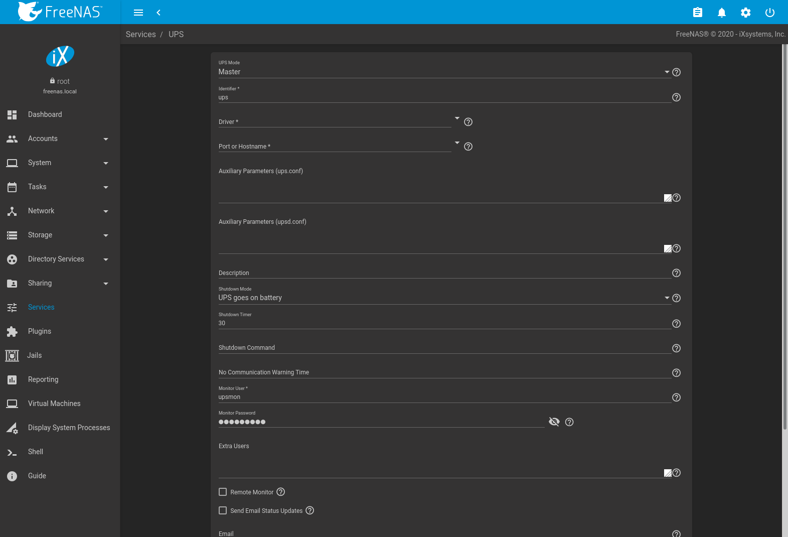

`Table %s <ups_config_opts_tab>` summarizes the options in the UPS
Configuration screen.

&gt;{RaggedRight}p{dimexpr 0.12linewidth-2tabcolsep}

<table>
<caption>UPS Configuration Options</caption>
<colgroup>
<col style="width: 18%" />
<col style="width: 10%" />
<col style="width: 71%" />
</colgroup>
<thead>
<tr class="header">
<th>Setting</th>
<th>Value</th>
<th>Description</th>
</tr>
</thead>
<tbody>
<tr class="odd">
<td>UPS Mode</td>
<td>drop-down menu</td>
<td>Select <em>Master</em> if the UPS is plugged directly into the system serial port. The UPS will remain the last item to shut down. Select <em>Slave</em> to have the system shut down before <em>Master</em>.</td>
</tr>
<tr class="even">
<td>Identifier</td>
<td>string</td>
<td>Required. Describe the UPS device. Can contain alphanumeric, period, comma, hyphen, and underscore characters.</td>
</tr>
<tr class="odd">
<td>Driver / Remote Host</td>
<td>combo-box</td>
<td>
Required. For a list of supported devices, see the <a href="https://networkupstools.org/stable-hcl.html">Network UPS Tools compatibility list</a>. The field suggests drivers based on the text entered. To search for a specific driver, begin typing the name of the driver. The search is case sensitive.

The <code class="interpreted-text" role="guilabel">Driver</code> field changes to <code class="interpreted-text" role="guilabel">Remote Host</code> when <code class="interpreted-text" role="guilabel">UPS Mode</code> is set to <em>Slave</em>. Enter the IP address of the system configured as the UPS <em>Master</em> system. See this <a href="https://forums.freenas.org/index.php?resources/configuring-ups-support-for-single-or-multiple-freenas-servers.30/">post</a> for more details about configuring multiple systems with a single UPS.
</td>
</tr>
<tr class="even">
<td>Port or Hostname</td>
<td>drop-down menu</td>
<td>
Serial or USB port connected to the UPS. To automatically detect and manage the USB port settings, open the drop-down menu and select <em>auto</em>. If the specific USB port must be chosen, see this <code class="interpreted-text" role="ref">note &lt;UPS USB&gt;</code> about identifing the USB port used by the UPS.

When an SNMP driver is selected, enter the IP address or hostname of the SNMP UPS device.

<code class="interpreted-text" role="guilabel">Port or Hostname</code> becomes <code class="interpreted-text" role="guilabel">Remote Port</code> when the <code class="interpreted-text" role="guilabel">UPS Mode</code> is set to <em>Slave</em>. Enter the open network port number of the UPS <em>Master</em> system. The default port is <em>3493</em>.
</td>
</tr>
<tr class="odd">
<td>Auxiliary Parameters (ups.conf)</td>
<td>string</td>
<td>Enter any additional options from <a href="https://www.freebsd.org/cgi/man.cgi?query=ups.conf">ups.conf(5)</a>.</td>
</tr>
<tr class="even">
<td>Auxiliary Parameters (upsd.conf)</td>
<td>string</td>
<td>Enter any additional options from <a href="https://www.freebsd.org/cgi/man.cgi?query=upsd.conf">upsd.conf(5)</a>.</td>
</tr>
<tr class="odd">
<td>Description</td>
<td>string</td>
<td>Optional. Describe the UPS service.</td>
</tr>
<tr class="even">
<td>Shutdown Mode</td>
<td>drop-down menu</td>
<td>Choose when the UPS initiates shutdown. Choices are <em>UPS goes on battery</em> and <em>UPS reaches low battery</em>.</td>
</tr>
<tr class="odd">
<td>Shutdown Timer</td>
<td>integer</td>
<td>Select a value in seconds for the UPS to wait before initiating shutdown. Shutdown will not occur if the power is restored while the timer is counting down. This value only applies when <em>Shutdown Mode</em> is set to <em>UPS goes on battery</em>.</td>
</tr>
<tr class="even">
<td>Shutdown Command</td>
<td>string</td>
<td>Enter the command to run to shut down the computer when battery power is low or shutdown timer runs out.</td>
</tr>
<tr class="odd">
<td>No Communication Warning Time</td>
<td>string</td>
<td>Enter a value in seconds to wait before alerting that the service cannot reach any UPS. Warnings continue until the situation is fixed.</td>
</tr>
<tr class="even">
<td>Monitor User</td>
<td>string</td>
<td>Required. Enter a user to associate with this service. The recommended default user is <em>upsmon</em>.</td>
</tr>
<tr class="odd">
<td>Monitor Password</td>
<td>string</td>
<td>Required. Default is the known value <em>fixmepass</em>. Change this to enhance system security. Cannot contain a space or <code>#</code>.</td>
</tr>
<tr class="even">
<td>Extra Users</td>
<td>string</td>
<td>Enter accounts that have administrative access. See <a href="https://www.freebsd.org/cgi/man.cgi?query=upsd.users">upsd.users(5)</a> for examples.</td>
</tr>
<tr class="odd">
<td>Remote Monitor</td>
<td>checkbox</td>
<td>Set for the default configuration to listen on all interfaces using the known values of user: <em>upsmon</em> and password: <em>fixmepass</em>.</td>
</tr>
<tr class="even">
<td>Send Email Status Updates</td>
<td>checkbox</td>
<td>Set to enables the FreeNAS® system to send email updates to the configured <code class="interpreted-text" role="guilabel">Email</code> field.</td>
</tr>
<tr class="odd">
<td>Email</td>
<td>email address</td>
<td>Enter any email addresses to receive status updates. Separate multiple addresses with a semicolon (<code>;</code>).</td>
</tr>
<tr class="even">
<td>Email Subject</td>
<td>string</td>
<td>Enter a subject line for email status updates.</td>
</tr>
<tr class="odd">
<td>Power Off UPS</td>
<td>checkbox</td>
<td>Set for the UPS to power off after shutting down the FreeNAS® system.</td>
</tr>
<tr class="even">
<td>Host Sync</td>
<td>integer</td>
<td>Enter a time in seconds for <a href="https://www.freebsd.org/cgi/man.cgi?query=upsmon">UPSMON(8)</a> to wait in master mode for the slaves to disconnect during a shutdown.</td>
</tr>
</tbody>
</table>

UPS Configuration Options

Note

For USB devices, the easiest way to determine the correct device name is
to enable the `Show console messages` option in `System --> Advanced`.
Plug in the USB device and look for a */dev/ugen* or */dev/uhid* device
name in the console messages.

Some UPS models might be unresponsive with the default polling
frequency. This can show in FreeNAS® logs as a recurring
error like: `libusb_get_interrupt: Unknown error`.

If this error occurs, decrease the polling frequency by adding an entry
to `Auxiliary Parameters (ups.conf)`: `pollinterval = 10`. The default
polling frequency is two seconds.

[upsc(8)](https://www.freebsd.org/cgi/man.cgi?query=upsc) can be used to
get status variables from the UPS daemon such as the current charge and
input voltage. It can be run from `Shell` using this syntax:

    upsc ups@localhost

The [upsc(8)](https://www.freebsd.org/cgi/man.cgi?query=upsc) man page
gives some other usage examples.

[upscmd(8)](https://www.freebsd.org/cgi/man.cgi?query=upscmd) can be
used to send commands directly to the UPS, assuming the hardware
supports the command being sent. Only users with administrative rights
can use this command. These users are created in the `Extra users`
field.

### Multiple Computers with One UPS

A UPS with adequate capacity can power multiple computers. One computer
is connected to the UPS data port with a serial or USB cable. This
*master* makes UPS status available on the network for other computers.
These *slave* computers are powered by the UPS, but receive UPS status
data from the master computer. See the [NUT User
Manual](https://networkupstools.org/docs/user-manual.chunked/index.html)
and [NUT User Manual
Pages](https://networkupstools.org/docs/man/index.html#User_man).

WebDAV

WebDAV
------

The WebDAV service can be configured to provide a file browser over a
web connection. Before starting this service, at least one WebDAV share
must be created by navigating to `Sharing --> WebDAV Shares`, and
clicking `ADD`. Refer to `WebDAV Shares` for instructions on how to
create a share and connect to it after the service is configured and
started.

The settings in the WebDAV service apply to all WebDAV shares.
`Figure %s <webdav_config_fig>` shows the WebDAV configuration screen.
`Table %s <webdav_config_opts_tab>` summarizes the available options.

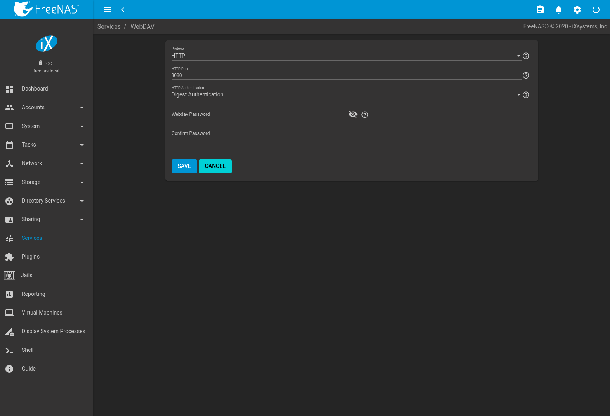

&gt;{RaggedRight}p{dimexpr 0.12linewidth-2tabcolsep}

| Setting                | Value          | Description                                                                                                                                             |
|------------------------|----------------|---------------------------------------------------------------------------------------------------------------------------------------------------------|
| Protocol               | drop-down menu | *HTTP* keeps the connection unencrypted. *HTTPS* encrypts the connection. *HTTP+HTTPS* allows both types of connections.                                |
| HTTP Port              | string         | Specify a port for unencrypted connections. The default port *8080* is recommended. **Do not** use a port number already being used by another service. |
| HTTPS Port             | string         | Specify a port for encrypted connections. The default port *8081* is recommended. **Do not** use a port number already being used by another service.   |
| Webdav SSL Certificate | drop-down menu | Select the SSL certificate to be used for encrypted connections. To create a certificate, use `System --> Certificates`.                                |
| HTTP Authentication    | drop-down menu | Choices are *No Authentication*, *Basic Authentication* (unencrypted) or *Digest Authentication* (encrypted).                                           |
| Webdav Password        | string         | Default is *davtest*. Change this password as it is a known value.                                                                                      |

WebDAV Configuration Options

