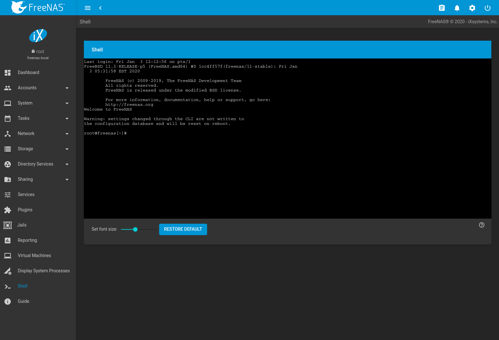

Shell

Shell
=====

The FreeNAS® web interface provides a web shell, making it
convenient to run command line tools from the web browser as the *root*
user.

The prompt shows that the current user is *root*, the hostname is
*freenas*, and the current working directory is `~`, the home directory
of the logged-in user.

Note

The default shell for a new install of FreeNAS® is
[zsh](https://www.freebsd.org/cgi/man.cgi?query=zsh).
FreeNAS® systems which have been upgraded from an earlier
version will continue to use `csh` as the default shell.

The default shell can be changed in `Accounts --> Users`. Click
ui-options and `Edit` for the *root* user. Choose the desired shell from
the `Shell` drop-down and click `SAVE`.

The `Set font size` slider adjusts the size of text displayed in the
Shell. Click `RESTORE DEFAULT` to reset the shell font and size.

A history of previous commands is available. Use the up and down arrow
keys to scroll through previously entered commands. Edit the command if
desired, then press `Enter` to re-enter the command.

`Home`, `End`, and `Delete` keys are supported. Tab completion is also
available. Type a few letters and press `Tab` to complete a command name
or filename in the current directory. Right-clicking in the terminal
window displays a reminder about using `Command+c` and `Command+v` or
`Ctrl+Insert` and `Shift+Insert` for copy and paste operations in the
FreeNAS® shell.

Type `exit` to leave the session.

Clicking other web interface menus closes the shell session and stops
commands running in the shell. `tmux` provides the ability to detach
shell sessions and then reattach to them later. Commands continue to run
in a detached session.

Note

Not all shell features render correctly in Chrome. Firefox is the
recommended browser when using the shell.

Most FreeBSD `command line utilities <Command Line Utilities>` are
available in the `Shell`, including additional troubleshooting
applications for FreeNAS®.
