System
======

The System section of the web interface contains these entries:

-   `General` configures general settings such as HTTPS access, the
    language, and the timezone
-   `NTP Servers` adds, edits, and deletes Network Time Protocol servers
-   `Boot` creates, renames, and deletes boot environments. It also
    shows the condition of the Boot Pool.
-   `Advanced` configures advanced settings such as the serial console,
    swap space, and console messages
-   `Email` configures the email address to receive notifications
-   `System Dataset` configures the location where logs and reporting
    graphs are stored
-   `Alert Services` configures services used to notify the
    administrator about system events.
-   `Alert Settings` lists the available `Alert` conditions and provides
    configuration of the notification frequency for each alert.
-   `Cloud Credentials` is used to enter connection credentials for
    remote cloud service providers
-   `SSH Connections` manages connecting to a remote system with SSH.
-   `SSH Keypairs` manages all private and public SSH key pairs.
-   `Tunables` provides a front-end for tuning in real-time and to load
    additional kernel modules at boot time
-   `Update` performs upgrades and checks for system updates
-   `CAs`: import or create internal or intermediate CAs (Certificate
    Authorities)
-   `Certificates`: import existing certificates, create self-signed
    certificates, or configure ACME certificates.
-   `ACME DNS`: automate domain authentication for compatible CAs and
    certificates.
-   `Support`: report a bug or request a new feature.

Each of these is described in more detail in this section.

General
-------

`System --> General` contains options for configuring the web interface
and other basic system settings.

> General System Options

&gt;{RaggedRight}p{dimexpr 0.12linewidth-2tabcolsep}

| Setting                          | Value          | Description                                                                                                                                                                                                                                                                                                                                                                                                                                             |
|----------------------------------|----------------|---------------------------------------------------------------------------------------------------------------------------------------------------------------------------------------------------------------------------------------------------------------------------------------------------------------------------------------------------------------------------------------------------------------------------------------------------------|
| GUI SSL Certificate              | drop-down menu | The system uses a self-signed `certificate <Certificates>` to enable encrypted web interface connections. To change the default certificate, select a different created or imported certificate.                                                                                                                                                                                                                                                        |
| WebGUI IPv4 Address              | drop-down menu | Choose a recent IP addresses to limit the usage when accessing the web interface. The built-in HTTP server binds to the wildcard address of *0.0.0.0* (any address) and issues an alert if the specified address becomes unavailable.                                                                                                                                                                                                                   |
| WebGUI IPv6 Address              | drop-down menu | Choose a recent IPv6 addresses to limit the usage when accessing the web interface. The built-in HTTP server binds to the wildcard address of *0.0.0.0* (any address) and issues an alert if the specified address becomes unavailable.                                                                                                                                                                                                                 |
| WebGUI HTTP Port                 | integer        | Allow configuring a non-standard port for accessing the web interface over HTTP. Changing this setting might require changing a [Firefox configuration setting](https://www.redbrick.dcu.ie/~d_fens/articles/Firefox:_This_Address_is_Restricted).                                                                                                                                                                                                      |
| WebGUI HTTPS Port                | integer        | Allow configuring a non-standard port to access the web interface over HTTPS.                                                                                                                                                                                                                                                                                                                                                                           |
| WebGUI HTTP -&gt; HTTPS Redirect | checkbox       | Redirect *HTTP* connections to *HTTPS*. A `GUI SSL Certificate` is required for *HTTPS*. Activating this also sets the [HTTP Strict Transport Security (HSTS)](https://en.wikipedia.org/wiki/HTTP_Strict_Transport_Security) maximum age to *31536000* seconds (one year). This means that after a browser connects to the FreeNAS® web interface for the first time, the browser continues to use HTTPS and renews this setting every year. |
| Language                         | combo box      | Select a language from the drop-down menu. The list can be sorted by `Name` or [Language code](https://en.wikipedia.org/wiki/List_of_ISO_639-1_codes). View the translated status of a language in the [webui GitHub repository](https://github.com/freenas/webui/tree/master/src/assets/i18n). Refer to `Contributing to FreeNAS\ :sup:`®\`\` for more information about assisting with translations.                                                  |
| Console Keyboard Map             | drop-down menu | Select a keyboard layout.                                                                                                                                                                                                                                                                                                                                                                                                                               |
| Timezone                         | drop-down menu | Select a timezone.                                                                                                                                                                                                                                                                                                                                                                                                                                      |
| Syslog level                     | drop-down menu | When `Syslog server` is defined, only logs matching this level are sent.                                                                                                                                                                                                                                                                                                                                                                                |
| Syslog server                    | string         | Remote syslog server DNS hostname or IP address. Nonstandard port numbers can be used by adding a colon and the port number to the hostname, like `mysyslogserver:1928`. Log entries are written to local logs and sent to the remote syslog server.                                                                                                                                                                                                    |
| Crash reporting                  | checkbox       | Send failed HTTP request data which can include client and server IP addresses, failed method call tracebacks, and middleware log file contents to iXsystems.                                                                                                                                                                                                                                                                                           |
| Usage Collection                 | checkbox       | Enable sending anonymous usage statistics to iXsystems.                                                                                                                                                                                                                                                                                                                                                                                                 |

General Configuration Settings

After making any changes, click `SAVE`. Changes to any of the `GUI`
fields can interrupt web interface connectivity while the new settings
are applied.

This screen also contains these buttons:

-   `SAVE CONFIG`: save a backup copy of the current configuration
    database in the format *hostname-version-architecture* to the
    computer accessing the web interface. Saving the configuration after
    making any configuration changes is highly recommended.
    FreeNAS® automatically backs up the configuration
    database to the system dataset every morning at 3:45. However, this
    backup does not occur if the system is shut down at that time. If
    the system dataset is stored on the boot pool and the boot pool
    becomes unavailable, the backup will also not be available. The
    location of the system dataset can be viewed or set using
    `System --> System Dataset`.

    

    

    Note

    

    `SSH` keys are not stored in the configuration database and must be
    backed up separately. System host keys are files with names
    beginning with `ssh_host_` in `/usr/local/etc/ssh/`. The root user
    keys are stored in `/root/.ssh`.

    

    There are two types of passwords. User account passwords for the
    base operating system are stored as hashed values, do not need to be
    encrypted to be secure, and are saved in the system configuration
    backup. Other passwords, like iSCSI CHAP passwords, Active Directory
    bind credentials, and cloud credentials are stored in an encrypted
    form to prevent them from being visible as plain text in the saved
    system configuration. The key or *seed* for this encryption is
    normally stored only on the operating system device. When
    `Save Config` is chosen, a dialog gives two options.
    `Export Password Secret Seed` includes passwords in the
    configuration file which allows the configuration file to be
    restored to a different operating system device where the decryption
    seed is not already present. Configuration backups containing the
    seed must be physically secured to prevent decryption of passwords
    and unauthorized access.

    

    

    Warning

    

    The `Export Password Secret Seed` option is off by default and
    should only be used when making a configuration backup that will be
    stored securely. After moving a configuration to new hardware, media
    containing a configuration backup with a decryption seed should be
    securely erased before reuse.

    

    `Export Pool Encryption Keys` includes the encryption keys of
    encrypted pools in the configuration file. The encyrption keys are
    restored if the configuration file is uploaded to the system using
    `UPLOAD CONFIG`.

-   `UPLOAD CONFIG`: allows browsing to the location of a previously
    saved configuration file to restore that configuration.

-   `RESET CONFIG`: reset the configuration database to the default base
    version. This does not delete user SSH keys or any other data stored
    in a user home directory. Since configuration changes stored in the
    configuration database are erased, this option is useful when a
    mistake has been made or to return a test system to the original
    configuration.

NTP Servers,

NTP Servers
-----------

The network time protocol (NTP) is used to synchronize the time on the
computers in a network. Accurate time is necessary for the successful
operation of time sensitive applications such as Active Directory or
other directory services. By default, FreeNAS® is
pre-configured to use three public NTP servers. If the network is using
a directory service, ensure that the FreeNAS® system and the
server running the directory service have been configured to use the
same NTP servers.

Available NTP servers can be found at
<https://support.ntp.org/bin/view/Servers/NTPPoolServers>. For time
accuracy, choose NTP servers that are geographically close to the
physical location of the FreeNAS® system.

Click `System --> NTP Servers` and `ADD` to add an NTP server.
`Figure %s <ntp_server_fig>` shows the configuration options.
`Table %s <ntp_server_conf_opts_tab>` summarizes the options available
when adding or editing an NTP server.
[ntp.conf(5)](https://www.freebsd.org/cgi/man.cgi?query=ntp.conf)
explains these options in more detail.

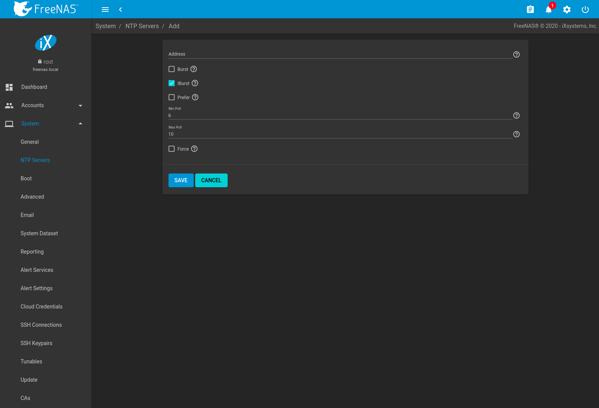

&gt;{RaggedRight}p{dimexpr 0.12linewidth-2tabcolsep}

| Setting  | Value    | Description                                                                                                                                            |
|----------|----------|--------------------------------------------------------------------------------------------------------------------------------------------------------|
| Address  | string   | Enter the hostname or IP address of the NTP server.                                                                                                    |
| Burst    | checkbox | Recommended when `Max. Poll` is greater than *10*. Only use on personal servers. **Do not** use with a public NTP server.                              |
| IBurst   | checkbox | Speed up the initial synchronization, taking seconds rather than minutes.                                                                              |
| Prefer   | checkbox | This option is only recommended for highly accurate NTP servers, such as those with time monitoring hardware.                                          |
| Min Poll | integer  | The minimum polling interval, in seconds, as a power of 2. For example, *6* means 2^6, or 64 seconds. The default is *6*, minimum value is *4*.        |
| Max Poll | integer  | The maximum polling interval, in seconds, as a power of 2. For example, *10* means 2^10, or 1,024 seconds. The default is *10*, maximum value is *17*. |
| Force    | checkbox | Force the addition of the NTP server, even if it is currently unreachable.                                                                             |

NTP Servers Configuration Options

Boot Environments, Multiple Boot Environments, Boot

Boot
----

FreeNAS® supports a ZFS feature known as multiple boot
environments. With multiple boot environments, the process of updating
the operating system becomes a low-risk operation. The updater
automatically creates a snapshot of the current boot environment and
adds it to the boot menu before applying the update.

If an update fails, reboot the system and select the previous boot
environment, using the instructions in `If Something Goes Wrong`, to
instruct the system to go back to that system state.

Note

Boot environments are separate from the configuration database. Boot
environments are a snapshot of the *operating system* at a specified
time. When a FreeNAS® system boots, it loads the specified
boot environment, or operating system, then reads the configuration
database to load the current configuration values. If the intent is to
make configuration changes rather than operating system changes, make a
backup of the configuration database first using the instructions in
`System --> General <General>`.

The example shown in `Figure %s <view_boot_env_fig>`, includes the two
boot environments that are created when FreeNAS® is
installed. The *Initial-Install* boot environment can be booted into if
the system needs to be returned to a non-configured version of the
installation.

> Viewing Boot Environments

Each boot environment entry contains this information:

-   **Name:** the name of the boot entry as it will appear in the boot
    menu. Alphanumeric characters, dashes (*-*), underscores (*\_*), and
    periods (*.*) are allowed.
-   **Active:** indicates which entry will boot by default if the user
    does not select another entry in the boot menu.
-   **Created:** indicates the date and time the boot entry was created.
-   **Space:** displays the size of the boot environment.
-   **Keep:** indicates whether or not this boot environment can be
    pruned if an update does not have enough space to proceed. Click
    ui-options and `Keep` for an entry if that boot environment should
    not be automatically pruned.

Click ui-options on an entry to access actions specific to that entry:

-   **Activate:** only appears on entries which are not currently set to
    `Active`. Changes the selected entry to the default boot entry on
    next boot. The status changes to `Reboot` and the current `Active`
    entry changes from `Now/Reboot` to `Now`, indicating that it was
    used on the last boot but will not be used on the next boot.
-   **Clone:** makes a new boot environment from the selected boot
    environment. When prompted for the name of the clone, alphanumeric
    characters, dashes (*-*), underscores (*\_*), and periods (*.*) are
    allowed.
-   **Rename:** used to change the name of the boot environment.
    Alphanumeric characters, dashes (*-*), underscores (*\_*), and
    periods (*.*) are allowed.
-   **Delete:** used to delete the highlighted entry, which also removes
    that entry from the boot menu. Since an activated entry cannot be
    deleted, this button does not appear for the active boot
    environment. To delete an entry that is currently activated, first
    activate another entry. Note that this button does not appear for
    the *default* boot environment as this entry is needed to return the
    system to the original installation state.
-   **Keep:** used to toggle whether or not the updater can prune
    (automatically delete) this boot environment if there is not enough
    space to proceed with the update.

Click `ACTIONS` to:

-   **Add:** make a new boot environment from the active environment.
    The active boot environment contains the text `Now/Reboot` in the
    `Active` column. Only alphanumeric characters, underscores, and
    dashes are allowed in the `Name`.
-   **Stats/Settings:** display statistics for the operating system
    device: condition, total and used size, and date and time of the
    last scrub. By default, the operating system device is scrubbed
    every 7 days. To change the default, input a different number in the
    `Automatic scrub interval (in days)` field and click
    `UPDATE INTERVAL`.
-   **Boot Pool Status:** display the status of each device in the
    operating system device, including any read, write, or checksum
    errors.
-   **Scrub Boot Pool:** perform a manual scrub of the operating system
    device.

Mirroring the operating system device

operating system device Mirroring
\~\~\~\~\~\~\~\~\~\~\~\~\~\~\~\~\~\~\~\~\~

`System --> Boot --> Boot Pool Status` is used to manage the devices
comprising the operating system device. An example is seen in
`Figure %s <status_boot_dev_fig>`.

> Viewing the Status of the operating system device

FreeNAS® supports 2-device mirrors for the operating system
device. In a mirrored configuration, a failed device can be detached and
replaced.

An additional device can be attached to an existing one-device operating
system device, with these caveats:

-   The new device must have at least the same capacity as the existing
    device. Larger capacity devices can be added, but the mirror will
    only have the capacity of the smallest device. Different models of
    devices which advertise the same nominal size are not necessarily
    the same actual size. For this reason, adding another device of the
    same model of is recommended.
-   It is **strongly recommended** to use SSDs rather than USB devices
    when creating a mirrored operating system device.

Click ui-options on a device entry to access actions specific to that
device:

-   **Attach:** use to add a second device to create a mirrored
    operating system device. If another device is available, it appears
    in the `Member disk` drop-down menu. Select the desired device. The
    `Use all disk space` option controls the capacity made available to
    the operating system device. By default, the new device is
    partitioned to the same size as the existing device. When
    `Use all disk space` is enabled, the entire capacity of the new
    device is used. If the original operating system device fails and is
    detached, the boot mirror will consist of just the newer drive, and
    will grow to whatever capacity it provides. However, new devices
    added to this mirror must now be as large as the new capacity. Click
    `SAVE` to attach the new disk to the mirror.
-   **Detach:** remove the failed device from the mirror so that it can
    be replaced.
-   **Replace:** once the failed device has been detached, select the
    new replacement device from the `Member disk` drop-down menu to
    rebuild the mirror.

Advanced
--------

`System --> Advanced` is shown in `Figure %s <system_adv_fig>`. The
configurable settings are summarized in `Table %s <adv_config_tab>`.

> Advanced Screen

&gt;{RaggedRight}p{dimexpr 0.12linewidth-2tabcolsep}

| Setting                                   | Value           | Description                                                                                                                                                                                                                                                                                                                                                              |
|-------------------------------------------|-----------------|--------------------------------------------------------------------------------------------------------------------------------------------------------------------------------------------------------------------------------------------------------------------------------------------------------------------------------------------------------------------------|
| Show Text Console without Password Prompt | checkbox        | Set for the text console to be available without entering a password.                                                                                                                                                                                                                                                                                                    |
| Enable Serial Console                     | checkbox        | **Do not** enable this option if the serial port is disabled. Adds the *Serial Port* and *Serial Speed* fields.                                                                                                                                                                                                                                                          |
| Serial Port                               | string          | Select the serial port address in hex.                                                                                                                                                                                                                                                                                                                                   |
| Serial Speed                              | drop-down menu  | Select the speed in bps used by the serial port.                                                                                                                                                                                                                                                                                                                         |
| Swap size in GiB                          | non-zero number | By default, all data disks are created with this amount of swap. This setting does not affect log or cache devices as they are created without swap. Setting to *0* disables swap creation completely. This is *strongly* discouraged.                                                                                                                                   |
| Enable autotune                           | checkbox        | Enable the `autotune` script which attempts to optimize the system based on the installed hardware. *Warning*: Autotuning is only used as a temporary measure and is not a permanent fix for system hardware issues.                                                                                                                                                     |
| Enable Debug Kernel                       | checkbox        | Use a debug version of the kernel on the next boot.                                                                                                                                                                                                                                                                                                                      |
| Show console messages                     | checkbox        | Display console messages from `/var/log/console.log` in real time at bottom of browser window. Click the console to bring up a scrollable screen. Set the `Stop refresh` option in the scrollable screen to pause updates. Unset to continue watching messages as they occur. When this option is set, a button to show the console log appears on busy spinner dialogs. |
| MOTD banner                               | string          | This message is shown when a user logs in with SSH.                                                                                                                                                                                                                                                                                                                      |
| Show advanced fields by default           | checkbox        | Show `Advanced Mode` fields by default.                                                                                                                                                                                                                                                                                                                                  |
| Use FQDN for logging                      | checkbox        | Include the Fully-Qualified Domain Name (FQDN) in logs to precisely identify systems with similar hostnames.                                                                                                                                                                                                                                                             |
| ATA Security User                         | drop-down menu  | User passed to `camcontrol security -u` for unlocking SEDs. Values are *User* or *Master*.                                                                                                                                                                                                                                                                               |
| SED Password                              | string          | Global password used to unlock `Self-Encrypting Drives`.                                                                                                                                                                                                                                                                                                                 |
| Reset SED Password                        | checkbox        | Select to clear the `Password for SED` column of `Storage --> Disks`.                                                                                                                                                                                                                                                                                                    |

Advanced Configuration Settings

Click the `SAVE` button after making any changes.

This tab also contains this button:

`SAVE DEBUG`: used to generate text files that contain diagnostic
information. After the debug data is collected, the system prompts for a
location to save the compressed `.tar` file.

Autotune

### Autotune

FreeNAS® provides an autotune script which optimizes the
system depending on the installed hardware. For example, if a pool
exists on a system with limited RAM, the autotune script automatically
adjusts some ZFS sysctl values in an attempt to minimize memory
starvation issues. It should only be used as a temporary measure on a
system that hangs until the underlying hardware issue is addressed by
adding more RAM. Autotune will always slow such a system, as it caps the
ARC.

The `Enable autotune` option in `System --> Advanced` is off by default.
Enable this option to run the autotuner at boot. To run the script
immediately, reboot the system.

If the autotune script adjusts any settings, the changed values appear
in `System --> Tunables`. Note that deleting tunables that were created
by autotune only affects the current session, as autotune-set tunables
are recreated at boot. This means that any autotune-set value that is
manually changed will revert back to the value set by autotune on
reboot. To permanently change a value set by autotune, change the
description of the tunable. For example, changing the description to
*manual override* prevents autotune from reverting that tunable back to
the autotune default value.

When attempting to increase the performance of the FreeNAS®
system, and particularly when the current hardware may be limiting
performance, try enabling autotune.

For those who wish to see which checks are performed, the autotune
script is located in `/usr/local/bin/autotune`.

Self-Encrypting Drives

### Self-Encrypting Drives

FreeNAS® version 11.1-U5 introduced Self-Encrypting Drive
(SED) support.

These SED specifications are supported:

-   Legacy interface for older ATA devices. **Not recommended for
    security-critical environments**

-   [TCG Opal
    1](https://trustedcomputinggroup.org/wp-content/uploads/Opal_SSC_1.00_rev3.00-Final.pdf)
    legacy specification

-   [TCG OPAL
    2](https://trustedcomputinggroup.org/wp-content/uploads/TCG_Storage-Opal_SSC_v2.01_rev1.00.pdf)
    standard for newer consumer-grade devices

-   [TCG
    Opalite](https://trustedcomputinggroup.org/wp-content/uploads/TCG_Storage-Opalite_SSC_FAQ.pdf)
    is a reduced form of OPAL 2

-   TCG Pyrite [Version
    1](https://trustedcomputinggroup.org/wp-content/uploads/TCG_Storage-Pyrite_SSC_v1.00_r1.00.pdf)
    and [Version
    2](https://trustedcomputinggroup.org/wp-content/uploads/TCG_Storage-Pyrite_SSC_v2.00_r1.00_PUB.pdf)
    are similar to Opalite, but hardware encryption is removed. Pyrite
    provides a logical equivalent of the legacy ATA security for non-ATA
    devices. Only the drive firmware is used to protect the device.

    

    

    Danger

    

    Pyrite Version 1 SEDs do not have PSID support and **can become
    unusable if the password is lost.**

    

-   [TCG
    Enterprise](https://trustedcomputinggroup.org/wp-content/uploads/TCG_Storage-SSC_Enterprise-v1.01_r1.00.pdf)
    is designed for systems with many data disks. These SEDs do not have
    the functionality to be unlocked before the operating system boots.

See this Trusted Computing Group® and NVM Express®
[joint white
paper](https://nvmexpress.org/wp-content/uploads/TCGandNVMe_Joint_White_Paper-TCG_Storage_Opal_and_NVMe_FINAL.pdf)
for more details about these specifications.

FreeNAS® implements the security capabilities of
[camcontrol](https://www.freebsd.org/cgi/man.cgi?query=camcontrol) for
legacy devices and [sedutil-cli](https://www.mankier.com/8/sedutil-cli)
for TCG devices. When managing a SED from the command line, it is
recommended to use the `sedhelper` wrapper script for `sedutil-cli` to
ease SED administration and unlock the full capabilities of the device.
Examples of using these commands to identify and deploy SEDs are
provided below.

A SED can be configured before or after assigning the device to a
`pool <Pools>`.

By default, SEDs are not locked until the administrator takes ownership
of them. Ownership is taken by explicitly configuring a global or
per-device password in the FreeNAS® web interface and adding
the password to the SEDs. Adding SED passwords to FreeNAS®
also allows FreeNAS® to automatically unlock SEDs.

A password-protected SED protects the data stored on the device when the
device is physically removed from the FreeNAS® system. This
allows secure disposal of the device without having to first wipe the
contents. Repurposing a SED on another system requires the SED password.

#### Deploying SEDs

Run `sedutil-cli --scan` in the `Shell` to detect and list devices. The
second column of the results identifies the drive type:

-   **no** indicates a non-SED device
-   **1** indicates a legacy TCG OPAL 1 device
-   **2** indicates a modern TCG OPAL 2 device
-   **L** indicates a TCG Opalite device
-   **p** indicates a TCG Pyrite 1 device
-   **P** indicates a TCG Pyrite 2 device
-   **E** indicates a TCG Enterprise device

Example:

    root@truenas1:~ # sedutil-cli --scan
    Scanning for Opal compliant disks
    /dev/ada0  No  32GB SATA Flash Drive SFDK003L
    /dev/ada1  No  32GB SATA Flash Drive SFDK003L
    /dev/da0   No  HGST    HUS726020AL4210  A7J0
    /dev/da1   No  HGST    HUS726020AL4210  A7J0
    /dev/da10    E WDC     WUSTR1519ASS201  B925
    /dev/da11    E WDC     WUSTR1519ASS201  B925

FreeNAS® supports setting a global password for all detected
SEDs or setting individual passwords for each SED. Using a global
password for all SEDs is strongly recommended to simplify deployment and
avoid maintaining separate passwords for each SED.

##### Setting a global password for SEDs

Go to `System --> Advanced --> SED Password` and enter the password.
**Record this password and store it in a safe place!**

Now the SEDs must be configured with this password. Go to the `Shell`
and enter `sedhelper setup {password}`, where *password* is the global
password entered in `System --> Advanced --> SED Password`.

`sedhelper` ensures that all detected SEDs are properly configured to
use the provided password:

    root@truenas1:~ # sedhelper setup abcd1234
    da9          [OK]
    da10         [OK]
    da11         [OK]

Rerun `sedhelper setup {password}` every time a new SED is placed in the
system to apply the global password to the new SED.

##### Creating separate passwords for each SED

Go to `Storage --> Disks`. Click ui-options for the confirmed SED, then
`Edit`. Enter and confirm the password in the `SED Password` and
`Confirm SED Password` fields.

The `Storage --> Disks` screen shows which disks have a configured SED
password. The `SED Password` column shows a mark when the disk has a
password. Disks that are not a SED or are unlocked using the global
password are not marked in this column.

The SED must be configured to use the new password. Go to the `Shell`
and enter `sedhelper setup --disk {da1} {password}`, where *da1* is the
SED to configure and *password* is the created password from
`Storage --> Disks --> Edit Disks --> SED Password`.

This process must be repeated for each SED and any SEDs added to the
system in the future.

Danger

Remember SED passwords! If the SED password is lost, SEDs cannot be
unlocked and their data is unavailable. Always record SED passwords
whenever they are configured or modified and store them in a secure
place!

#### Check SED Functionality

When SED devices are detected during system boot, FreeNAS®
checks for configured global and device-specific passwords.

Unlocking SEDs allows a pool to contain a mix of SED and non-SED
devices. Devices with individual passwords are unlocked with their
password. Devices without a device-specific password are unlocked using
the global password.

To verify SED locking is working correctly, go to the `Shell`. Enter
`sedutil-cli --listLockingRange 0 {password} dev/{da1}`, where *da1* is
the SED and *password* is the global or individual password for that
SED. The command returns `ReadLockEnabled: 1`, `WriteLockEnabled: 1`,
and `LockOnReset: 1` for drives with locking enabled:

    root@truenas1:~ # sedutil-cli --listLockingRange 0 abcd1234 /dev/da9
    Band[0]:
        Name:            Global_Range
        CommonName:      Locking
        RangeStart:      0
        RangeLength:     0
        ReadLockEnabled: 1
        WriteLockEnabled:1
        ReadLocked:      0
        WriteLocked:     0
        LockOnReset:     1

SED, SED Password

#### Managing SED Passwords and Data

This section contains command line instructions to manage SED passwords
and data. The command used is
[sedutil-cli(8)](https://www.mankier.com/8/sedutil-cli). Most SEDs are
TCG-E (Enterprise) or TCG-Opal ([Opal
v2.0](https://trustedcomputinggroup.org/wp-content/uploads/TCG_Storage-Opal_SSC_v2.01_rev1.00.pdf)).
Commands are different for the different drive types, so the first step
is identifying which type is being used.

Warning

These commands can be destructive to data and passwords. Keep backups
and use the commands with caution.

Check SED version on a single drive, `/dev/da0` in this example:

    root@truenas:~ # sedutil-cli --isValidSED /dev/da0
    /dev/da0 SED --E--- Micron_5N/A U402

All connected disks can be checked at once:

    root@truenas:~ # sedutil-cli --scan
    Scanning for Opal compliant disks
    /dev/ada0 No 32GB SATA Flash Drive SFDK003L
    /dev/ada1 No 32GB SATA Flash Drive SFDK003L
    /dev/da0 E Micron_5N/A U402
    /dev/da1 E Micron_5N/A U402
    /dev/da12 E SEAGATE XS3840TE70014 0103
    /dev/da13 E SEAGATE XS3840TE70014 0103
    /dev/da14 E SEAGATE XS3840TE70014 0103
    /dev/da2 E Micron_5N/A U402
    /dev/da3 E Micron_5N/A U402
    /dev/da4 E Micron_5N/A U402
    /dev/da5 E Micron_5N/A U402
    /dev/da6 E Micron_5N/A U402
    /dev/da9 E Micron_5N/A U402
    No more disks present ending scan
    root@truenas:~ #

##### TCG-Opal Instructions

Reset the password without losing data:
`sedutil-cli --revertNoErase {oldpassword} /dev/{device}`

Use **both** of these commands to change the password without destroying
data:

`sedutil-cli --setSIDPassword {oldpassword} {newpassword} /dev/{device}`  
`sedutil-cli --setPassword {oldpassword} Admin1 {newpassword} /dev/{device}`

Wipe data and reset password to default MSID:
`sedutil-cli --revertPer {oldpassword} /dev/{device}`

Wipe data and reset password using the PSID:
`sedutil-cli --yesIreallywanttoERASEALLmydatausingthePSID {PSINODASHED} /dev/{device}`
where *PSINODASHED* is the PSID located on the pysical drive with no
dashes (`-`).

##### TCG-E Instructions

Use **all** of these commands to reset the password without losing data:

`sedutil-cli --setSIDPassword {oldpassword} "" /dev/{device}`  
`sedutil-cli --setPassword {oldpassword} EraseMaster "" /dev/{device}`  
`sedutil-cli --setPassword {oldpassword} BandMaster0 "" /dev/{device}`  
`sedutil-cli --setPassword {oldpassword} BandMaster1 "" /dev/{device}`

Use **all** of these commands to change the password without destroying
data:

`sedutil-cli --setSIDPassword {oldpassword} {newpassword} /dev/{device}`  
`sedutil-cli --setPassword {oldpassword} EraseMaster {newpassword} /dev/{device}`  
`sedutil-cli --setPassword {oldpassword} BandMaster0 {newpassword} /dev/{device}`  
`sedutil-cli --setPassword {oldpassword} BandMaster1 {newpassword} /dev/{device}`

Wipe data and reset password to default MSID:

`sedutil-cli --eraseLockingRange 0 {password} /dev/<device>`  
`sedutil-cli --setSIDPassword {oldpassword} "" /dev/<device>`  
`sedutil-cli --setPassword {oldpassword} EraseMaster "" /dev/<device>`

Wipe data and reset password using the PSID:
`sedutil-cli --yesIreallywanttoERASEALLmydatausingthePSID {PSINODASHED} /dev/{device}`
where *PSINODASHED* is the PSID located on the pysical drive with no
dashes (`-`).

Email

Email
-----

An automatic script sends a nightly email to the *root* user account
containing important information such as the health of the disks.
`Alert` events are also emailed to the *root* user account. Problems
with `Scrub Tasks` are reported separately in an email sent at 03:00AM.

Note

`S.M.A.R.T.` reports are mailed separately to the address configured in
that service.

The administrator typically does not read email directly on the
FreeNAS® system. Instead, these emails are usually sent to an
external email address where they can be read more conveniently. It is
important to configure the system so it can send these emails to the
administrator's remote email account so they are aware of problems or
status changes.

The first step is to set the remote address where email will be sent. Go
to `Accounts --> Users`, click ui-options and `Edit` for the *root*
user. In the `Email` field, enter the email address on the remote system
where email is to be sent, like *admin@example.com*. Click `SAVE` to
save the settings.

Additional configuration is performed with `System --> Email`, shown in
`Figure %s <email_conf_fig>`.

> Email Screen

p{1.2in}

&gt;{RaggedRight}p{dimexpr 0.20linewidth-2tabcolsep}

| Setting              | Value                | Description                                                                                                                                                                     |
|----------------------|----------------------|---------------------------------------------------------------------------------------------------------------------------------------------------------------------------------|
| From E-mail          | string               | The envelope From address shown in the email. This can be set to make filtering mail on the receiving system easier.                                                            |
| From Name            | string               | The friendly name to show in front of the sending email address.                                                                                                                |
| Outgoing Mail Server | string or IP address | Hostname or IP address of SMTP server used for sending this email.                                                                                                              |
| Mail Server Port     | integer              | SMTP port number. Typically *25*, *465* (secure SMTP), or *587* (submission).                                                                                                   |
| Security             | drop-down menu       | Choose an encryption type. Choices are *Plain (No Encryption)*, *SSL (Implicit TLS)*, or *TLS (STARTTLS)*.                                                                      |
| SMTP Authentication  | checkbox             | Enable or disable [SMTP AUTH](https://en.wikipedia.org/wiki/SMTP_Authentication) using PLAIN SASL. Setting this enables the required `Username` and optional `Password` fields. |
| Username             | string               | Enter the SMTP username when the SMTP server requires authentication.                                                                                                           |
| Password             | string               | Enter the SMTP account password if needed for authentication. Only plain text characters (7-bit ASCII) are allowed in passwords. UTF or composed characters are not allowed.    |

Email Configuration Settings

Click the `SEND TEST MAIL` button to verify that the configured email
settings are working. If the test email fails, double-check that the
`Email` field of the *root* user is correctly configured by clicking the
`Edit` button for the *root* account in `Accounts --> Users`.

Configuring email for TLS/SSL email providers is described in [Are you
having trouble getting FreeNAS to email you in
Gmail?](https://forums.freenas.org/index.php?threads/are-you-having-trouble-getting-freenas-to-email-you-in-gmail.22517/).

System Dataset

System Dataset
--------------

`System --> System Dataset`, shown in `Figure %s <system_dataset_fig>`,
is used to select the pool which contains the persistent system dataset.
The system dataset stores debugging core files,
`encryption keys <Encryption and Recovery Keys>` for encrypted pools,
and Samba4 metadata such as the user/group cache and share level
permissions.

> System Dataset Screen

Use the `System Dataset Pool` drop-down menu to select the volume (pool)
to contain the system dataset. The system dataset can be moved to
unencrypted volumes (pools) or encrypted volumes which do not have
passphrases. If the system dataset is moved to an encrypted volume, that
volume is no longer allowed to be locked or have a passphrase set.

Moving the system dataset also requires restarting the `SMB` service. A
dialog warns that the SMB service must be restarted, causing a temporary
outage of any active SMB connections.

System logs can also be stored on the system dataset. Storing this
information on the system dataset is recommended when large amounts of
data is being generated and the system has limited memory or a limited
capacity operating system device.

Set `Syslog` to store system logs on the system dataset. Leave unset to
store system logs in `/var` on the operating system device.

Click `SAVE` to save changes.

If the pool storing the system dataset is changed at a later time,
FreeNAS® migrates the existing data in the system dataset to
the new location.

Note

Depending on configuration, the system dataset can occupy a large amount
of space and receive frequent writes. Do not put the system dataset on a
flash drive or other media with limited space or write life.

Reporting, Reporting settings

Reporting
---------

This section contains settings to customize some of the reporting tools.
These settings are described in `Table %s <reporting_options>`

&gt;{RaggedRight}p{dimexpr 0.20linewidth-2tabcolsep}

| Setting                         | Value    | Description                                                                                                                                                                                                                                                          |
|---------------------------------|----------|----------------------------------------------------------------------------------------------------------------------------------------------------------------------------------------------------------------------------------------------------------------------|
| Report CPU usage in percent     | checkbox | Report CPU usage in percent instead of units of kernel time.                                                                                                                                                                                                         |
| Remote Graphite Server Hostname | string   | Hostname or IP address of a remote [Graphite](http://graphiteapp.org/) server.                                                                                                                                                                                       |
| Graph Age in Months             | integer  | Maximum time a graph is stored in months (allowed values are *1* - *60*). Changing this value causes the `Confirm RRD Destroy` dialog to appear. Changes do not take effect until the existing reporting database is destroyed.                                      |
| Number of Graph Points          | integer  | Number of points for each hourly, daily, weekly, monthly, or yearly graph (allowed values are *1* - *4096*). Changing this value causes the `Confirm RRD Destroy` checkbox to appear. Changes do not take effect until the existing reporting database is destroyed. |

Reporting Settings

Changes to `Reporting settings <reporting_options>` clear the report
history. To keep history with the old settings, cancel the warning
dialog. Click `RESET TO DEFAULTS` to restore the original settings.

Alert Services

Alert Services
--------------

FreeNAS® can use a number of methods to notify the
administrator of system events that require attention. These events are
system `Alerts <Alert>`.

Available alert services:

-   [AWS-SNS](https://aws.amazon.com/sns/)
-   E-mail
-   [InfluxDB](https://www.influxdata.com/)
-   [Mattermost](https://about.mattermost.com/)
-   [OpsGenie](https://www.opsgenie.com/)
-   [PagerDuty](https://www.pagerduty.com/)
-   [Slack](https://slack.com/)
-   [SNMP Trap](http://www.dpstele.com/snmp/trap-basics.php)
-   [VictorOps](https://victorops.com/)

Warning

These alert services might use a third party commercial vendor not
directly affiliated with iXsystems. Please investigate and fully
understand that vendor's pricing policies and services before using
their alert service. iXsystems is not responsible for any charges
incurred from the use of third party vendors with the Alert Services
feature.

Select `System --> Alert Services` to show the Alert Services screen,
`Figure %s <alert_services_fig>`.

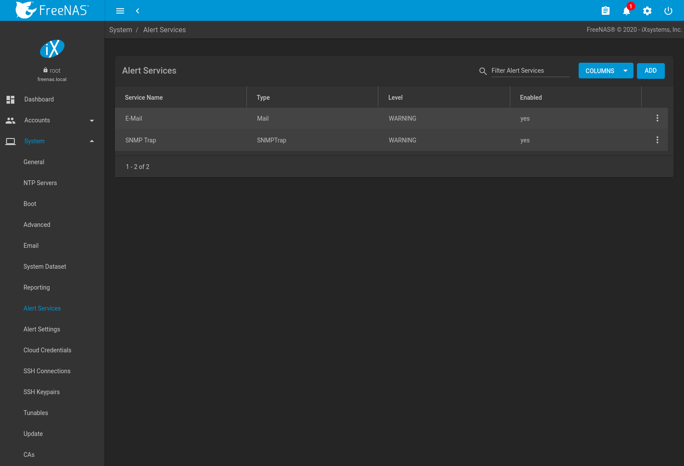

Click `ADD` to display the `Add Alert Service` form,
`Figure %s <alert_service_add_fig>`.

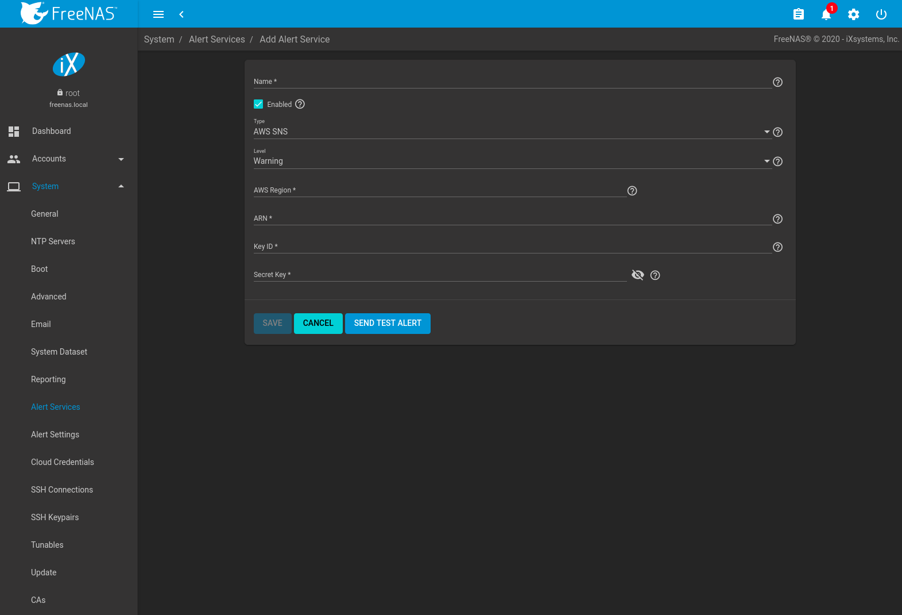

Select the `Type` to choose an alert service to configure.

Alert services can be set for a particular severity `Level`. All alerts
of that level are then sent out with that alert service. For example, if
the *E-Mail* alert service `Level` is set to *Info*, any *Info* level
alerts are sent by that service. Multiple alert services can be set to
the same level. For instance, *Critical* alerts can be sent both by
email and PagerDuty by setting both alert services to the *Critical*
level.

The configurable fields and required information differ for each alert
service. Set `Enabled` to activate the service. Enter any other required
information and click `SAVE`.

Click `SEND TEST ALERT` to test the chosen alert service.

All saved alert services are displayed in `System --> Alert Services`.
To delete an alert service, click ui-options and `Delete`. To disable an
alert service temporarily, click ui-options and `Edit`, then unset the
`Enabled` option.

Alert Settings

Alert Settings
--------------

`System --> Alert Settings` has options to configure each
FreeNAS® `Alert`.

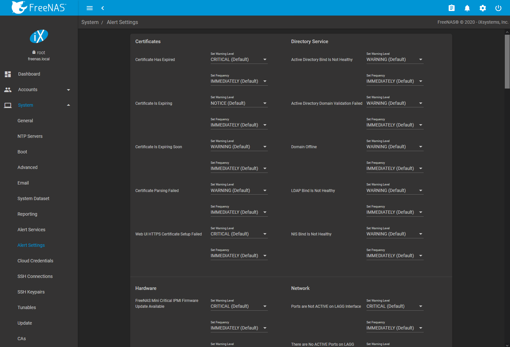

Alerts are grouped by web interface feature or service monitor. To
customize alert importance, use the `Warning Level` drop-down. To adjust
how often alert notifications are sent, use the `Frequency` drop-down.
Setting the `Frequency` to *NEVER* prevents that alert from being added
to alert notifications, but the alert can still show in the web
interface if it is triggered.

To configure where alert notifications are sent, use `Alert Services`.

Cloud Credentials

Cloud Credentials
-----------------

FreeNAS® can use cloud services for features like
`Cloud Sync Tasks`. The [rclone](https://rclone.org/) credentials to
provide secure connections with cloud services are entered here. Amazon
S3, Backblaze B2, Box, Dropbox, FTP, Google Cloud Storage, Google Drive,
HTTP, hubiC, Mega, Microsoft Azure Blob Storage, Microsoft OneDrive,
pCloud, SFTP, WebDAV, and Yandex are available.

Note

The hubiC cloud service has [suspended creation of new
accounts](https://www.ovh.co.uk/subscriptions-hubic-ended/).

Warning

Cloud Credentials are stored in encrypted form. To be able to restore
Cloud Credentials from a `saved configuration<General>`, "Export
Password Secret Seed" must be set when saving that configuration.

Click `System --> Cloud Credentials` to see the screen shown in
`Figure %s <cloud_creds_fig>`.

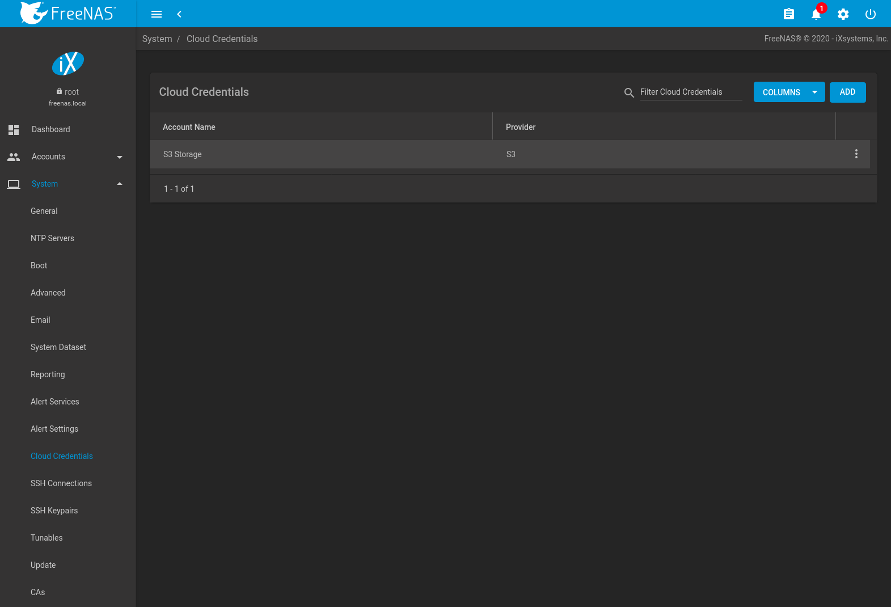

The list shows the `Account Name` and `Provider` for each credential.
There are options to `Edit` and `Delete` a credential after clicking
ui-options for a credential.

Click `ADD` to add a new cloud credential. Choose a `Provider` to
display any specific options for that provider.
`Figure %s <cloud_creds_add_fig>` shows an example configuration:

Enter a descriptive and unique name for the cloud credential in the
`Name` field. The remaining options vary by `Provider`, and are shown in
`Table %s <cloud_cred_tab>`. Clicking a provider name opens a new
browser tab to the [rclone documentation](https://rclone.org/docs/) for
that provider.

&gt;{RaggedRight}p{dimexpr 0.20linewidth-2tabcolsep}

<table>
<caption>Cloud Credential Options</caption>
<colgroup>
<col style="width: 25%" />
<col style="width: 12%" />
<col style="width: 61%" />
</colgroup>
<thead>
<tr class="header">
<th>Provider</th>
<th>Setting</th>
<th>Description</th>
</tr>
</thead>
<tbody>
<tr class="odd">
<td><a href="https://rclone.org/s3/">Amazon S3</a></td>
<td>Access Key ID</td>
<td>Enter the Amazon Web Services Key ID. This is found on <a href="https://aws.amazon.com">Amazon AWS</a> by going through <em>My Account --&gt; Security Credentials --&gt; Access Keys</em>. Must be alphanumeric and between 5 and 20 characters.</td>
</tr>
<tr class="even">
<td><a href="https://rclone.org/s3/">Amazon S3</a></td>
<td>Secret Access Key</td>
<td>Enter the Amazon Web Services password. If the Secret Access Key cannot be found or remembered, go to <em>My Account --&gt; Security Credentials --&gt; Access Keys</em> and create a new key pair. Must be alphanumeric and between 8 and 40 characters.</td>
</tr>
<tr class="odd">
<td><a href="https://rclone.org/s3/">Amazon S3</a></td>
<td>Endpoint URL</td>
<td>Set <code class="interpreted-text" role="guilabel">Advanced Settings</code> to access this option. S3 API <a href="https://docs.aws.amazon.com/AmazonS3/latest/dev/WebsiteEndpoints.html">endpoint URL</a>. When using AWS, the endpoint field can be empty to use the default endpoint for the region, and available buckets are automatically fetched. Refer to the AWS Documentation for a list of <a href="https://docs.aws.amazon.com/general/latest/gr/rande.html#s3_website_region_endpoints">Simple Storage Service Website Endpoints</a>.</td>
</tr>
<tr class="even">
<td><a href="https://rclone.org/s3/">Amazon S3</a></td>
<td>Region</td>
<td><a href="https://docs.aws.amazon.com/general/latest/gr/rande-manage.html">AWS resources in a geographic area</a>. Leave empty to automatically detect the correct public region for the bucket. Entering a private region name allows interacting with Amazon buckets created in that region. For example, enter <code>us-gov-east-1</code> to discover buckets created in the eastern <a href="https://docs.aws.amazon.com/govcloud-us/latest/UserGuide/whatis.html">AWS GovCloud</a> region.</td>
</tr>
<tr class="odd">
<td><a href="https://rclone.org/s3/">Amazon S3</a></td>
<td>Disable Endpoint Region</td>
<td>Set <code class="interpreted-text" role="guilabel">Advanced Settings</code> to access this option. Skip automatic detection of the <code class="interpreted-text" role="guilabel">Endpoint URL</code> region. Set this when configuring a custom <code class="interpreted-text" role="guilabel">Endpoint URL</code>.</td>
</tr>
<tr class="even">
<td><a href="https://rclone.org/s3/">Amazon S3</a></td>
<td>Use Signature Version 2</td>
<td>Set <code class="interpreted-text" role="guilabel">Advanced Settings</code> to access this option. Force using <a href="https://docs.aws.amazon.com/general/latest/gr/signature-version-2.html">Signature Version 2</a> to sign API requests. Set this when configuring a custom <code class="interpreted-text" role="guilabel">Endpoint URL</code>.</td>
</tr>
<tr class="odd">
<td><a href="https://rclone.org/b2/">Backblaze B2</a></td>
<td>Key ID, Application Key</td>
<td>Alphanumeric <a href="https://www.backblaze.com/b2/cloud-storage.html">Backblaze B2</a> application keys. To generate a new application key, log in to the Backblaze account, go to the <code class="interpreted-text" role="guilabel">App Keys</code> page, and add a new application key. Copy the <code>keyID</code> and <code>applicationKey</code> strings into the FreeNAS® web interface fields.</td>
</tr>
<tr class="even">
<td><a href="https://rclone.org/box/">Box</a></td>
<td>Access Token</td>
<td>Configured with <code class="interpreted-text" role="ref">Open Authentication &lt;OAuth Config&gt;</code>.</td>
</tr>
<tr class="odd">
<td><a href="https://rclone.org/dropbox/">Dropbox</a></td>
<td>Access Token</td>
<td>Configured with <code class="interpreted-text" role="ref">Open Authentication &lt;OAuth Config&gt;</code>. The access token can be manually created by going to the Dropbox <a href="https://www.dropbox.com/developers/apps">App Console</a>. After creating an app, go to <em>Settings</em> and click <code class="interpreted-text" role="guilabel">Generate</code> under the Generated access token field.</td>
</tr>
<tr class="even">
<td><a href="https://rclone.org/ftp/">FTP</a></td>
<td>Host, Port</td>
<td>Enter the FTP host and port.</td>
</tr>
<tr class="odd">
<td><a href="https://rclone.org/ftp/">FTP</a></td>
<td>Username, Password</td>
<td>Enter the FTP username and password.</td>
</tr>
<tr class="even">
<td><a href="https://rclone.org/googlecloudstorage/">Google Cloud Storage</a></td>
<td>JSON Service Account Key</td>
<td>Upload a Google <a href="https://rclone.org/googlecloudstorage/#service-account-support">Service Account credential file</a>. The file is created with the <a href="https://console.cloud.google.com/apis/credentials">Google Cloud Platform Console</a>.</td>
</tr>
<tr class="odd">
<td><a href="https://rclone.org/drive/">Google Drive</a></td>
<td>Access Token, Team Drive ID</td>
<td>The <code class="interpreted-text" role="guilabel">Access Token</code> is configured with <code class="interpreted-text" role="ref">Open Authentication &lt;OAuth Config&gt;</code>. <code class="interpreted-text" role="guilabel">Team Drive ID</code> is only used when connecting to a <a href="https://developers.google.com/drive/api/v3/reference/teamdrives">Team Drive</a>. The ID is also the ID of the top level folder of the Team Drive.</td>
</tr>
<tr class="even">
<td><a href="https://rclone.org/http/">HTTP</a></td>
<td>URL</td>
<td>Enter the HTTP host URL.</td>
</tr>
<tr class="odd">
<td><a href="https://rclone.org/hubic/">hubiC</a></td>
<td>Access Token</td>
<td>Enter the access token. See the <a href="https://api.hubic.com/sandbox/">Hubic guide</a> for instructions to obtain an access token.</td>
</tr>
<tr class="even">
<td><a href="https://rclone.org/mega/">Mega</a></td>
<td>Username, Password</td>
<td>Enter the <a href="https://mega.nz/">Mega</a> username and password.</td>
</tr>
<tr class="odd">
<td><a href="https://rclone.org/azureblob/">Microsoft Azure Blob Storage</a></td>
<td>Account Name, Account Key</td>
<td>Enter the Azure Blob Storage account name and key.</td>
</tr>
<tr class="even">
<td><a href="https://rclone.org/onedrive/">Microsoft OneDrive</a></td>
<td>Access Token, Drives List, Drive Account Type, Drive ID</td>
<td>
The <code class="interpreted-text" role="guilabel">Access Token</code> is configured with <code class="interpreted-text" role="ref">Open Authentication &lt;OAuth Config&gt;</code>. Authenticating a Microsoft account adds the <code class="interpreted-text" role="guilabel">Drives List</code> and selects the correct <code class="interpreted-text" role="guilabel">Drive Account Type</code>.

The <code class="interpreted-text" role="guilabel">Drives List</code> shows all the drives and IDs registered to the Microsoft account. Selecting a drive automatically fills the <code class="interpreted-text" role="guilabel">Drive ID</code> field.
</td>
</tr>
<tr class="odd">
<td><a href="https://rclone.org/pcloud/">pCloud</a></td>
<td>Access Token</td>
<td>Configured with <code class="interpreted-text" role="ref">Open Authentication &lt;OAuth Config&gt;</code>.</td>
</tr>
<tr class="even">
<td><a href="https://rclone.org/sftp/">SFTP</a></td>
<td>Host, Port, Username, Password, Private Key ID</td>
<td>Enter the SFTP host and port. Enter an account user name that has SSH access to the host. Enter the password for that account <em>or</em> import the private key from an existing <code class="interpreted-text" role="ref">SSH keypair &lt;SSH Keypairs&gt;</code>. To create a new SSH key for this credential, open the <code class="interpreted-text" role="guilabel">Private Key ID</code> drop-down and select <em>Generate New</em>.</td>
</tr>
<tr class="odd">
<td><a href="https://rclone.org/webdav/">WebDAV</a></td>
<td>URL, WebDAV service</td>
<td>Enter the URL and use the dropdown to select the WebDAV service.</td>
</tr>
<tr class="even">
<td><a href="https://rclone.org/webdav/">WebDAV</a></td>
<td>Username, Password</td>
<td>Enter the username and password.</td>
</tr>
<tr class="odd">
<td><a href="https://rclone.org/yandex/">Yandex</a></td>
<td>Access Token</td>
<td>Configured with <code class="interpreted-text" role="ref">Open Authentication &lt;OAuth Config&gt;</code>.</td>
</tr>
</tbody>
</table>

Cloud Credential Options

For Amazon S3, `Access Key` and `Secret Key` values are found on the
Amazon AWS website by clicking on the account name, then
`My Security Credentials` and
`Access Keys (Access Key ID and Secret Access Key)`. Copy the Access Key
value to the FreeNAS® Cloud Credential `Access Key` field,
then enter the `Secret Key` value saved when the key pair was created.
If the Secret Key value is unknown, a new key pair can be created on the
same Amazon screen.

[Open Authentication (OAuth)](https://openauthentication.org/) is used
with some cloud providers. These providers have a `LOGIN TO PROVIDER`
button that opens a dialog to log in to that provider and fill the
`Access Token` field with valid credentials.

Enter the information and click `VERIFY CREDENTIAL`.
`The Credential is valid.` displays when the credential information is
verified.

More details about individual `Provider` settings are available in the
[rclone documentation](https://rclone.org/about/).

SSH Connections

SSH Connections
---------------

[Secure Socket Shell
(SSH)](https://searchsecurity.techtarget.com/definition/Secure-Shell) is
a network protocol that provides a secure method to access and transfer
files between two hosts while using an unsecure network. SSH can use
user account credentials to establish secure connections, but often uses
key pairs shared between host systems for authentication.

FreeNAS® uses `System --> SSH Connections` to quickly create
SSH connections and show any saved connections. These connections are
required when creating a new `replication <Replication Tasks>` to back
up dataset snapshots.

The remote system must be configured to allow SSH connections. Some
situations can also require allowing root account access to the remote
system. For FreeNAS® systems, go to `Services` and edit the
`SSH` service to allow SSH connections and root account access.

To add a new SSH connection, go to `System --> SSH Connections` and
click `ADD`.

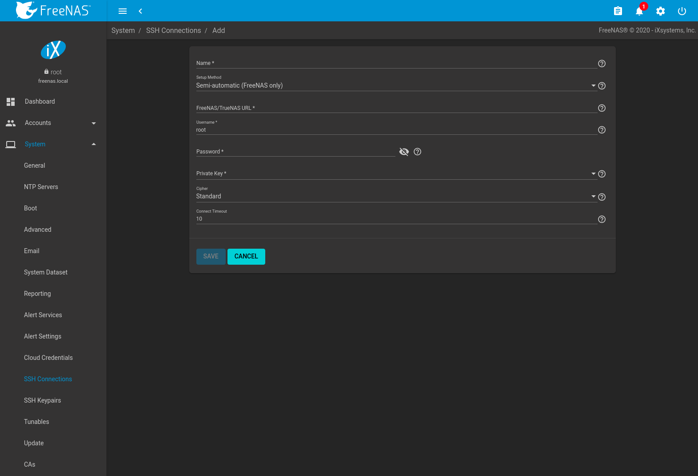

&gt;{RaggedRight}p{dimexpr 0.20linewidth-2tabcolsep}

<table>
<caption>SSH Connection Options</caption>
<colgroup>
<col style="width: 14%" />
<col style="width: 14%" />
<col style="width: 71%" />
</colgroup>
<thead>
<tr class="header">
<th>Setting</th>
<th>Value</th>
<th>Description</th>
</tr>
</thead>
<tbody>
<tr class="odd">
<td>Name</td>
<td>string</td>
<td>Descriptive name of this SSH connection. SSH connection names must be unique.</td>
</tr>
<tr class="even">
<td>Setup Method</td>
<td>drop-down menu</td>
<td>
How to configure the connection:

<em>Manual</em> requires configuring authentication on the remote system. This can require copying SSH keys and modifying the <em>root</em> user account on that system. See <code class="interpreted-text" role="ref">Manual Setup</code>.

<em>Semi-automatic</em> is only functional when configuring an SSH connection between FreeNAS® systems. After authenticating the connection, all remaining connection options are automatically configured. See <code class="interpreted-text" role="ref">Semi-Automatic Setup</code>.
</td>
</tr>
<tr class="odd">
<td>Host</td>
<td>string</td>
<td>Enter the hostname or IP address of the remote system. Only available with <em>Manual</em> configurations.</td>
</tr>
<tr class="even">
<td>Port</td>
<td>integer</td>
<td>Port number on the remote system to use for the SSH connection. Only available with <em>Manual</em> configurations.</td>
</tr>
<tr class="odd">
<td>FreeNAS URL</td>
<td>string</td>
<td>Hostname or IP address of the remote FreeNAS® system. Only available with <em>Semi-automatic</em> configurations. A valid URL scheme is required. Example: <code class="interpreted-text" role="samp">https://{10.231.3.76}</code></td>
</tr>
<tr class="even">
<td>Username</td>
<td>string</td>
<td>User account name to use for logging in to the remote system</td>
</tr>
<tr class="odd">
<td>Password</td>
<td>string</td>
<td>User account password used to log in to the FreeNAS® system. Only available with <em>Semi-automatic</em> configurations.</td>
</tr>
<tr class="even">
<td>Private Key</td>
<td>drop-down menu</td>
<td>Choose a saved <code class="interpreted-text" role="ref">SSH Keypair &lt;SSH Keypairs&gt;</code> or select <em>Generate New</em> to create a new keypair and apply it to this connection.</td>
</tr>
<tr class="odd">
<td>Remote Host Key</td>
<td>string</td>
<td>Remote system SSH key for this system to authenticate the connection. Only available with <em>Manual</em> configurations. When all other fields are properly configured, click <code class="interpreted-text" role="guilabel">DISCOVER REMOTE HOST KEY</code> to query the remote system and automatically populate this field.</td>
</tr>
<tr class="even">
<td>Cipher</td>
<td>drop-down menu</td>
<td>
Connection security level:

<ul>
<li><em>Standard</em> is most secure, but has the greatest impact on connection speed.</li>
<li><em>Fast</em> is less secure than <em>Standard</em> but can give reasonable transfer rates for devices with limited cryptographic speed.</li>
<li><em>Disabled</em> removes all security in favor of maximizing connection speed. Disabling the security should only be used within a secure, trusted network.</li>
</ul></td>
</tr>
<tr class="odd">
<td>Connect Timeout</td>
<td>integer</td>
<td>Time (in seconds) before the system stops attempting to establish a connection with the remote system.</td>
</tr>
</tbody>
</table>

SSH Connection Options

Saved connections can be edited or deleted. Deleting an SSH connection
also deletes or disables paired `SSH Keypairs`, `Replication Tasks`, and
`Cloud Credentials`.

### Manual Setup

Choosing to manually set up the SSH connection requires copying a public
encryption key from the local to remote system. This allows a secure
connection without a password prompt.

The examples here and in `Semi-Automatic Setup` refer to the
FreeNAS® system that is configuring a new connection in
`System --> SSH Connections` as *Host 1*. The FreeNAS® system
that is receiving the encryption key is *Host 2*.

On *Host 1*, go to `System --> SSH Keypairs` and create a new
`SSH Keypair <SSH Keypairs>`. Highlight the entire `Public Key` text,
right-click in the highlighted area, and click `Copy`.

Log in to *Host 2* and go to `Accounts --> Users`. Click ui-options for
the *root* account, then `Edit`. Paste the copied key into the
`SSH Public Key` field and click `SAVE` as shown in
`Figure %s <zfs_paste_replication_key_fig>`.

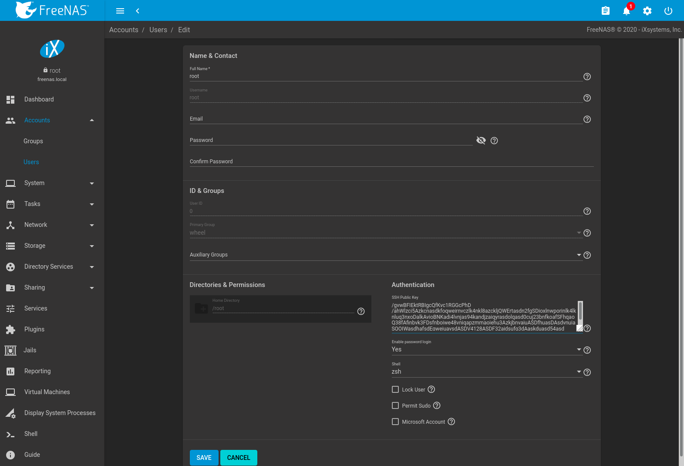

Switch back to *Host 1* and go to `System --> SSH Connections` and click
`ADD`. Set the `Setup Method` to *Manual*, select the previously created
keypair as the `Private Key`, and fill in the rest of the connection
details for *Host 2*. Click `DISCOVER REMOTE HOST KEY` to obtain the
remote system key. Click `SAVE` to store this SSH connection.

### Semi-Automatic Setup

FreeNAS® offers a semi-automatic setup mode that simplifies
setting up an SSH connection with another FreeNAS or TrueNAS system.
When administrator account credentials are known for *Host 2*,
semi-automatic setup allows configuring the SSH connection without
logging in to *Host 2* to transfer SSH keys.

In *Host 1*, go to `System --> SSH Keypairs` and create a new
`SSH Keypair <SSH Keypairs>`. Go to `System --> SSH Connections` and
click `ADD`.

Choose *Semi-automatic* as the `Setup Method`. Enter the *Host 2* URL in
`FreeNAS URL` using the format `http://{freenas.remote}`, where
*freenas.remote* is the *Host 2* hostname or IP address.

Enter credentials for an *Host 2* user account that can accept SSH
connection requests and modify *Host 2*. This is typically the *root*
account.

Select the SSH keypair that was just created for the `Private Key`.

Fill in the remaining connection configuration fields and click `SAVE`.
*Host 1* can use this saved configuration to establish a connection to
*Host 2* and exchange the remaining authentication keys.

SSH Keypairs

SSH Keypairs
------------

FreeNAS® generates and stores
[RSA-encrypted](https://en.wikipedia.org/wiki/RSA_%28cryptosystem%29)
SSH public and private keypairs in `System --> SSH Keypairs`. These are
generally used when configuring `SSH Connections` or *SFTP*
`Cloud Credentials`. Encrypted keypairs or keypairs with passphrases are
not supported.

To generate a new keypair, click `ADD`, enter a name, and click
`GENERATE KEYPAIR`. The `Private Key` and `Public Key` fields fill with
the key strings. SSH key pair names must be unique.

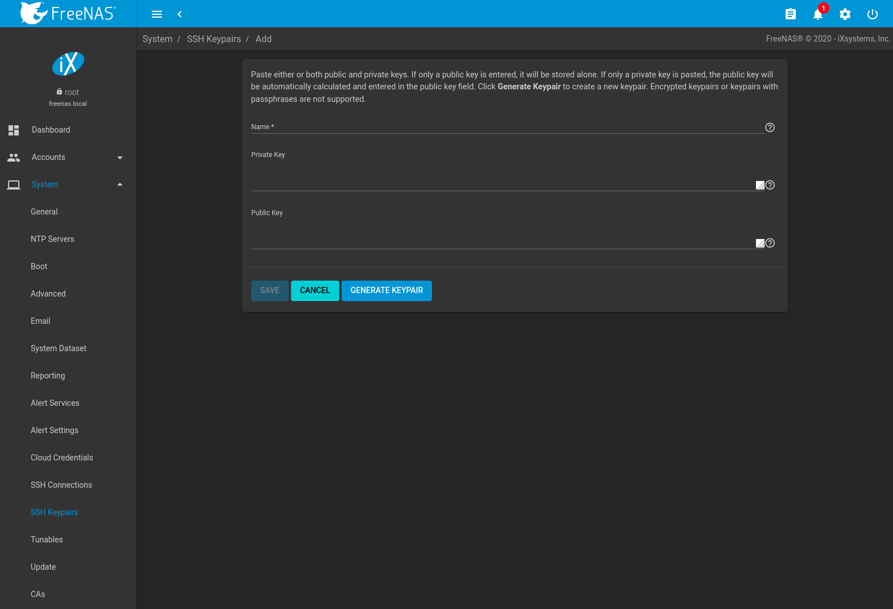

Click `SAVE` to store the new keypair. These saved keypairs can be
selected later in the web interface wihout having to manually copy the
key values.

Keys are viewed or modified by going to `System --> SSH Keypairs` and
clicking ui-options and `Edit` for the keypair name.

Deleting an SSH Keypair also deletes any associated `SSH Connections`.
`Replication Tasks` or SFTP `Cloud Credentials` that use this keypair
are disabled but not removed.

Tunables

Tunables
--------

`System --> Tunables` can be used to manage:

1.  **FreeBSD sysctls:** a
    [sysctl(8)](https://www.freebsd.org/cgi/man.cgi?query=sysctl) makes
    changes to the FreeBSD kernel running on a FreeNAS®
    system and can be used to tune the system.
2.  **FreeBSD loaders:** a loader is only loaded when a FreeBSD-based
    system boots and can be used to pass a parameter to the kernel or to
    load an additional kernel module such as a FreeBSD hardware driver.
3.  **FreeBSD rc.conf options:**
    [rc.conf(5)](https://www.freebsd.org/cgi/man.cgi?query=rc.conf) is
    used to pass system configuration options to the system startup
    scripts as the system boots. Since FreeNAS® has been
    optimized for storage, not all of the services mentioned in
    rc.conf(5) are available for configuration. Note that in
    FreeNAS®, customized rc.conf options are stored in
    `/tmp/rc.conf.freenas`.

Warning

Adding a sysctl, loader, or `rc.conf` option is an advanced feature. A
sysctl immediately affects the kernel running the FreeNAS®
system and a loader could adversely affect the ability of the
FreeNAS® system to successfully boot. **Do not create a
tunable on a production system before testing the ramifications of that
change.**

Since sysctl, loader, and rc.conf values are specific to the kernel
parameter to be tuned, the driver to be loaded, or the service to
configure, descriptions and suggested values can be found in the man
page for the specific driver and in many sections of the [FreeBSD
Handbook](https://www.freebsd.org/doc/en_US.ISO8859-1/books/handbook/).

To add a loader, sysctl, or `rc.conf` option, go to
`System --> Tunables` and click `ADD` to access the screen shown in
`Figure %s <add_tunable_fig>`.

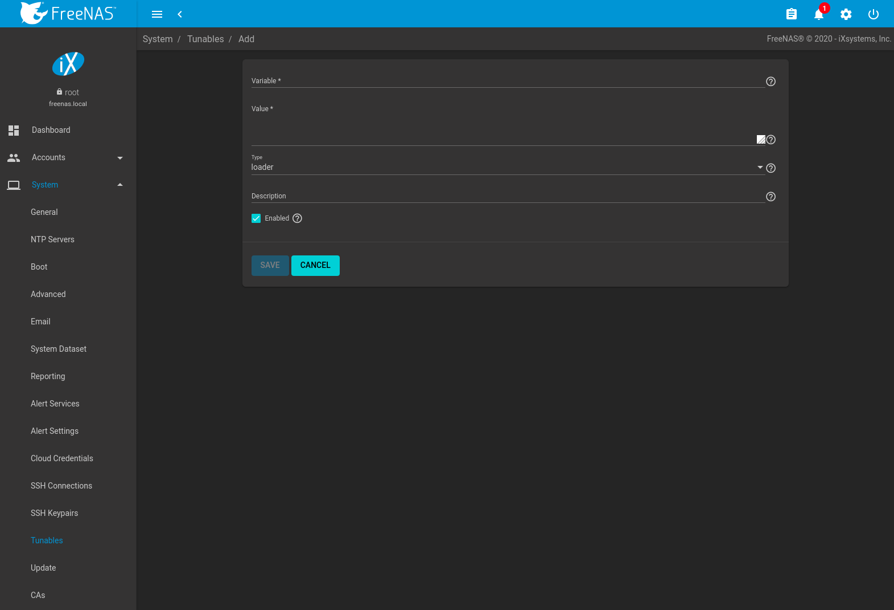

`Table %s <add_tunable_tab>` summarizes the options when adding a
tunable.

&gt;{RaggedRight}p{dimexpr 0.20linewidth-2tabcolsep}

| Setting     | Value             | Description                                                                                                                                                                                 |
|-------------|-------------------|---------------------------------------------------------------------------------------------------------------------------------------------------------------------------------------------|
| Variable    | string            | The name of the sysctl or driver to load.                                                                                                                                                   |
| Value       | integer or string | Set a value for the `Variable`. Refer to the man page for the specific driver or the [FreeBSD Handbook](https://www.freebsd.org/doc/en_US.ISO08859-1/books/handbook/) for suggested values. |
| Type        | drop-down menu    | Choices are *Loader*, *rc.conf*, and *Sysctl*.                                                                                                                                              |
| Description | string            | Optional. Enter a description of this tunable.                                                                                                                                              |
| Enabled     | checkbox          | Deselect this option to disable the tunable without deleting it.                                                                                                                            |

Adding a Tunable

Note

As soon as a *Sysctl* is added or edited, the running kernel changes
that variable to the value specified. However, when a *Loader* or
*rc.conf* value is changed, it does not take effect until the system is
rebooted. Regardless of the type of tunable, changes persist at each
boot and across upgrades unless the tunable is deleted or the `Enabled`
option is deselected.

Existing tunables are listed in `System --> Tunables`. To change the
value of an existing tunable, click ui-options and `Edit`. To remove a
tunable, click ui-options and `Delete`.

Restarting the FreeNAS® system after making sysctl changes is
recommended. Some sysctls only take effect at system startup, and
restarting the system guarantees that the setting values correspond with
what is being used by the running system.

The web interface does not display the sysctls that are pre-set when
FreeNAS® is installed. FreeNAS® ships with the
sysctls set:

    kern.corefile=/var/tmp/%N.core
    kern.metadelay=3
    kern.dirdelay=4
    kern.filedelay=5
    kern.coredump=1
    kern.sugid_coredump=1
    vfs.timestamp_precision=3
    net.link.lagg.lacp.default_strict_mode=0
    vfs.zfs.min_auto_ashift=12

**Do not add or edit these default sysctls** as doing so may render the
system unusable.

The web interface does not display the loaders that are pre-set when
FreeNAS® is installed. FreeNAS® ships with these
loaders set:

    product="FreeNAS"
    autoboot_delay="5"
    loader_logo="FreeNAS"
    loader_menu_title="Welcome to FreeNAS"
    loader_brand="FreeNAS"
    loader_version=" "
    kern.cam.boot_delay="30000"
    debug.debugger_on_panic=1
    debug.ddb.textdump.pending=1
    hw.hptrr.attach_generic=0
    vfs.mountroot.timeout="30"
    ispfw_load="YES"
    ipmi_load="YES"
    freenas_sysctl_load="YES"
    hint.isp.0.role=2
    hint.isp.1.role=2
    hint.isp.2.role=2
    hint.isp.3.role=2
    module_path="/boot/kernel;/boot/modules;/usr/local/modules"
    net.inet6.ip6.auto_linklocal="0"
    vfs.zfs.vol.mode=2
    kern.geom.label.disk_ident.enable=0
    kern.geom.label.ufs.enable=0
    kern.geom.label.ufsid.enable=0
    kern.geom.label.reiserfs.enable=0
    kern.geom.label.ntfs.enable=0
    kern.geom.label.msdosfs.enable=0
    kern.geom.label.ext2fs.enable=0
    hint.ahciem.0.disabled="1"
    hint.ahciem.1.disabled="1"
    kern.msgbufsize="524288"
    hw.mfi.mrsas_enable="1"
    hw.usb.no_shutdown_wait=1
    vfs.nfsd.fha.write=0
    vfs.nfsd.fha.max_nfsds_per_fh=32
    vm.lowmem_period=0

**Do not add or edit the default tunables.** Changing the default
tunables can make the system unusable.

The ZFS version used in deprecates these tunables:

    kvfs.zfs.write_limit_override
    vfs.zfs.write_limit_inflated
    vfs.zfs.write_limit_max
    vfs.zfs.write_limit_min
    vfs.zfs.write_limit_shift
    vfs.zfs.no_write_throttle

After upgrading from an earlier version of FreeNAS®, these
tunables are automatically deleted. Please do not manually add them
back.

Update
------

FreeNAS® has an integrated update system to make it easy to
keep up to date.

### Preparing for Updates

It is best to perform updates at times the FreeNAS® system is
idle, with no clients connected and no scrubs or other disk activity
going on. Most updates require a system reboot. Plan updates around
scheduled maintenance times to avoid disrupting user activities.

The update process will not proceed unless there is enough free space in
the boot pool for the new update files. If a space warning is shown, go
to `Boot` to remove unneeded boot environments.

### Updates and Trains

Cryptographically signed update files are used to update
FreeNAS®. Update files provide flexibility in deciding when
to upgrade the system. Go to `Boot <If Something Goes Wrong>` to test an
update.

FreeNAS® defines software branches, known as *trains*. There
are several trains available for updates, but the web interface only
displays trains that can be selected as an upgrade.

Update trains are labeled with a numeric version followed by a short
description. The current version receives regular bug fixes and new
features. Supported older versions of FreeNAS® only receive
maintenance updates. Several specific words are used to describe the
type of train:

-   **STABLE:** Bug fixes and new features are available from this
    train. Upgrades available from a *STABLE* train are tested and ready
    to apply to a production environment.
-   **Nightlies:** Experimental train used for testing future versions
    of FreeNAS®.
-   **SDK:** Software Developer Kit train. This has additional tools for
    testing and debugging FreeNAS®.

Warning

The UI will warn if the currently selected train is not suited for
production use. Before using a non-production train, be prepared to
experience bugs or problems. Testers are encouraged to submit bug
reports at &lt;https://bugs.ixsystems.com&gt;.

### Checking for Updates

`Figure %s <update_options_fig>` shows an example of the
`System --> Update` screen.

> Update Options

The system checks daily for updates and downloads an update if one is
available. An alert is issued when a new update becomes available. The
automatic check and download of updates is disabled by unsetting
`Check for Updates Daily and Download if Available`. Click ui-refresh to
perform another check for updates.

To change the train, use the drop-down menu to make a different
selection.

Note

The train selector does not allow downgrades. For example, the STABLE
train cannot be selected while booted into a Nightly boot environment,
or a 9.10 train cannot be selected while booted into a 11 boot
environment. To go back to an earlier version after testing or running a
more recent version, reboot and select a boot environment for that
earlier version. This screen can then be used to check for updates that
train.

In the example shown in `Figure %s <review_updates_fig>`, information
about the update is displayed along with a link to the `release notes`.
It is important to read the release notes before updating to determine
if any of the changes in that release impact the use of the system.

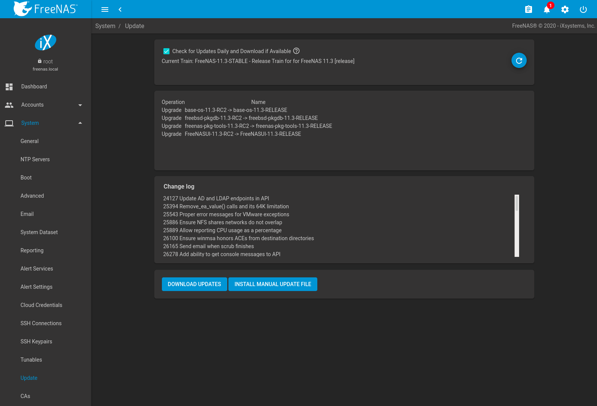

### Saving the Configuration File

A dialog to save the system `configuration file <saveconfig>` appears
before installing updates.

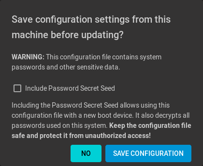

Warning

Keep the system configuration file secure after saving it. The security
information in the configuration file could be used for unauthorized
access to the FreeNAS® system.

### Applying Updates

Make sure the system is in a low-usage state as described above in
`Preparing for Updates`.

Click `DOWNLOAD UPDATES` to immediately download and install an update.

The `Save Configuration <Saving_The_Configuration_File>` dialog appears
so the current configuration can be saved to external media.

A confirmation window appears before the update is installed. When
`Apply updates and reboot system after downloading` is set and, clicking
`CONTINUE` downloads, applies the updates, and then automatically
reboots the system. The update can be downloaded for a later manual
installation by unsetting the
`Apply updates and reboot system after downloading` option.

`APPLY PENDING UPDATE` is visible when an update is downloaded and ready
to install. Click the button to see a confirmation window. Setting
`Confirm` and clicking `CONTINUE` installs the update and reboots the
system.

Warning

Each update creates a boot environment. If the update process needs more
space, it attempts to remove old boot environments. Boot environments
marked with the *Keep* attribute as shown in `Boot` are not removed. If
space for a new boot environment is not available, the upgrade fails.
Space on the operating system device can be manually freed using
`System --> Boot`. Review the boot environments and remove the *Keep*
attribute or delete any boot environments that are no longer needed.

### Manual Updates

Updates can also be manually downloaded and applied in
`System --> Update`.

Note

Manual updates cannot be used to upgrade from older major versions.

Go to <https://download.freenas.org/> and find an update file of the
desired version. Manual update file names end with
`-manual-update-unsigned.tar`.

Download the file to a desktop or laptop computer. Connect to
FreeNAS® with a browser and go to `System --> Update`. Click
`INSTALL MANUAL UPDATE FILE`.

The `Save Configuration <Saving_The_Configuration_File>` dialog opens.
This makes it possible to save a copy of the current configuration to
external media for backup in case of an update problem.

After the dialog closes, the manual update screen is shown:

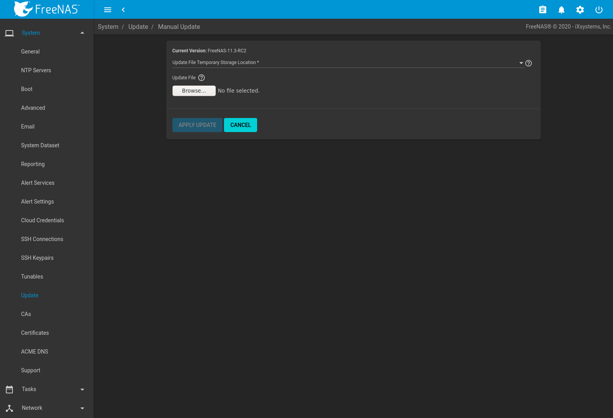

The current version of FreeNAS® is shown for verification.

Select the manual update file with the `Browse` button. Set
`Reboot After Update` to reboot the system after the update has been
installed. Click `APPLY UPDATE` to begin the update.

### Update in Progress

Starting an update shows a progress dialog. When an update is in
progress, the web interface shows an ui-update icon in the top row.
Dialogs also appear in every active web interface session to warn that a
system update is in progress. **Do not** interrupt a system update.

CA, Certificate Authority

CAs
---

FreeNAS® can act as a Certificate Authority (CA). When
encrypting SSL or TLS connections to the FreeNAS® system,
either import an existing certificate, or create a CA on the
FreeNAS® system, then create a certificate. This certificate
will appear in the drop-down menus for services that support SSL or TLS.

For secure LDAP, the public key of an existing CA can be imported with
`Import CA`, or a new CA created on the FreeNAS® system and
used on the LDAP server also.

`Figure %s <cas_fig>` shows the screen after clicking `System --> CAs`.

> Initial CA Screen

If the organization already has a CA, the CA certificate and key can be
imported. Click `ADD` and set the `Type` to *Import CA* to see the
configuration options shown in `Figure %s <import_ca_fig>`. The
configurable options are summarized in `Table %s <import_ca_opts_tab>`.

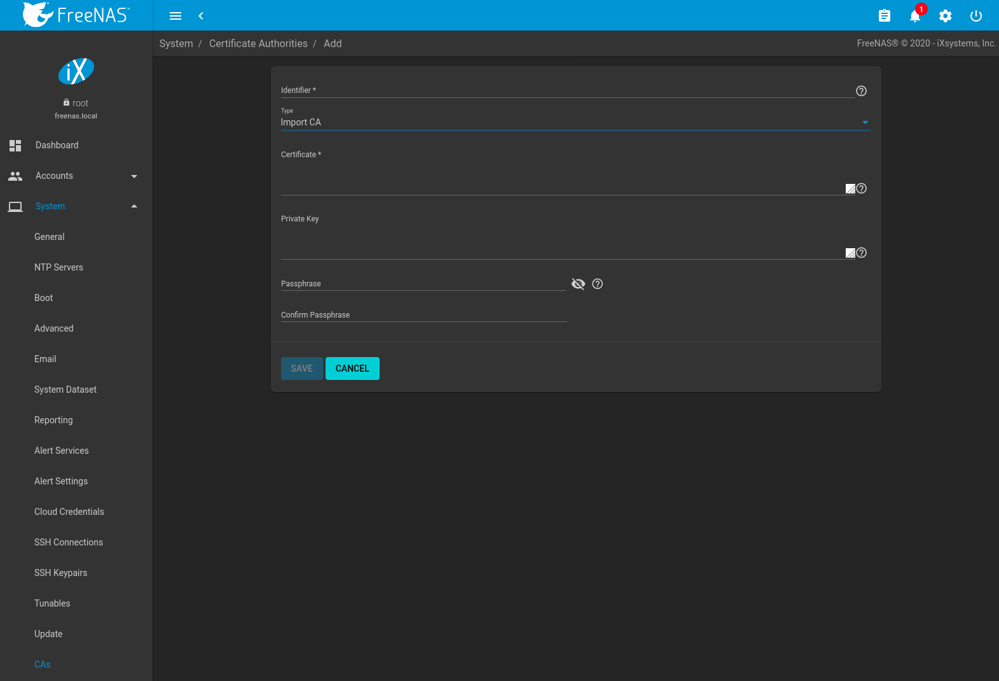

&gt;{RaggedRight}p{dimexpr 0.20linewidth-2tabcolsep}

| Setting     | Value          | Description                                                                                                               |
|-------------|----------------|---------------------------------------------------------------------------------------------------------------------------|
| Identifier  | string         | Enter a descriptive name for the CA using only alphanumeric, underscore (`_`), and dash (`-`) characters.                 |
| Type        | drop-down menu | Choose the type of CA. Choices are *Internal CA*, *Intermediate CA*, and *Import CA*.                                     |
| Certificate | string         | Mandatory. Paste in the certificate for the CA.                                                                           |
| Private Key | string         | If there is a private key associated with the `Certificate`, paste it here. Private keys must be at least 1024 bits long. |
| Passphrase  | string         | If the `Private Key` is protected by a passphrase, enter it here and repeat it in the "Confirm Passphrase" field.         |

Importing a CA Options

To create a new CA, first decide if it will be the only CA which will
sign certificates for internal use or if the CA will be part of a
[certificate chain](https://en.wikipedia.org/wiki/Root_certificate).

To create a CA for internal use only, click `ADD` and set the `Type` to
*Internal CA*. `Figure %s <create_ca_fig>` shows the available options.

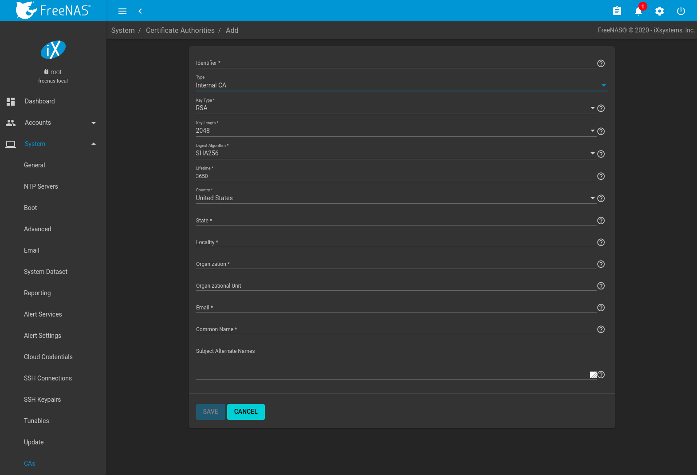

The configurable options are described in
`Table %s <internal_ca_opts_tab>`. When completing the fields for the
certificate authority, supply the information for the organization.

&gt;{RaggedRight}p{dimexpr 0.20linewidth-2tabcolsep}

| Setting                 | Value          | Description                                                                                                                                                                                                                                                          |
|-------------------------|----------------|----------------------------------------------------------------------------------------------------------------------------------------------------------------------------------------------------------------------------------------------------------------------|
| Identifier              | string         | Enter a descriptive name for the CA using only alphanumeric, underscore (`_`), and dash (`-`) characters.                                                                                                                                                            |
| Type                    | drop-down menu | Choose the type of CA. Choices are *Internal CA*, *Intermediate CA*, and *Import CA*.                                                                                                                                                                                |
| Key Type                | drop-down menu | Cryptosystem for the certificate authority key. Choose between *RSA* ([Rivest-Shamir-Adleman](https://en.wikipedia.org/wiki/RSA_(cryptosystem))) and *EC* ([Elliptic-curve](https://en.wikipedia.org/wiki/Elliptic-curve_cryptography)) encryption.                  |
| EC Curve                | drop-down menu | Elliptic curve to apply to the certificate authority key. Choose from different *Brainpool* or *SEC* curve parameters. See [RFC 5639](https://tools.ietf.org/html/rfc5639) and [SEC 2](http://www.secg.org/sec2-v2.pdf) for more details. Applies to *EC* keys only. |
| Key Length              | drop-down menu | For security reasons, a minimum of *2048* is recommended. Applies to *RSA* keys only.                                                                                                                                                                                |
| Digest Algorithm        | drop-down menu | The default is acceptable unless the organization requires a different algorithm.                                                                                                                                                                                    |
| Lifetime                | integer        | The lifetime of a CA is specified in days.                                                                                                                                                                                                                           |
| Country                 | drop-down menu | Select the country for the organization.                                                                                                                                                                                                                             |
| State                   | string         | Enter the state or province of the organization.                                                                                                                                                                                                                     |
| Locality                | string         | Enter the location of the organization.                                                                                                                                                                                                                              |
| Organization            | string         | Enter the name of the company or organization.                                                                                                                                                                                                                       |
| Organizational Unit     | string         | Organizational unit of the entity.                                                                                                                                                                                                                                   |
| Email                   | string         | Enter the email address for the person responsible for the CA.                                                                                                                                                                                                       |
| Common Name             | string         | Enter the fully-qualified hostname (FQDN) of the system. The `Common Name` **must** be unique within a certificate chain.                                                                                                                                            |
| Subject Alternate Names | string         | Multi-domain support. Enter additional space separated domain names.                                                                                                                                                                                                 |

Internal CA Options

To create an intermediate CA which is part of a certificate chain, set
the `Type` to *Intermediate CA*. This screen adds one more option to the
screen shown in `Figure %s <create_ca_fig>`:

-   **Signing Certificate Authority:** this drop-down menu is used to
    specify the root CA in the certificate chain. This CA must first be
    imported or created.

Imported or created CAs are added as entries in `System --> CAs`. The
columns in this screen indicate the name of the CA, whether it is an
internal CA, whether the issuer is self-signed, the CA lifetime (in
days), the common name of the CA, the date and time the CA was created,
and the date and time the CA expires.

Click ui-options on an existing CA to access these configuration
buttons:

-   **View:** use this option to view the contents of an existing
    `Certificate`, `Private Key`, or to edit the `Identifier`.
-   **Sign CSR:** used to sign internal Certificate Signing Requests
    created using `System --> Certificates --> Create CSR`. Signing a
    request adds a new certificate to `System --> Certificates`.
-   **Export Certificate:** prompts to browse to the location to save a
    copy of the CA's X.509 certificate on the computer being used to
    access the FreeNAS® system.
-   **Export Private Key:** prompts to browse to the location to save a
    copy of the CA's private key on the computer being used to access
    the FreeNAS® system. This option only appears if the CA
    has a private key.
-   **Delete:** prompts for confirmation before deleting the CA.

Certificates

Certificates
------------

FreeNAS® can import existing certificates or certificate
signing requests, create new certificates, and issue certificate signing
requests so that created certificates can be signed by the CA which was
previously imported or created in `CAs`.

Go to `System --> Certificates` to add or view certificates.

> Certificates

FreeNAS® uses a self-signed certificate to enable encrypted
access to the web interface. This certificate is generated at boot and
cannot be deleted until a different certificate is chosen as the
`GUI SSL Certificate <system_general_tab>`.

To import an existing certificate, click `ADD` and set the `Type` to
*Import Certificate*. `Figure %s <import_cert_fig>` shows the options.
When importing a certificate chain, paste the primary certificate,
followed by any intermediate certificates, followed by the root CA
certificate.

The configurable options are summarized in
`Table %s <cert_import_opt_tab>`.

&gt;{RaggedRight}p{dimexpr 0.20linewidth-2tabcolsep}

| Setting                       | Value          | Description                                                                                                                                                        |
|-------------------------------|----------------|--------------------------------------------------------------------------------------------------------------------------------------------------------------------|
| Identifier                    | string         | Enter a descriptive name for the certificate using only alphanumeric, underscore (`_`), and dash (`-`) characters.                                                 |
| Type                          | drop-down menu | Choose the type of certificate. Choices are *Internal Certificate*, *Certificate Signing Request*, *Import Certificate*, and *Import Certificate Signing Request*. |
| CSR exists on this system     | checkbox       | Set when the certificate being imported already has a Certificate Signing Request (CSR) on the system.                                                             |
| Signing Certificate Authority | drop-down menu | Select a previously created or imported CA. Active when `CSR exists on this system` is set.                                                                        |
| Certificate                   | string         | Paste the contents of the certificate.                                                                                                                             |
| Private Key                   | string         | Paste the private key associated with the certificate. Private keys must be at least 1024 bits long. Active when `CSR exists on this system` is unset.             |
| Passphrase                    | string         | If the private key is protected by a passphrase, enter it here and repeat it in the `Confirm Passphrase` field. Active when `CSR exists on this system` is unset.  |

Certificate Import Options

Importing a certificate signing request requires copying the contents of
the signing request and key files into the form. Having the signing
request `CERTIFICATE REQUEST` and `PRIVATE KEY` strings visible in a
separate window simplifies the import process.

&gt;{RaggedRight}p{dimexpr 0.20linewidth-2tabcolsep}

| Setting         | Value          | Description                                                                                                                                                        |
|-----------------|----------------|--------------------------------------------------------------------------------------------------------------------------------------------------------------------|
| Identifier      | string         | Enter a descriptive name for the certificate using only alphanumeric, underscore (`_`), and dash (`-`) characters.                                                 |
| Type            | drop-down menu | Choose the type of certificate. Choices are *Internal Certificate*, *Certificate Signing Request*, *Import Certificate*, and *Import Certificate Signing Request*. |
| Signing Request | drop-down menu | Paste the `CERTIFICATE REQUEST` string from the signing request.                                                                                                   |
| Private Key     | string         | Paste the private key associated with the certificate signing request. Private keys must be at least 1024 bits long.                                               |
| Passphrase      | string         | If the private key is protected by a passphrase, enter it here and repeat it in the `Confirm Passphrase` field.                                                    |

Certificate Signing Request Import Options

To create a new self-signed certificate, set the `Type` to *Internal
Certificate* to see the options shown in
`Figure %s <create_new_cert_fig>`. The configurable options are
summarized in `Table %s <cert_create_opts_tab>`. When completing the
fields for the certificate authority, use the information for the
organization. Since this is a self-signed certificate, use the CA that
was imported or created with `CAs` as the signing authority.

&gt;{RaggedRight}p{dimexpr 0.20linewidth-2tabcolsep}

| Setting                       | Value          | Description                                                                                                                                                                                                                                                |
|-------------------------------|----------------|------------------------------------------------------------------------------------------------------------------------------------------------------------------------------------------------------------------------------------------------------------|
| Identifier                    | string         | Enter a descriptive name for the certificate using only alphanumeric, underscore (`_`), and dash (`-`) characters.                                                                                                                                         |
| Type                          | drop-down menu | Choose the type of certificate. Choices are *Internal Certificate*, *Certificate Signing Request*, and *Import Certificate*.                                                                                                                               |
| Signing Certificate Authority | drop-down menu | Select the CA which was previously imported or created using `CAs`.                                                                                                                                                                                        |
| Key Type                      | drop-down menu | Cryptosystem for the certificate key. Choose between *RSA* ([Rivest-Shamir-Adleman](https://en.wikipedia.org/wiki/RSA_(cryptosystem))) and *EC* ([Elliptic-curve](https://en.wikipedia.org/wiki/Elliptic-curve_cryptography)) encryption.                  |
| EC Curve                      | drop-down menu | Elliptic curve to apply to the certificate key. Choose from different *Brainpool* or *SEC* curve parameters. See [RFC 5639](https://tools.ietf.org/html/rfc5639) and [SEC 2](http://www.secg.org/sec2-v2.pdf) for more details. Applies to *EC* keys only. |
| Key Length                    | drop-down menu | For security reasons, a minimum of *2048* is recommended. Applies to *RSA* keys only.                                                                                                                                                                      |
| Digest Algorithm              | drop-down menu | The default is acceptable unless the organization requires a different algorithm.                                                                                                                                                                          |
| Lifetime                      | integer        | The lifetime of the certificate is specified in days.                                                                                                                                                                                                      |
| Country                       | drop-down menu | Select the country for the organization.                                                                                                                                                                                                                   |
| State                         | string         | State or province of the organization.                                                                                                                                                                                                                     |
| Locality                      | string         | Location of the organization.                                                                                                                                                                                                                              |
| Organization                  | string         | Name of the company or organization.                                                                                                                                                                                                                       |
| Organizational Unit           | string         | Organizational unit of the entity.                                                                                                                                                                                                                         |
| Email                         | string         | Enter the email address for the person responsible for the CA.                                                                                                                                                                                             |
| Common Name                   | string         | Enter the fully-qualified hostname (FQDN) of the system. The `Common Name` **must** be unique within a certificate chain.                                                                                                                                  |
| Subject Alternate Names       | string         | Multi-domain support. Enter additional domain names and separate them with a space.                                                                                                                                                                        |

Certificate Creation Options

If the certificate is signed by an external CA, such as Verisign,
instead create a certificate signing request. To do so, set the `Type`
to *Certificate Signing Request*. The options from
`Figure %s <create_new_cert_fig>` display, but without the
`Signing Certificate Authority` and `Lifetime` fields.

Certificates that are imported, self-signed, or for which a certificate
signing request is created are added as entries to
`System --> Certificates`. In the example shown in
`Figure %s <manage_cert_fig>`, a self-signed certificate and a
certificate signing request have been created for the fictional
organization *My Company*. The self-signed certificate was issued by the
internal CA named *My Company* and the administrator has not yet sent
the certificate signing request to Verisign so that it can be signed.
Once that certificate is signed and returned by the external CA, it
should be imported with a new certificate set to *Import Certificate*.
This makes the certificate available as a configurable option for
encrypting connections.

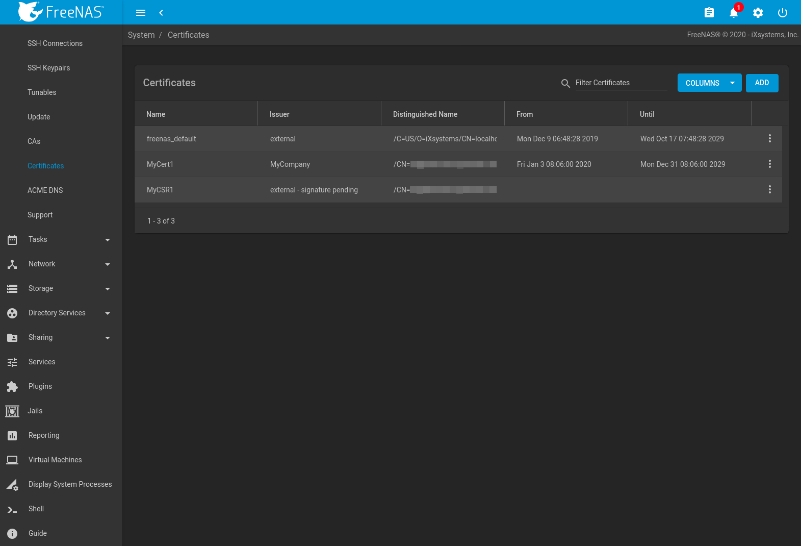

Clicking ui-options for an entry shows these configuration buttons:

-   **View:** use this option to view the contents of an existing
    `Certificate`, `Private Key`, or to edit the `Identifier`.
-   **Create ACME Certificate:** use an `ACME DNS` authenticator to
    verify, issue, and renew a certificate. Only visible with
    certificate signing requests.
-   **Export Certificate** saves a copy of the certificate or
    certificate signing request to the system being used to access the
    FreeNAS® system. For a certificate signing request, send
    the exported certificate to the external signing authority so that
    it can be signed.
-   **Export Private Key** saves a copy of the private key associated
    with the certificate or certificate signing request to the system
    being used to access the FreeNAS® system.
-   **Delete** is used to delete a certificate or certificate signing
    request.

### ACME Certificates

[Automatic Certificate Management Environment
(ACME)](https://ietf-wg-acme.github.io/acme/draft-ietf-acme-acme.html)
is available for automating certificate issuing and renewal. The user
must verify ownership of the domain before certificate automation is
allowed.

ACME certificates can be created for existing certificate signing
requests. These certificates use an `ACME DNS` authenticator to confirm
domain ownership, then are automatically issued and renewed. To create a
new ACME certificate, go to `System --> Certificates`, click ui-options
for an existing certificate signing request, and click
`Create ACME Certificate`.

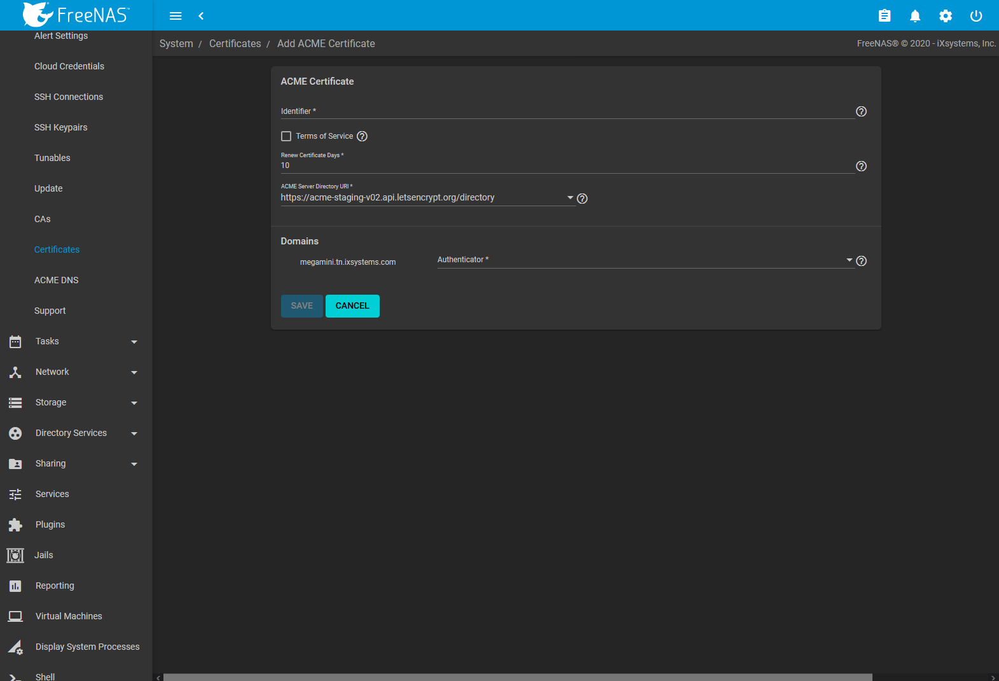

&gt;{RaggedRight}p{dimexpr 0.15linewidth-2tabcolsep}

| Setting                                                             | Value          | Description                                                                                                        |
|---------------------------------------------------------------------|----------------|--------------------------------------------------------------------------------------------------------------------|
| Identifier                                                          | string         | Internal identifier of the certificate. Only alphanumeric characters, dash (`-`), and underline (`_`) are allowed. |
| Terms of Service                                                    | checkbox       | Please accept the terms of service for the given ACME Server.                                                      |
| Renew Certificate Day                                               | integer        | Number of days to renew certificate before expiring.                                                               |
| ACME Server Directory URI                                           | drop-down menu | URI of the ACME Server Directory. Choose a preconfigured URI or enter a custom URI.                                |
| Authenticator for {Domain Name} ({Domain Name} dynamically changes) | drop-down menu | Authenticator to validate the Domain. Choose a previously configured `ACME DNS` authenticator.                     |

ACME Certificate Options

ACME DNS

ACME DNS
--------

Go to `System --> ACME DNS` and click `ADD` to show options to add a new
DNS authenticator to FreeNAS®. This is used to create
`ACME Certificates` that are automatically issued and renewed after
being validated.

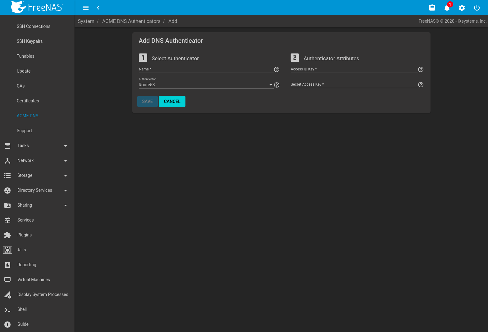

Enter a name for the authenticator. This is only used to identify the
authenticator in the FreeNAS® web interface. Choose a DNS
provider and configure any required `Authenticator Attributes`:

-   **Route 53:** Amazon DNS web service. Requires entering an Amazon
    account `Access ID Key` and `Secret Access Key`. See the [AWS
    documentation](https://docs.aws.amazon.com/IAM/latest/UserGuide/id_credentials_access-keys.html)
    for more details about generating these keys.

Click `SAVE` to register the DNS Authenticator and add it to the list of
authenticator options for `ACME Certificates`.

Support

Support
-------

The FreeNAS® `Support` option, shown in
`Figure %s <support_fig>`, provides a built-in ticketing system for
generating bug reports and feature requests.

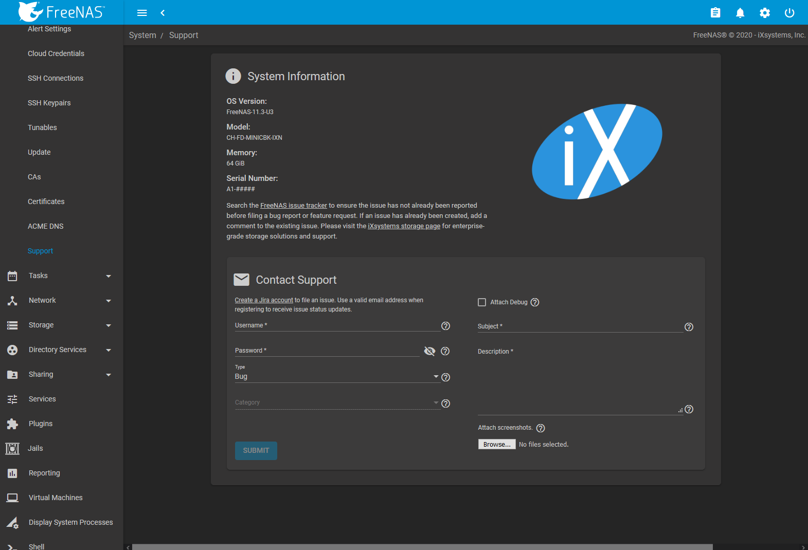

This screen provides a built-in interface to the FreeNAS®
issue tracker located at &lt;https://bugs.ixsystems.com&gt;.

An account is required to create tickets and receive notifications as
issues are addressed.

Log in to an existing account to enter an issue. If you do not have an
account yet, go to &lt;https://bugs.ixsystems.com&gt;, click
`Register`, and fill out the form. Reply to the registration email to
validate the account before logging in.

Before creating a bug report or feature request, ensure that an existing
report does not already exist at &lt;https://bugs.ixsystems.com&gt;. If a
similar issue is already present and has not been marked *Closed* or
*Resolved*, comment on that issue, adding new information to help solve
it. When similar issues are *Closed* or *Resolved*, create a new issue
and refer to the previous issue.

Note

Update the system to the latest version of STABLE and retest before
reporting an issue. Newer versions of the software might have already
fixed the problem.

To generate a report using the built-in `Support` screen, complete these
fields:

-   **Username:** enter the login name created when registering at &lt;https://bugs.ixsystems.com&gt;.

-   **Password:** enter the password associated with the registered
    login name.

-   **Type:** select *Bug* when reporting an issue or *Feature* when
    requesting a new feature.

-   **Category:** this drop-down menu is empty until a registered
    `Username` and `Password` are entered. The field remains empty if
    either value is incorrect. After the `Username` and `Password` are
    validated, possible categories are populated to the drop-down menu.
    Select the one that best describes the bug or feature being
    reported.

-   **Attach Debug:** enabling this option is recommended so an overview
    of the system hardware, build string, and configuration is
    automatically generated and included with the ticket. Generating and
    attaching a debug to the ticket can take some time.

    Debug file attachments are limited to 20 MiB. If the debug file is
    too large to include, unset the option to generate the debug file
    and let the system create an issue ticket as shown below. Manually
    create a debug file by going to `System --> Advanced` and clicking
    `SAVE DEBUG`.

    Go to the ticket at &lt;https://bugs.ixsystems.com&gt; and add
    the debug file as a private attachment.

-   **Subject:** enter a descriptive title for the ticket. A good
    *Subject* makes it easy to find similar reports.

-   **Description:** enter a one- to three-paragraph summary of the
    issue that describes the problem, and if applicable, what steps can
    be taken to reproduce it.

-   **Attach screenshots:** select screenshots on the client system to
    include with the report.

Click `SUBMIT` to automatically generate and upload the report to the
issue tracker (&lt;https://bugs.ixsystems.com&gt;). This
process can take several minutes while information is collected and
sent. All files included with the report are added to the issue tracker
ticket as private attachments and can only be accessed by the creator of
the ticket and iXsystems.

After the new ticket is created, the ticket URL is shown for viewing or
updating with more information.
