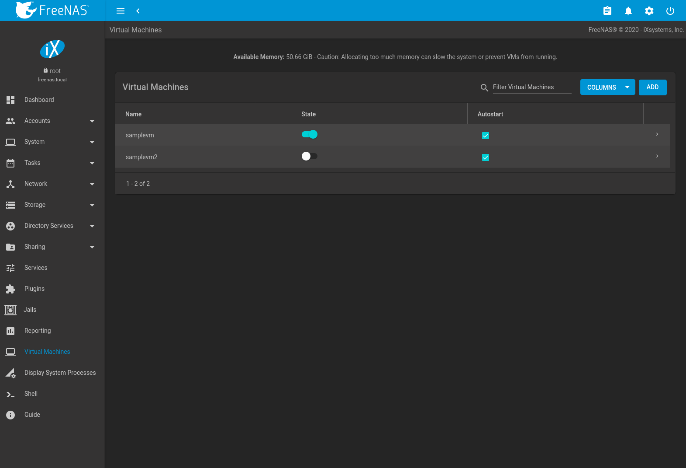
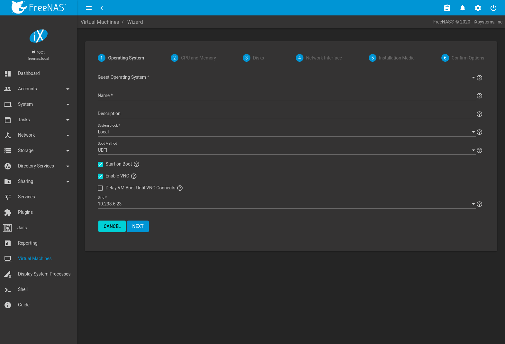
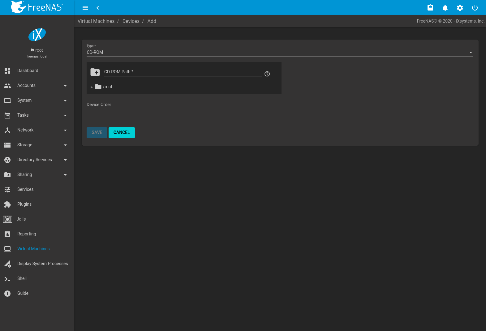
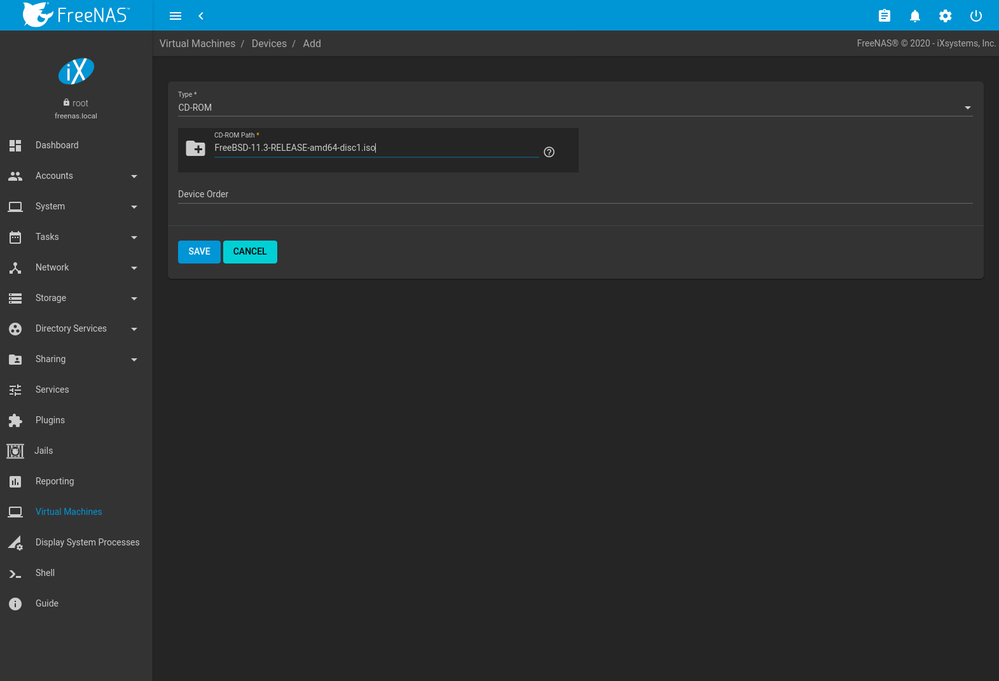
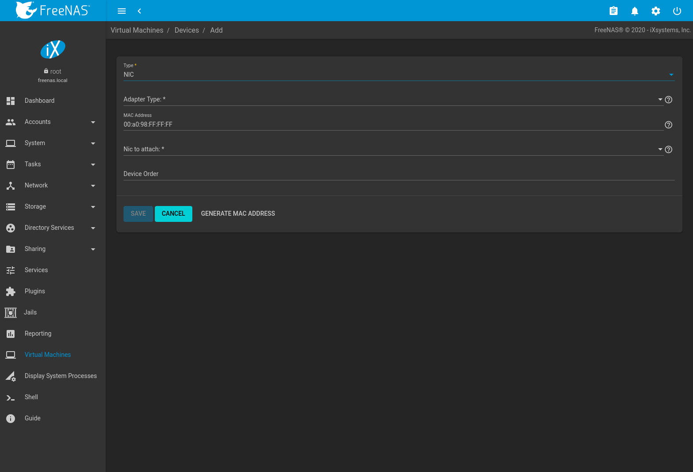
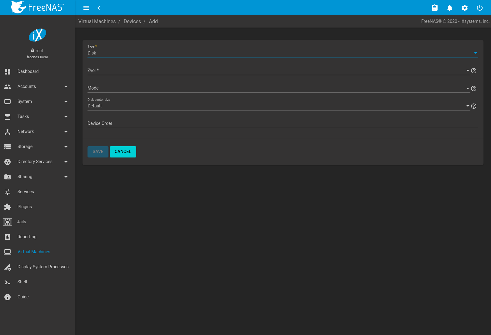
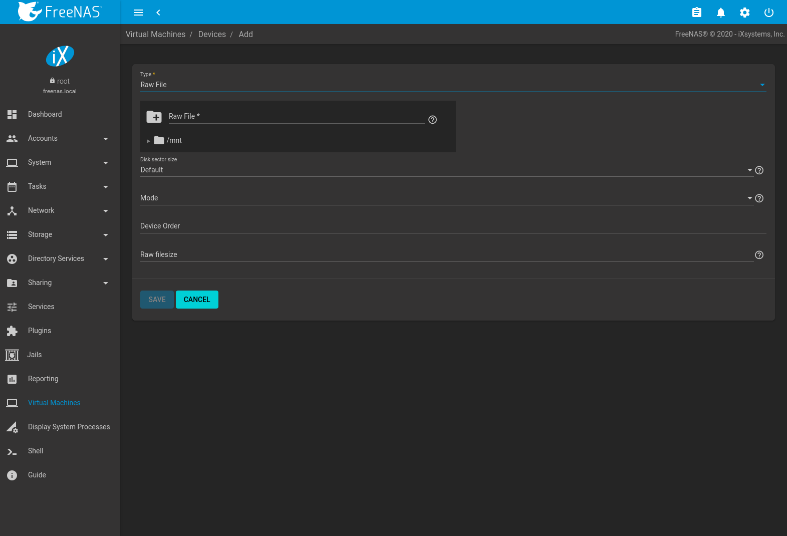
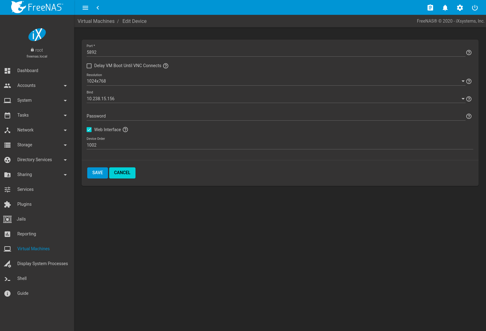

Virtual Machines,VMs

Virtual Machines
================

A Virtual Machine (*VM*) is an environment on a host computer that can
be used as if it were a separate physical computer. VMs can be used to
run multiple operating systems simultaneously on a single computer.
Operating systems running inside a VM see emulated virtual hardware
rather than the actual hardware of the host computer. This provides more
isolation than `Jails`, although there is additional overhead. A portion
of system RAM is assigned to each VM, and each VM uses a
`zvol <Adding Zvols>` for storage. While a VM is running, these
resources are not available to the host computer or other VMs.

FreeNAS® VMs use the
[bhyve(8)](https://www.freebsd.org/cgi/man.cgi?query=bhyve) virtual
machine software. This type of virtualization requires an Intel
processor with Extended Page Tables (EPT) or an AMD processor with Rapid
Virtualization Indexing (RVI) or Nested Page Tables (NPT). VMs cannot be
created unless the host system supports these features.

To verify that an Intel processor has the required features, use `Shell`
to run `grep VT-x /var/run/dmesg.boot`. If the *EPT* and *UG* features
are shown, this processor can be used with *bhyve*.

To verify that an AMD processor has the required features, use `Shell`
to run `grep POPCNT /var/run/dmesg.boot`. If the output shows the POPCNT
feature, this processor can be used with *bhyve*.

Note

AMD K10 "Kuma" processors include POPCNT but do not support NRIPS, which
is required for use with bhyve. Production of these processors ceased in
2012 or 2013.

By default, new VMs have the
[bhyve(8)](https://www.freebsd.org/cgi/man.cgi?query=bhyve) `-H` option
set. This causes the virtual CPU thread to yield when a HLT instruction
is detected and prevents idle VMs from consuming all of the host CPU.

`Virtual Machines` shows a list of installed virtual machines and
available memory. The available memory changes depending on what the
system is doing, including which virtual machines are running.

A log file for each VM is written to `/var/log/vm/{vmname}`.

*Name*, *State*, and `Autostart` are displayed on the `Virtual Machines`
page. Click ui-chevron-right to view additional options for controlling
and modifying VMs:

-   `Start` boots a VM. VMs can also be started by clicking the slide
    toggle on the desired VM.

    If there is insufficient memory to start the VM, a dialog will
    prompt to `Overcommit Memory`. Memory overcommitment allows the VM
    to launch even though there is insufficient free memory. Proceeding
    with the overcommitment option should be used with caution.

    To start a VM when the host system boots, set `Autostart`. If
    `Autostart` is set and the VM is in an encrypted, locked pool, the
    VM starts when the pool is unlocked.

-   `Edit` changes VM settings.

-   `Delete` removes the VM. `Zvols <Adding Zvols>` used in
    `disk devices <vms-disk-device>` and image files used in
    `raw file <vms-raw-file>` devices are *not* removed when a VM is
    deleted. These resources can be removed manually in
    `Storage --> Pools` after it is determined that the data in them has
    been backed up or is no longer needed.

-   `Devices` is used to add, remove, or edit devices attached to a
    virtual machine.

-   `Clone` copies the VM. A new name for the clone can be specified. If
    a custom name is not entered, the name assigned is
    `{vmname}_clone{N}`, where *vmname* is the orignal VM name and *N*
    is the clone number. Each clones is given a new VNC port.

These additional options in ui-chevron-right are available when a VM is
running:

-   `Power off` immediately halts the VM. This is equivalent to
    unplugging the power cord from a computer.

-   `Stop` shuts down the VM.

-   `Restart` shuts down and immediately starts the VM.

-   VMs with `Enable VNC` set show a `VNC` button. VNC connections
    permit remote graphical access to the VM.

-   `SERIAL` opens a connection to a virtual serial port on the VM.
    `/dev/nmdm1B` is assigned to the first VM, `/dev/nmdm2B` is assigned
    to the second VM, and so on. These virtual serial ports allow
    connections to the VM console from the `Shell`.

    

    

    Tip

    

    The [nmdm](https://www.freebsd.org/cgi/man.cgi?query=nmdm) device is
    dynamically created. The actual `nmdm {XY}` name varies on each VM.

    

    To connect to the first VM, type `cu -l /dev/nmdm{1B} -s 9600` in
    the `Shell`. See
    [cu(1)](https://www.freebsd.org/cgi/man.cgi?query=cu) for more
    information.

Creating VMs

Creating VMs
------------

Click `ADD` to open the wizard in `Figure %s <vms_add_fig>`:

The configuration options for a Virtual Machine (VM) type are described
in `Table %s <vms_add_opts_tab>`.

&gt;{RaggedRight}p{dimexpr 0.20linewidth-2tabcolsep}
&gt;{RaggedRight}p{dimexpr 0.60linewidth-2tabcolsep}\|

| Screen \# | Setting                                   | Value                           | Description                                                                                                                                                                                                                                                                                                     |
|-----------|-------------------------------------------|---------------------------------|-----------------------------------------------------------------------------------------------------------------------------------------------------------------------------------------------------------------------------------------------------------------------------------------------------------------|
| 1         | Guest Operating System                    | drop-down menu                  | Choose the VM operating system type. Choices are: *Windows*, *Linux*, or *FreeBSD*. See [this guide](https://github.com/FreeBSD-UPB/freebsd/wiki/How-to-launch-different-guest-OS) for detailed instructions about using a different guest OS.                                                                  |
| 1         | Name                                      | string                          | Name of the VM. Alphanumeric characters and `_` are allowed. The name must be unique.                                                                                                                                                                                                                           |
| 1         | Description                               | string                          | Description (optional).                                                                                                                                                                                                                                                                                         |
| 1         | System Clock                              | drop-down menu                  | Virtual Machine system time. Options are *Local* and *UTC*. *Local* is default.                                                                                                                                                                                                                                 |
| 1         | Boot Method                               | drop-down menu                  | Choices are *UEFI*, *UEFI-CSM*, and *Grub*. Select *UEFI* for newer operating systems, or *UEFI-CSM* (Compatibility Support Mode) for older operating systems that only understand *BIOS booting. VNC connections are only available with*UEFI\*. *Grub* is not supported by *Windows* guest operating systems. |
| 1         | Start on Boot                             | checkbox                        | Set to start the VM when the system boots.                                                                                                                                                                                                                                                                      |
| 1         | Enable VNC                                | checkbox                        | Add a VNC remote connection. Requires *UEFI* booting.                                                                                                                                                                                                                                                           |
| 1         | Delay VM Boot Until VNC Connects          | checkbox                        | Wait to start VM until VNC client connects. Only appears when `Enable VNC` is set.                                                                                                                                                                                                                              |
| 1         | Bind                                      | drop-down menu                  | VNC network interface IP address. The primary interface IP address is the default. A different interface IP address can be chosen.                                                                                                                                                                              |
| 2         | Virtual CPUs                              | integer                         | Number of virtual CPUs to allocate to the VM. The maximum is 16 unless limited by the host CPU. The VM operating system might also have operational or licensing restrictions on the number of CPUs.                                                                                                            |
| 2         | Memory Size                               | integer                         | Set the amount of RAM for the VM. Allocating too much memory can slow the system or prevent VMs from running. This is a `humanized field <Humanized Fields>`.                                                                                                                                                   |
| 3         | Disk image                                | check option with custom fields | Select `Create new disk image` to create a new zvol on an existing dataset. This is used as a virtual hard drive for the VM. Select `Use existing disk image` and choose an existing zvol from the `Select Existing zvol` drop-down.                                                                            |
| 3         | Select Disk Type                          | drop-down menu                  | Select the disk type. Choices are *AHCI* and *VirtIO*. Refer to `Disk Devices <vms-disk-device>` for more information about these disk types.                                                                                                                                                                   |
| 3         | Size (Examples: 500 KiB, 500M, 2TB)       |                                 | Allocate the amount of storage for the zvol. This is a `humanized field <Humanized Fields>`. Numbers without unit letters are interpreted as megabytes. For example, `500` sets the zvol size to 500 megabytes.                                                                                                 |
| 3         | Zvol Location                             |                                 | When `Create new disk image` is chosen, select a pool or dataset for the new zvol.                                                                                                                                                                                                                              |
| 3         | Select existing zvol                      | drop-down menu                  | When `Use existing disk image` is chosen, select an existing zvol for the VM.                                                                                                                                                                                                                                   |
| 4         | Adapter Type                              | drop-down menu                  | `Intel e82545 (e1000)` emulates the same Intel Ethernet card. This provides compatibility with most operating systems. `VirtIO` provides better performance when the operating system installed in the VM supports VirtIO paravirtualized network drivers.                                                      |
| 4         | MAC Address                               | string                          | Enter the desired MAC address to override the auto-generated randomized MAC address.                                                                                                                                                                                                                            |
| 4         | Attach NIC                                | drop-down menu                  | Select the physical interface to associate with the VM.                                                                                                                                                                                                                                                         |
| 5         | Optional: Choose installation media image | browse button                   | Click ui-browse to select an installer ISO or image file on the FreeNAS® system.                                                                                                                                                                                                                     |
| 5         | Upload ISO                                | checkbox and                    | Set to upload an installer ISO or image file to the FreeNAS® system.                                                                                                                                                                                                                                 |

VM Wizard Options

The final screen of the Wizard displays the chosen options for the new
Virtual Machine (VM) type. Click `SUBMIT` to create the VM or `BACK` to
change any settings.

After the VM has been installed, remove the install media device. Go to
`Virtual Machines -->` ui-options `--> Devices`. Remove the *CDROM*
device by clicking ui-options `--> Delete`. This prevents the virtual
machine from trying to boot with the installation media after it has
already been installed.

This example creates a FreeBSD VM:

1.  `Guest Operating System` is set to *FreeBSD*. `Name` is set to
    *samplevm*. Other options are left at defaults.
2.  `Virtual CPUs` is set to *2* and `Memory Size (MiB)` is set to
    *2048*.
3.  `Create new disk image` is selected. The zvol size is set to *20*
    GiB and stored on the pool named *pool1*.
4.  Network settings are left at default values.
5.  A FreeBSD ISO installation image has been selected and uploaded to
    the FreeNAS® system. The
    `Choose installation media image` field is populated when the upload
    completes.
6.  After verifying the `VM Summary` is correct, `SUBMIT` is clicked.

`Figure %s <vms_create_example>` shows the confirmation step and basic
settings for the new virtual machine:

Installing Docker
-----------------

[Docker](https://www.docker.com/) can be used on FreeNAS® by
installing it on a Linux virtual machine.

Choose a Linux distro and install it on FreeNAS® by following
the steps in `Creating VMs`. Using [Ubuntu](https://ubuntu.com/) is
recommended.

After the Linux operating system has been installed, start the VM.
Connect to it by clicking ui-chevron-right `--> VNC`. Follow the [Docker
documentation](https://docs.docker.com/) for Docker installation and
usage.

Adding Devices to a VM

Adding Devices to a VM
----------------------

Go to `Virtual Machines`, ui-options `--> Devices`, and click `ADD` to
add a new VM device.

Select the new device from the `Type` field. These devices are
available:

-   `CD-ROM <vms-cd-rom>`
-   `NIC (Network Interface Card) <vms-network-interface>`
-   `Disk Device <vms-disk-device>`
-   `Raw File <vms-raw-file>`
-   `VNC Interface <vms-vnc>` (only available on virtual machines with
    `Boot Loader Type` set to *UEFI*)

`Virtual Machines -->` ui-options `--> Devices` is also used to edit or
delete existing devices. Click ui-options for a device to display
`Edit`, `Delete`, `Change Device Order`, and `Details` options:

-   `Edit` modifies a device.
-   `Delete` removes the device from the VM.
-   `Change Device Order` sets the priority number for booting this
    device. Smaller numbers are higher in boot priority.
-   `Details` shows additional information about the specific device.
    This includes the physical interface and MAC address in a *NIC*
    device, the path to the zvol in a *DISK* device, and the path to an
    `.iso` or other file for a *CDROM* device.

### CD-ROM Devices

Adding a CD-ROM device makes it possible to boot the VM from a CD-ROM
image, typically an installation CD. The image must be present on an
accessible portion of the FreeNAS® storage. In this example,
a FreeBSD installation image is shown:

Note

VMs from other virtual machine systems can be recreated for use in
FreeNAS®. Back up the original VM, then create a new
FreeNAS® VM with virtual hardware as close as possible to the
original VM. Binary-copy the disk image data into the
`zvol <Adding Zvols>` created for the FreeNAS® VM with a tool
that operates at the level of disk blocks, like
[dd(1)](https://www.freebsd.org/cgi/man.cgi?query=dd). For some VM
systems, it is best to back up data, install the operating system from
scratch in a new FreeNAS® VM, and restore the data into the
new VM.

### NIC (Network Interfaces)

`Figure %s <vms-nic_fig>` shows the fields that appear after going to
`Virtual Machines -->` ui-options `--> Devices`, clicking `ADD`, and
selecting `NIC` as the `Type`.

The `Adapter Type` can emulate an Intel e82545 (e1000) Ethernet card for
compatibility with most operating systems. *VirtIO* can provide better
performance when the operating system installed in the VM supports
VirtIO paravirtualized network drivers.

By default, the VM receives an auto-generated random MAC address. To
override the default with a custom value, enter the desired address in
`MAC Address`. Click `GENERATE MAC ADDRESS` to automatically populate
`MAC Address` with a new randomized MAC address.

If the system has multiple physical network interface cards, use the
`NIC to attach` drop-down menu to specify which physical interface to
associate with the VM. To prevent a network interface reset when the VM
starts, edit the `network interface <Interfaces>` and set
`Disable Hardware Offloading`.

Set a `Device Order` number to determine the boot order of this device.
A lower number means a higher boot priority.

Tip

To check which interface is attached to a VM, start the VM and go to the
`Shell`. Type `ifconfig` and find the
[tap](https://en.wikipedia.org/wiki/TUN/TAP) interface that shows the
name of the VM in the description.

### Disk Devices

`Zvols <adding zvols>` are typically used as virtual hard drives. After
`creating a zvol <adding zvols>`, associate it with the VM by clicking
`Virtual Machines -->` ui-options `--> Devices`, clicking `ADD`, and
selecting `Disk` as the `Type`.

Open the drop-down menu to select a created `Zvol`, then set the disk
`Mode`:

-   *AHCI* emulates an AHCI hard disk for best software compatibility.
    This is recommended for Windows VMs.
-   *VirtIO* uses paravirtualized drivers and can provide better
    performance, but requires the operating system installed in the VM
    to support VirtIO disk devices.

If a specific sector size is required, enter the number of bytes in
`Disk sector size`. The default of *0* uses an autotune script to
determine the best sector size for the zvol.

Set a `Device Order` number to determine the boot order of this device.
A lower number means a higher boot priority.

### Raw Files

*Raw Files* are similar to `Zvol <Adding Zvols>` disk devices, but the
disk image comes from a file. These are typically used with existing
read-only binary images of drives, like an installer disk image file
meant to be copied onto a USB stick.

After obtaining and copying the image file to the FreeNAS®
system, click `Virtual Machines -->` ui-options `--> Devices`, click
`ADD`, then set the `Type` to `Raw File`.

Click ui-browse to select the image file. If a specific sector size is
required, choose it from `Disk sector size`. The *Default* value
automatically selects a preferred sector size for the file.

Setting disk `Mode` to *AHCI* emulates an AHCI hard disk for best
software compatibility. *VirtIO* uses paravirtualized drivers and can
provide better performance, but requires the operating system installed
in the VM to support VirtIO disk devices.

Set a `Device Order` number to determine the boot order of this device.
A lower number means a higher boot priority.

Set the size of the file in GiB.

### VNC Interface

VMs set to *UEFI* booting are also given a VNC (Virtual Network
Computing) remote connection. A standard
[VNC](https://en.wikipedia.org/wiki/Virtual_Network_Computing) client
can connect to the VM to provide screen output and keyboard and mouse
input.

Each VM can have a single VNC device. An existing VNC interface can be
changed by clicking ui-options and `Edit`.

Note

Using a non-US keyboard with VNC is not yet supported. As a workaround,
select the US keymap on the system running the VNC client, then
configure the operating system running in the VM to use a keymap that
matches the physical keyboard. This will enable passthrough of all keys
regardless of the keyboard layout.

`Figure %s <vms-vnc_fig>` shows the fields that appear after going to
`Virtual Machines -->` ui-options `--> Devices`, and clicking ui-options
`--> Edit` for VNC.

Setting `Port` to *0* automatically assigns a port when the VM is
started. If a fixed, preferred port number is needed, enter it here.

Set `Delay VM Boot until VNC Connects` to wait to start the VM until a
VNC client connects.

`Resolution` sets the default screen resolution used for the VNC
session.

Use `Bind` to select the IP address for VNC connections.

To automatically pass the VNC password, enter it into the `Password`
field. Note that the password is limited to 8 characters.

To use the VNC web interface, set `Web Interface`.

Tip

If a RealVNC 5.X Client shows the error
`RFB protocol error: invalid message type`, disable the
`Adapt to network speed` option and move the slider to `Best quality`.
On later versions of RealVNC, select `File --> Preferences`, click
`Expert`, `ProtocolVersion`, then select 4.1 from the drop-down menu.

Set a `Device Order` number to determine the boot order of this device.
A lower number means a higher boot priority.
