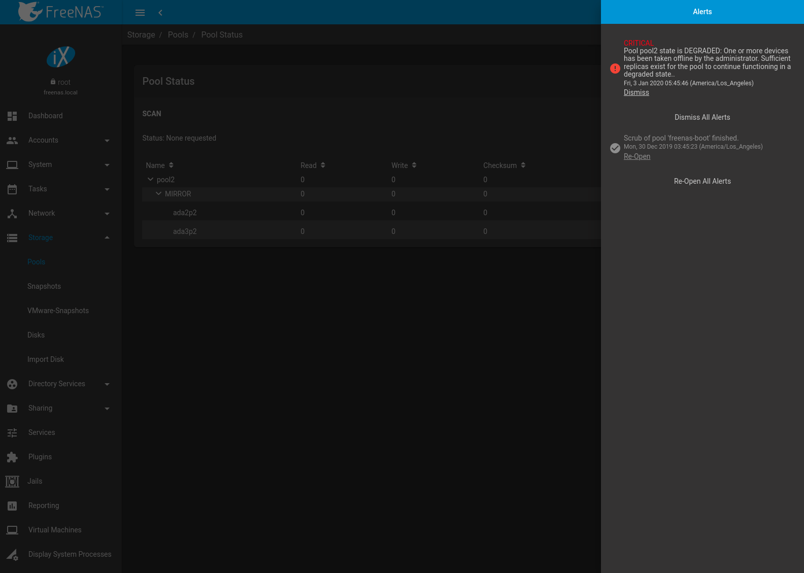

.. index:: Alert

.. _Alert:

Alert
-----

The FreeNAS\ :sup:`®` alert system provides a visual warning of any
conditions that require administrative attention. The
:guilabel:`Alert` icon in the upper right corner has a
notification badge that displays the total number of unread alerts.
In the example alert shown in
:numref:`Figure %s <alert2a>`,
the system is warning that a pool is degraded.

.. _alert2a:

   Example Alert Message

:numref:`Table %s <alert_icons_tab>` shows the icons that indicate
notification, warning, critical, and one-shot critical alerts. Critical
messages are also emailed to the root account. One-shot critical alerts
must be dismissed by the user.

.. tabularcolumns:: |>{\RaggedRight}p{\dimexpr 0.20\linewidth-2\tabcolsep}
                    |>{\RaggedRight}p{\dimexpr 0.15\linewidth-2\tabcolsep}|

.. _alert_icons_tab:

.. table:: FreeNAS\ :sup:`®` Alert Icons
   :class: longtable

   +-------------------+------------------------+
   | Alert Level       | Icon                   |
   |                   |                        |
   +===================+========================+
   | Notification      | |alert-icon-info|      |
   |                   |                        |
   +-------------------+------------------------+
   | Warning           | |alert-icon-watch|     |
   |                   |                        |
   +-------------------+------------------------+
   | Critical          | |alert-icon-error|     |
   |                   |                        |
   +-------------------+------------------------+
   | One-shot Critical | |alert-icon-one-error| |
   |                   |                        |
   +-------------------+------------------------+

Close an alert message by clicking
:guilabel:`Dismiss`. There is also an option to
:guilabel:`Dismiss All Alerts`. Dismissing all alerts removes the
notification badge from the alerts icon. Dismissed alerts can be
re-opened by clicking :guilabel:`Re-Open`.

Behind the scenes, an alert daemon checks for various alert
conditions, such as pool and disk status, and writes the current
conditions to the system RAM. These messages are flushed to the SQLite
database periodically and then published to the user interface.

Current alerts are viewed from the Shell option of the Console
Setup Menu
(:numref:`Figure %s <console_setup_menu_fig>`)
or the Web Shell
(:numref:`Figure %s <web_shell_fig>`)
by running :command:`midclt call alert.list`.

Notifications for specific alerts are adjusted in the
:ref:`Alert Settings` menu. An alert message can be set to
publish :guilabel:`IMMEDIATELY`, :guilabel:`HOURLY`,
:guilabel:`DAILY`, or :guilabel:`NEVER`.

Some of the conditions that trigger an alert include:

* used space on a pool, dataset, or zvol goes over 80%; the alert
  goes red at 95%

* new :ref:`ZFS Feature Flags` are available for the pool; this alert
  can be adjusted in :ref:`Alert Settings` if a pool upgrade is not
  desired at present

* a new update is available

* hardware events detected by an attached :ref:`IPMI` controller

* an error with the :ref:`Active Directory` connection

* ZFS pool status changes from :guilabel:`HEALTHY`

* a S.M.A.R.T. error occurs

* the system is unable to bind to the :guilabel:`WebGUI IPv4 Address`
  set in
  :menuselection:`System --> General`

* the system can not find an IP address configured on an iSCSI portal

* the NTP server cannot be contacted

* `syslog-ng(8) <https://www.freebsd.org/cgi/man.cgi?query=syslog-ng>`__
  is not running

* a periodic snapshot or replication task fails

* a VMware login or a :ref:`VMware-Snapshots` task fails

* a :ref:`Cloud Sync task <Cloud Sync Tasks>` fails

* deleting a VMware snapshot fails

* a Certificate Authority or certificate is invalid or malformed

* an update failed, or the system needs to reboot to complete a
  successful update

* a re-key operation fails on an encrypted pool

* an Active Directory domain goes offline; by default the winbindd
  connection manager will try to reconnect every 30 seconds and will
  clear the alert when the domain comes back online

* LDAP failed to bind to the domain

* any member interfaces of a lagg interface are not active

* a device is slowing pool I/O

* :ref:`Rsync task <Rsync Tasks>` status

* the status of an Avago MegaRAID SAS controller has changed;
  `mfiutil(8) <https://www.freebsd.org/cgi/man.cgi?query=mfiutil>`__
  is included for managing these devices

* a scrub has been paused for more than eight hours

* a connected Uninterruptible Power Supply (UPS) switches to battery
  power, switches to line power, communication with the UPS is lost or
  established, the battery is low, or the battery needs to be replaced

